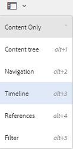

# 時間軸中的活動資料流 {#activity-stream-in-timeline}

此功能會顯示時間軸上資產的活動記錄。 如果您在[!DNL Adobe Experience Manager Assets]中執行下列任何資產相關作業，活動資料流功能會更新時間表以反映活動。

下列作業會記錄於活動資料流中：

* 建立
* 刪除
* 下載（包括轉譯）
* 發佈
* 未發佈
* 核准
* 拒絕
* 移動

將從儲存日誌檔案的CRX位置提取要在時 `/var/audit/com.day.cq.dam/content/dam` 間軸中顯示的活動日誌。 此外，當上傳新資產或修改現有資產並透過[Adobe資產連結](https://helpx.adobe.com/enterprise/admin-guide.html/enterprise/using/manage-assets-using-adobe-asset-link.ug.html)或[Experience Manager案頭應用程式](https://experienceleague.adobe.com/docs/experience-manager-desktop-app/using/release-notes.html)簽入[!DNL Experience Manager]時，會記錄時間軸活動。

>[!NOTE]
>
>暫時性工作流程不會顯示在時間軸中，因為沒有為這些工作流程儲存歷史記錄資訊。

若要檢視活動資料流，請在資產上執行一或多個作業、選取資產，然後從GlobalNav清單中選擇&#x200B;**[!UICONTROL 時間表]**。

時間軸會顯示您對資產執行之操作的活動資料流。

>[!NOTE]
>
>「發佈」和「取消發佈」任 **[!UICONTROL 務的預設日]** 志存 **[!UICONTROL 儲位置為]**`/var/audit/com.day.cq.replication/content`。 對於 **[!UICONTROL 移動]** ，預設位置為 `/var/audit/com.day.cq.wcm.core.page`。
