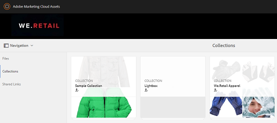

# 將集合發佈至Brand Portal {#publish-collections-to-brand-portal}

身為Adobe Experience Manager (AEM) Assets管理員，您可以將集合發佈至貴組織的AEM Assets Brand Portal執行個體。 不過，您必須先整合AEM Assets與Brand Portal。 如需詳細資訊，請參閱[使用 Brand Portal 設定 AEM Assets](/help/assets/configure-aem-assets-with-brand-portal.md)。

如果您對AEM Assets中的原始集合進行後續修改，則在您再次發佈集合前，這些變更不會反映在Brand Portal中。 此特性可確保在Brand Portal中不會出現進行中的變更。 Brand Portal 僅提供管理員發佈的已核准變更。

>[!NOTE]
>
>內容片段無法發佈至 Brand Portal。因此，如果您在AEM Author上選取內容片段，則無法使用&#x200B;**發佈至Brand Portal**&#x200B;動作。
>
>如果從AEM Author將包含內容片段的集合發佈到Brand Portal，則除了內容片段以外，資料夾的所有內容都會複製到Brand Portal介面。

## 將集合發佈至Brand Portal {#publish-a-collection-to-brand-portal}

1. 在 AEM Assets UI 中按一下 AEM 標誌。
1. 從&#x200B;**導覽**&#x200B;頁面，前往&#x200B;**Assets >集合**。
1. 在集合控制檯中，選取您要發佈至Brand Portal的集合。

   

1. 從工具列中按一下&#x200B;**發佈至 Brand Portal**。
1. 在確認對話方塊中，按一下&#x200B;**發佈**。
1. 關閉確認訊息。
1. 以管理員身分登入Brand Portal。 已發佈的集合可在「集合」控制台中使用。

   

## 取消發佈集合 {#unpublish-collections}

您可以取消發佈從AEM Assets發佈到Brand Portal的集合。 取消發佈原始集合後，Brand Portal使用者將無法再使用其副本。

1. 從AEM Assets例項的集合控制檯中，選取您要取消發佈的集合。

   

1. 在工具列中按一下&#x200B;**從 Brand Portal 移除**&#x200B;圖示。
1. 在對話方塊中，按一下&#x200B;**取消發佈**。
1. 關閉確認訊息。集合會從 Brand Portal 介面中移除。
