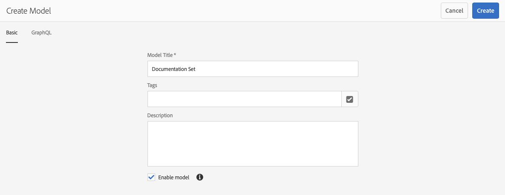

# 內容片段模型 {#content-fragment-models}

AEM中的內容片段模型定義了您[內容片段，](/help/assets/content-fragments/content-fragments.md)作為您Headless內容基礎的內容結構。

若要使用內容片段模型，您可以：

1. [為您的執行個體啟用內容片段模型功能](/help/assets/content-fragments/content-fragments-configuration-browser.md)。
1. [建立](#creating-a-content-fragment-model)，並[設定您的內容片段模型](#defining-your-content-fragment-model)。
1. [啟用您的內容片段模型](#enabling-disabling-a-content-fragment-model)，以便在建立內容片段時使用。
1. [藉由設定&#x200B;**原則**，在必要的Assets資料夾](#allowing-content-fragment-models-assets-folder)上允許您的內容片段模型。

## 建立內容片段模型 {#creating-a-content-fragment-model}

1. 導覽至&#x200B;**工具**、**Assets**，然後開啟&#x200B;**內容片段模型**。
1. 導覽至適合您[組態](/help/assets/content-fragments/content-fragments-configuration-browser.md)的資料夾。
1. 使用&#x200B;**建立**&#x200B;開啟精靈。

   >[!CAUTION]
   >
   >如果尚未啟用[使用內容片段模型](/help/assets/content-fragments/content-fragments-configuration-browser.md)，則&#x200B;**建立**&#x200B;選項無法使用。

1. 指定「模 **型標題」**。您也可以新增&#x200B;**標籤**、**描述**，並在必要時選取&#x200B;**啟用模型**&#x200B;以[啟用模型](#enabling-disabling-a-content-fragment-model)。

   

1. 使用&#x200B;**建立**&#x200B;儲存空的模型。 訊息會指出動作是否成功，您可以選取&#x200B;**開啟**&#x200B;立即編輯模型，或選取&#x200B;**完成**&#x200B;返回主控台。

## 定義內容片段模型 {#defining-your-content-fragment-model}

內容片段模型有效定義結果內容片段的結構，方法是使用&#x200B;**[資料型別](#data-types)**&#x200B;的選項。 使用模型編輯器，您可以新增資料型別的例項，然後將其設定以建立必填欄位：

>[!CAUTION]
>
>編輯現有的內容片段模型可能會影響相依片段。

1. 導覽至&#x200B;**工具**、**Assets**，然後開啟&#x200B;**內容片段模型**。

1. 導覽至容納您的內容片段模式的資料夾。

1. 開啟&#x200B;**編輯**&#x200B;所需的模型；使用快速動作，或選取模型，然後從工具列選取動作。

   開啟模型編輯器後，會顯示：

   * 左：欄位已定義
   * 右：資 **料類型** ，可用於建立欄位( **和屬性** ，以供建立欄位後使用)

   >[!NOTE]
   >
   >當欄位為&#x200B;**必要**&#x200B;時，左窗格中指示的&#x200B;**標籤**&#x200B;會標示為字元(**&#42;**)。

   

1. **新增欄位**

   * 將欄位所需的資料型別拖曳到所需位置：

     

   * 將欄位新增至模型後，右側面板會顯示可針對該特定資料型別定義的&#x200B;**屬性**。 您可以在此處定義該欄位的必要條件。

      * 許多屬性不言自明，如需詳細資訊，請參閱[屬性](#properties)。
      * 輸入&#x200B;**欄位標籤**&#x200B;會自動完成&#x200B;**屬性名稱** （如果空白），之後可以手動更新。

        >[!CAUTION]
        >
        >手動更新資料型別的屬性&#x200B;**屬性名稱**&#x200B;時，名稱必須僅包含A-Z、a-z、0-9以及底線「_」作為特殊字元。
        >
        >如果在舊版AEM中建立的模型包含非法字元，請移除或更新這些字元。

     例如：

     

1. **移除欄位**

   選取必填欄位，然後按一下垃圾桶圖示。 系統會要求您確認動作。

   

1. 新增所有必要欄位，並視需要定義相關屬性。 例如：

   

1. 選取&#x200B;**儲存**&#x200B;以保留定義。

## 資料類型 {#data-types}

定義模型時可選用多種資料型別：

* **單行文字**
   * 新增一行或多行文字的欄位；可以定義最大長度
* **多行文字**
   * 可能是RTF、純文字或Markdown的文字區域

     >[!NOTE]
     >
     >基於效能考量，不建議在單一模式中使用超過10個RTF欄位。
     >
     >如有需要，建議您使用[巢狀內容片段](#fragment-reference-nested-fragments)。

* **數字**
   * 新增一或多個數值欄位
* **布林值**
   * 新增布林值核取方塊
* **日期和時間**
   * 新增日期和/或時間
* **分項清單**
   * 新增一組核取方塊、選項按鈕或下拉式欄位
* **標籤**
   * 允許片段作者存取及選取標籤區域
* **內容參考**
   * 參考任何型別的其他內容；可用於[建立巢狀內容](#using-references-to-form-nested-content)
   * 如果參照了影像，您可以選擇顯示縮圖
* **片段參考**
   * 參考其他內容片段；可用於[建立巢狀內容](#using-references-to-form-nested-content)
   * 可以設定此資料類型以允許片段作者：
      * 直接編輯參考的片段。
      * 根據適當的模型建立內容片段
* **JSON物件**
   * 允許內容片段作者在片段的對應元素中輸入JSON語法。
      * 允許AEM儲存您從其他服務複製並貼上的直接JSON。
      * JSON會傳遞，並在GraphQL中輸出為JSON。
      * 在內容片段編輯器中包括JSON語法醒目提示、自動完成和錯誤醒目提示。
* **索引標籤預留位置**
   * 允許引進索引標籤，以在編輯內容片段內容時使用。
這會在模型編輯器中顯示為分隔線，用於分隔內容資料型別清單的各個區段。 每個例項代表新索引標籤的開始。
在片段編輯器中，每個例項都會顯示為一個索引標籤。

     >[!NOTE]
     >
     >此資料型別僅用於格式設定，AEM GraphQL結構描述會忽略此資料型別。

## 屬性 {#properties}

許多屬性的含義一目瞭然，對於某些屬性，其他詳細資訊如下：


* **屬性名稱**

  手動更新資料型別的這個屬性時，名稱&#x200B;**必須**&#x200B;僅包含&#x200B;*個* A-Z、a-z、0-9，且底線「_」為特殊字元。

  >[!CAUTION]
  >
  >如果在舊版AEM中建立的模型包含非法字元，請移除或更新這些字元。

* **呈現為**
在片段中實現/轉譯欄位的各種選項。 這通常可讓您定義作者會看到欄位的單一例項，還是允許建立多個例項。

* **欄位標籤**
輸入&#x200B;**欄位標籤**&#x200B;會自動產生&#x200B;**屬性名稱**，然後可視需要手動更新。

* **驗證**
基本驗證可由機制使用，例如&#x200B;**Required**&#x200B;屬性。 有些資料型別有額外的驗證欄位。 如需詳細資訊，請參閱[驗證](#validation)。

* 對於「多行」 **資料類型** ，可將「預設類型 **&#x200B;**&#x200B;」定義為：

   * **RTF格式**
   * **Markdown**
   * **純文字**

  如果未指定，此欄位會使用預設值&#x200B;**RTF**。

  在內容片段模型中變更&#x200B;**預設型別**，只會在編輯器中開啟並儲存該片段後，對現有、相關的內容片段生效。

* **唯一**
從目前模型建立的所有內容片段內容（適用於特定欄位）必須是唯一的。

  這是為了確保內容作者無法重複已新增至相同模型其他片段中的內容。

  例如，內容片段模型中名為`Country`的&#x200B;**單行文字**&#x200B;欄位在兩個相依的內容片段中不能有值`Japan`。 嘗試第二個執行個體時會發出警告。

  >[!NOTE]
  >
  >確保每個語言根的唯一性。

  >[!NOTE]
  >
  >變數可以有與相同片段變數相同的&#x200B;*唯一*&#x200B;值，但與其他片段變數中使用的值不同。

* 如需特定資料型別及其屬性的詳細資訊，請參閱&#x200B;**[內容參考](#content-reference)**。

* 如需特定資料型別及其屬性的詳細資訊，請參閱&#x200B;**[片段參考（巢狀片段）](#fragment-reference-nested-fragments)**。

<!--
* **Translatable**
  Checking the **Translatable** checkbox on a field in the Content Fragment Model editor does the following:

  * Ensures that the field's property name is added to the translation configuration, context `/content/dam/<sites-configuration>`, if not already present. 
  * For GraphQL: sets a `<translatable>` property on the Content Fragment field to `yes`, to allow GraphQL query filter for JSON output with only translatable content.
-->

## 驗證  {#validation}

各種資料型別現在包含定義在結果片段中輸入內容時適用的驗證需求的可能性：

* **單行文字**
   * 與預先定義的規則運算式比較。
* **數字**
   * 檢查特定值。
* **內容參考**
   * 測試特定型別的內容。
   * 只能參考指定檔案大小或更小的資產。
   * 只能參考預先定義的寬度和/或高度範圍（以畫素為單位）內的影像。
* **片段參考**
   * 測試特定內容片段模型。

## 使用參照來形成巢狀內容 {#using-references-to-form-nested-content}

內容片段可使用下列任一種資料型別來形成巢狀內容：

* **[內容參考](#content-reference)**
   * 提供其他內容的簡單參照；任何型別。
   * 它可以設定為一個參考或多個參考（在產生的片段中）。

* **[片段參考](#fragment-reference-nested-fragments)** （巢狀片段）
   * 根據指定的特定模型，參考其他片段。
   * 可讓您包含/擷取結構化資料。

     >[!NOTE]
     >
     >此方法對於搭配GraphQL[&#128279;](/help/assets/content-fragments/content-fragments-graphql.md)使用內容片段的Headless內容傳遞特別感興趣。
   * 它可以設定為一個參考或多個參考（在產生的片段中）。

>[!NOTE]
>
>AEM對下列專案提供週期性保護：
>
>* 內容參照
>這可防止使用者新增對目前片段的引用。 這可能會導致空的片段參考選擇器對話方塊。
>
>* GraphQL中的片段參考
>如果您建立深層查詢，且該查詢傳回多個互相參照的內容片段，則該查詢在第一次出現時會傳回null。

### 內容參考 {#content-reference}

內容參考可讓您轉譯來自其他來源的內容；例如，影像或內容片段。

除了標準屬性之外，您還可以指定：

* 任何參考內容的&#x200B;**根路徑**
* 可參考的內容型別
* 檔案大小限制
* 如果參照影像：
   * 顯示縮圖
   * 影像高度和寬度的限制


### 片段參考（巢狀片段） {#fragment-reference-nested-fragments}

「片段參考」會參考一或多個內容片段。 此功能在擷取用於應用程式的內容時特別有意義，因為它可讓您擷取具有多個圖層的結構化資料。

例如：

* 定義員工詳細資訊的模型；這些包括：
   * 定義僱主（公司）的模型參考

```xml
type EmployeeModel {
    name: String
    firstName: String
    company: CompanyModel
}

type CompanyModel {
    name: String
    street: String
    city: String
}
```

>[!NOTE]
>
>這對[搭配GraphQL](/help/assets/content-fragments/content-fragments-graphql.md)使用內容片段的Headless內容傳遞特別感興趣。

除了標準屬性之外，您還可以定義：

* **呈現為**：

   * **multifield** — 片段作者可以建立多個個別參考

   * **fragmentreference** — 允許片段作者選取片段的單一參考

* **模型型別**
可選取多個模型。 製作內容片段時，必須已使用這些模型建立任何參照的片段。

* **根路徑**
這會指定所參考之任何片段的根路徑。

* **允許建立片段**

  如此可讓片段作者根據適當的模型建立片段。

   * **fragmentreferencecomposite** — 允許片段作者藉由選取多個片段來建置複合

  

>[!NOTE]
>
>已建立重複保護機制。 它禁止使用者在片段參考中選取目前的內容片段。 這可能會導致空的片段參考選擇器對話方塊。
>
>GraphQL中也有片段參考的週期性保護。 如果您在兩個互相參照的內容片段間建立深層查詢，則會傳回null。

## 啟用或停用內容片段模型 {#enabling-disabling-a-content-fragment-model}

為了完全控制內容片段模型的使用，您可以設定其狀態。

### 啟用內容片段模型 {#enabling-a-content-fragment-model}

建立模型後，必須將其啟用，以便：

* 可在建立內容片段時選擇。
* 可在內容片段模型中參照。
* 它可供GraphQL使用；因此會產生結構。

若要啟用被標示為下列其中一項的模型：

* **草稿** ： mew （從未啟用）。
* **已停用** ：已停用。

您可以從下列任一位置使用&#x200B;**啟用**&#x200B;選項：

* 當選取所需的「模型」時，頂部工具列。
* 對應的「快速動作」(Quick Action) （將滑鼠移到所需模型上）。


### 停用內容片段模型 {#disabling-a-content-fragment-model}

也可以停用模型，以便：

* 此模型無法再用來建立&#x200B;*新的*&#x200B;內容片段。
* 但是：
   * GraphQL結構描述會持續產生，且仍可查詢（以避免影響JSON API）。
   * 您仍可以從GraphQL端點查詢及傳回任何以模型為基礎的內容片段。
* 該模型無法再參考，但現有參考將保持不變，並且仍可以從GraphQL端點查詢和返回。

若要停用標示為&#x200B;**已啟用**&#x200B;的模型，您可從下列任一選項使用&#x200B;**停用**&#x200B;選項：

* 當選取所需的「模型」時，頂部工具列。
* 對應的「快速動作」(Quick Action) （將滑鼠移到所需模型上）。


## 允許資產資料夾中的內容片段模型 {#allowing-content-fragment-models-assets-folder}

若要實作內容控管，您可以在Assets資料夾上設定&#x200B;**原則**，以控制允許在該資料夾中建立片段的內容片段模型。

>[!NOTE]
>
>此機制類似於[允許在頁面的進階屬性中，為頁面及其子頁面設定頁面範本](/help/sites-authoring/templates.md#allowing-a-template-author)。

若要為&#x200B;**允許的內容片段模型**&#x200B;設定&#x200B;**原則**：

1. 瀏覽並開啟必要的Assets資料夾的&#x200B;**屬性**。

1. 開啟&#x200B;**原則**&#x200B;標籤，您可以在其中設定：

   * **繼承自`<folder>`**

     建立子資料夾時，會自動繼承原則；如果子資料夾需要允許與父資料夾不同的模型，則可以重新設定原則（並中斷繼承）。

   * **允許的內容片段模型（依路徑**）

     可允許多個模型。

   * **允許的內容片段模型（依標籤）**

     可允許多個模型。

   

1. **儲存**&#x200B;任何變更。

允許用於資料夾的內容片段模型的解析如下：

* **允許的內容片段模型**&#x200B;的&#x200B;**原則**。
* 如果空白，請嘗試使用繼承規則來決定原則。
* 如果繼承鏈結未傳遞結果，請檢視該資料夾的&#x200B;**雲端服務**&#x200B;設定（也請先直接再透過繼承）。
* 如果以上所有內容均未提供任何結果，則該資料夾不允許使用模型。

## 刪除內容片段模型 {#deleting-a-content-fragment-model}

>[!CAUTION]
>
>刪除內容片段模型可能會影響相依片段。

若要刪除內容片段模型：

1. 導覽至&#x200B;**工具**、**Assets**，然後開啟&#x200B;**內容片段模型**。

1. 導覽至容納您的內容片段模式的資料夾。
1. 選取您的模型，然後從工具列&#x200B;**刪除**。

   >[!NOTE]
   >
   >如果參照模型，則會發出警告。 採取適當的動作。

## 發佈內容片段模型 {#publishing-a-content-fragment-model}

發佈任何相依內容片段時/之前，必須發佈內容片段模型。

若要發佈內容片段模型：

1. 導覽至&#x200B;**工具**、**Assets**，然後開啟&#x200B;**內容片段模型**。

1. 導覽至容納您的內容片段模式的資料夾。
1. 選取您的模型，然後從工具列選取&#x200B;**發佈**。
主控台會指出發佈狀態。

   >[!NOTE]
   >
   >如果您發佈的內容片段尚未發佈模型，選擇清單會指出這一點，模型會與片段一起發佈。

## 取消發佈內容片段模型 {#unpublishing-a-content-fragment-model}

如果內容片段模型未由任何片段引用，則可取消發佈這些模型。

若要取消發佈內容片段模型：

1. 導覽至&#x200B;**工具**、**Assets**，然後開啟&#x200B;**內容片段模型**。

1. 導覽至容納您的內容片段模式的資料夾。
1. 選取您的模型，然後從工具列&#x200B;**取消發佈**。
主控台會指出發佈狀態。

## 內容片段模型 — 屬性 {#content-fragment-model-properties}

您可以編輯內容片段模型的&#x200B;**屬性**：

* **基本**
   * **模型標題**
   * **標籤**
   * **說明**
   * **上傳影像**
