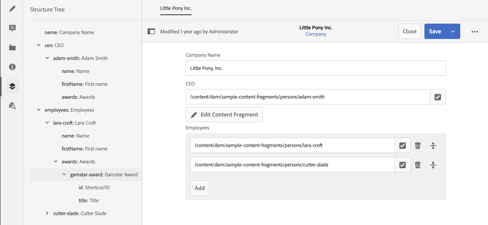

# 內容片段結構樹 {#content-fragment-structure-tree}

使用AEM中內容片段編輯器的結構樹功能，更能瞭解您的Headless內容。

在內容片段編輯器中，您可以選取「結構樹」圖示：

這會在左側窗格中開啟片段結構的表示法。 您可以使用此項來導覽所參考的片段，以及瀏覽至所參考的片段。 選取一個參考會開啟該片段供您編輯。

>[!NOTE]
>
>使用主面板中的階層連結，您可以瀏覽回起點。

