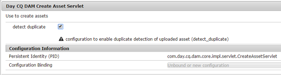

# 啟用偵測重複資產 {#enable-detection-of-duplicate-assets}

如果您嘗試上傳[!DNL Adobe Experience Manager Assets]中存在的資產，重複資料偵測功能會將其識別為重複。 重複資料偵測預設為停用。 若要啟用此功能，請執行下列步驟：

1. 存取`https://[aem_server]:[port]/system/console/configMgr`以開啟[!DNL Experience Manager] Web主控台設定頁面。
1. 編輯Servlet **[!UICONTROL Day CQ DAM建立資產]**&#x200B;的設定。
1. 選取&#x200B;**[!UICONTROL 偵測重複]**&#x200B;選項，然後按一下&#x200B;**[!UICONTROL 儲存]**。

   

   *圖：選取servlet中的偵測重複選項。*

[!DNL Assets]中現在已啟用偵測重複功能。 當使用者嘗試上傳存在於[!DNL Experience Manager]中的資產時，系統會檢查衝突並加以指示。 資產識別使用儲存在`jcr:content/metadata/dam:sha1`的SHA-1雜湊，這表示不論檔案名稱為何，都會偵測到重複的資產。

>[!MORELIKETHIS]
>
>* [在現有存放庫中複製資產（來自社群成員的教學課程）](https://experience-aem.blogspot.com/2019/06/aem-65-find-duplicate-assets-binaries-in-existing-repository.html)
>* [在AEM as a Cloud Service中偵測重複的資產](https://experienceleague.adobe.com/docs/experience-manager-cloud-service/content/assets/admin/detect-duplicate-assets.html)
