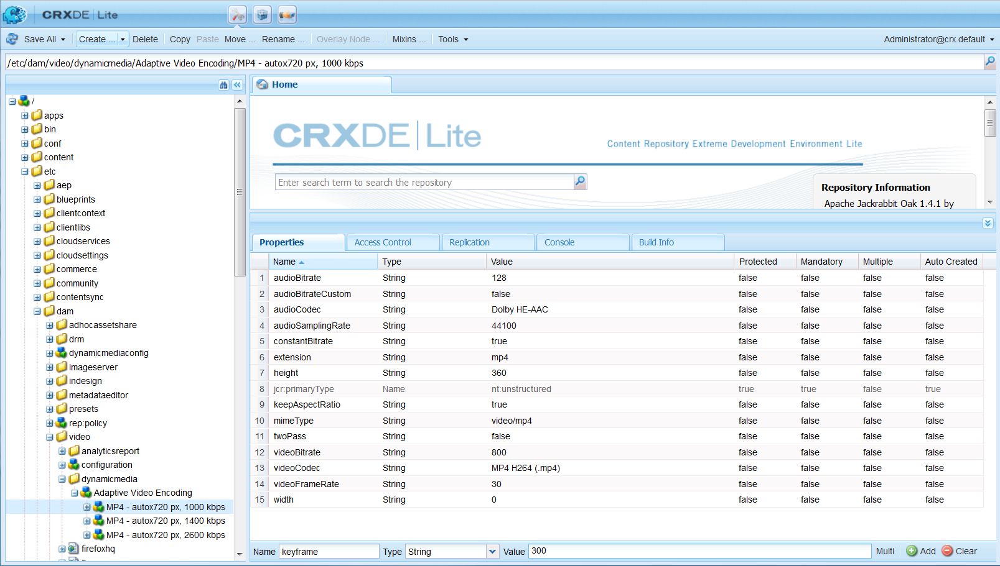

# 視訊設定檔 {#video-profiles}

Dynamic Media已隨附預先定義的自我調整視訊編碼設定檔。 此現成可用設定檔中的設定已最佳化，讓您的客戶獲得最佳檢視體驗。 當您使用最適化視訊編碼設定檔編碼您的主要來源視訊時，視訊播放器會最佳化播放品質。 它會根據客戶的網際網路連線速度自動調整視訊資料流。 此功能稱為最適化位元速率串流。

以下是決定視訊品質的其他因素：

* **已上傳主要來源視訊的解析度**

  如果MP4視訊是以較低的解析度錄製（例如240p或360p），則無法以高解析度進行串流。

* **視訊播放器大小**

  依預設，最適化視訊編碼設定檔中的「寬度」會設為「自動」。 在播放期間，視訊播放器會根據其大小自動選取最佳品質。

請參閱[視訊編碼的最佳實務](/help/assets/video.md#best-practices-for-encoding-videos)。

另請參閱[組織數位Assets以使用處理設定檔的最佳實務](/help/assets/organize-assets.md)。

>[!NOTE]
>
>若要產生視訊的中繼資料和相關的視訊影像縮圖，視訊本身必須經過Dynamic Media中的編碼程式。 在Adobe Experience Manager中，如果您已啟用動態媒體並設定視訊雲端服務，**[!UICONTROL 動態媒體編碼視訊]**&#x200B;工作流程會對視訊進行編碼。 此工作流程會擷取工作流程處理歷程記錄和失敗資訊。請參閱[監視視訊編碼和YouTube發佈進度](/help/assets/video.md#monitoring-video-encoding-and-youtube-publishing-progress)。 如果您已啟用Dynamic Media並設定視訊雲端服務，當您上傳視訊時，**[!UICONTROL Dynamic Media編碼視訊]**&#x200B;工作流程會自動生效。 （如果您未使用Dynamic Media，**[!UICONTROL DAM更新資產]**&#x200B;工作流程將會生效。）
>
>中繼資料在搜尋資產時相當實用。 縮圖是在編碼期間產生的靜態視訊影像。 Experience Manager系統需要這些視訊，並在使用者介面中使用這些視訊，協助您在「卡片」檢視、「搜尋結果」檢視和「資產清單」檢視中以視覺化方式識別影片。 當您選取已編碼視訊的「轉譯」圖示（上色調色盤）時，可以看到產生的縮圖。

當您完成視訊描述檔的建立後，可將其套用至一個或多個資料夾。 請參閱[將視訊設定檔套用至資料夾](#applying-a-video-profile-to-folders)。

若要定義其他資產型別的進階處理引數，請參閱[設定資產處理](/help/assets/config-dms7.md#configuring-asset-processing)。

另請參閱[處理中繼資料、影像和影片的設定檔](processing-profiles.md)。

## 自我調整視訊編碼預設集 {#adaptive-video-encoding-presets}

下表列出將自我調整視訊串流傳送到行動裝置、平板電腦裝置和桌上型電腦的最佳實務編碼設定檔。 您可以對任何長寬比視訊使用這些預設集。

<table>
 <tbody>
  <tr>
   <td><strong>視訊格式轉碼器</strong></td>
   <td><strong>視訊大小 — 寬度(px)</strong></td>
   <td><strong>視訊大小 — 高度(px)</strong></td>
   <td><strong>保持外觀比例？</strong></td>
   <td><strong>視訊位元速率(Kbps)</strong></td>
   <td><strong>視訊影格速率(Fps)</strong></td>
   <td><strong>音訊轉碼器</strong></td>
   <td><strong>音訊位元速率(Kbps)</strong></td>
  </tr>
  <tr>
   <td>
MP4 H.264 (mp4)
 </td>
   <td>自動</td>
   <td>360</td>
   <td>是</td>
   <td>730</td>
   <td>30</td>
   <td>Dolby HE-AAC</td>
   <td>128</td>
  </tr>
  <tr>
   <td>
MP4 H.264 (mp4)
 </td>
   <td>自動</td>
   <td>540</td>
   <td>是</td>
   <td>2000  </td>
   <td>30</td>
   <td>Dolby HE-AAC</td>
   <td>128</td>
  </tr>
  <tr>
   <td>
MP4 H.264 (mp4)
 </td>
   <td>自動</td>
   <td>720  </td>
   <td>是</td>
   <td>3000  </td>
   <td>30</td>
   <td>Dolby HE-AAC</td>
   <td>128</td>
  </tr>
 </tbody>
</table>

## 關於在視訊設定檔中使用智慧型裁切 {#about-smart-crop-video}

視訊智慧型裁切功能（視訊描述檔提供的選用功能）是運用Adobe Sensei人工智慧功能的工具。 它會自動偵測並裁切您上傳之任何最適化視訊或漸進式視訊中的焦點，無論大小。

支援的智慧型裁切視訊格式包括MP4、MKV、MOV、AVI、FLV和WMV。

智慧型裁切支援的視訊檔案大小上限如下：

* 持續五分鐘。
* 每秒30個畫面(FPS)。
* 300-MB檔案大小。

Adobe Sensei限製為9000個畫面。 也就是說，30 FPS時需要5分鐘。 如果您的視訊具有較高的FPS，則支援的最大視訊持續時間會減少。 例如，Adobe Sensei和智慧型裁切只有在長度至少為二分半鐘時，才支援60 FPS視訊。

視訊

>[!IMPORTANT]
>
>若要讓視訊智慧型裁切運作，您必須在視訊設定檔中加入一或多個視訊編碼預設集。

若要針對視訊使用智慧型裁切，請建立最適化或漸進式視訊編碼設定檔。 在您的設定檔中，使用&#x200B;**[!UICONTROL 智慧型裁切比例]**&#x200B;工具來選取預先定義的外觀比例。 例如，在定義視訊編碼預設集後，您可以新增外觀比例為16×9的「行動橫向」定義。 您也可以新增外觀比例為9×16的「行動縱向」定義。 其他外觀或裁切比例可供您選擇，包括1 × 1、4 × 3和4 × 5。

您可以使用使用者介面中&#x200B;**[!UICONTROL 智慧型裁切比例]**&#x200B;最右側的滑桿，將視訊描述檔中的視訊智慧型裁切切換為開啟或關閉。

建立並儲存視訊設定檔後，您可以將其套用至您想要的資料夾。

請參閱[將視訊設定檔套用至特定資料夾](#applying-video-profiles-to-specific-folders)或[全域套用視訊設定檔](#applying-a-video-profile-globally)。

另請參閱[影像的智慧型裁切](image-profiles.md)。

## 建立視訊設定檔以進行最適化位元速率串流 {#creating-a-video-encoding-profile-for-adaptive-streaming}

Dynamic Media已隨附預先定義的自我調整視訊編碼設定檔（MP4 H.264的一組視訊上傳設定），此設定檔已最佳化為提供最佳檢視體驗。 上傳視訊時，您可以使用此設定檔。

不過，如果此預先定義的設定檔不符合您的需求，您可以選擇建立您自己的最適化視訊編碼設定檔。 當您使用設定&#x200B;**[!UICONTROL 最適化串流編碼]** — 作為最佳實務 — 您新增到設定檔的所有編碼預設集都會經過驗證，以確保所有視訊具有相同的外觀比例。 此外，經過編碼的視訊會被視為串流適用的多位元速率集。

當您建立視訊編碼設定檔時，請注意大多數編碼選項都會預先填入建議的預設設定，以協助您。 不過，如果您選取的值不是建議的預設值，可能會導致錄放期間的視訊品質變差以及其他效能問題。

因此，為了啟用自我調整位元速率串流，系統會驗證設定檔中所有MP4 H.264視訊編碼預設集的某些值。 設定檔中的個別編碼預設集必須保持下列值一致：

* 視訊格式轉碼器 — MP4 H.264 (.mp4)
* 音訊轉碼器
* 音訊位元速率
* 保持外觀比例
* 兩階段編碼
* 固定位元速率
* H264 設定檔
* 音訊取樣速率

如果值不同，您可以繼續依原樣建立設定檔。 不過，無法進行自我調整位元速率串流。 相反地，使用者會體驗單一位元速率串流。 Adobe建議您編輯編碼設定，以在設定檔中的個別編碼預設集中使用相同的值。 （如果已啟用&#x200B;**[!UICONTROL 自我調整資料流的編碼]**，視訊設定檔/預設集編輯器會強制自我調整視訊編碼設定的同位檢查。）

另請參閱[建立漸進式資料流的視訊編碼設定檔](#creating-a-video-encoding-profile-for-progressive-streaming)。

另請參閱[視訊編碼的最佳實務](/help/assets/video.md#best-practices-for-encoding-videos)。

若要定義其他資產型別的進階處理引數，請參閱[設定資產處理](/help/assets/config-dms7.md#configuring-asset-processing)。

**若要建立最適化位元速率資料流的視訊設定檔**，

1. 選取Experience Manager標誌並導覽至&#x200B;**[!UICONTROL 工具]** > **[!UICONTROL Assets]** > **[!UICONTROL 視訊設定檔]**。
1. 選取&#x200B;**[!UICONTROL 建立]**&#x200B;以新增視訊設定檔。

1. 輸入設定檔的名稱和描述。
1. 在[建立/編輯視訊編碼預設集]頁面上，選取[**[!UICONTROL 新增視訊編碼預設集]**]。
1. 在&#x200B;**[!UICONTROL 基本]**索引標籤上，設定視訊和音訊選項。
選取每個選項旁邊的資訊圖示。 您可以閱讀相關說明，或根據所選視訊格式轉碼器建議的設定。
1. 在「視訊大小」標題下，確定已核取&#x200B;**[!UICONTROL 保持外觀比例]**&#x200B;選項。
1. 設定視訊影格大小解析度（畫素）。 使用&#x200B;**[!UICONTROL Auto]**&#x200B;值可自動縮放以符合來源外觀比例（寬高比）。 例如，Auto × 480或640 × Auto。

1. 執行下列任一項作業：

   * 在&#x200B;**[!UICONTROL 寬度]**&#x200B;欄位中，輸入&#x200B;**[!UICONTROL 自動]**。 在&#x200B;**[!UICONTROL 高度]**&#x200B;欄位中，輸入畫素值。

   * 若要協助您視覺化視訊的大小，請選取&#x200B;**[!UICONTROL 高度]**&#x200B;右邊的「資訊」圖示(i)以開啟「大小電腦」頁面。 使用&#x200B;**[!UICONTROL 大小電腦]**&#x200B;設定您想要的視訊尺寸（以藍色方塊表示）。 完成時，選取右上角的&#x200B;**[!UICONTROL X]**。

1. （選擇性）選取&#x200B;**[!UICONTROL 進階]**&#x200B;索引標籤，並確定已選取&#x200B;**[!UICONTROL 使用預設值]**&#x200B;核取方塊（建議）。 或者，修改進階視訊與音訊設定。
1. 在頁面的右上角，選取「**[!UICONTROL 儲存]**」以儲存預設集。
1. 執行下列任一項作業：
   * 重複步驟4至10，建立其他編碼預設集。 （最適化視訊串流需要多個視訊預設集）。
   * 繼續下一個步驟。

1. （可選）若要將視訊智慧型裁切新增至套用此設定檔的視訊，請執行下列動作：
   * 在「編輯視訊描述檔」頁面的「智慧型裁切比例」標題右側，選取「**[!UICONTROL 新增]**」。
   * 在「名稱」欄位中，輸入裁切比率的名稱，協助您輕鬆識別。
   * 從&#x200B;**[!UICONTROL 裁切比例]**&#x200B;下拉式清單中，選取您要使用的比例。

1. 執行下列任一項作業：

   * 視需要繼續新增裁切比例。
   * 繼續下一個步驟。

1. 在頁面的右上角，再次選取&#x200B;**[!UICONTROL 儲存]**&#x200B;以儲存設定檔。

您現在可以將設定檔套用至包含影片的資料夾。 請參閱[將視訊設定檔套用至資料夾](#applying-a-video-profile-to-folders)或[全域套用視訊設定檔](#applying-a-video-profile-globally)。

## 建立漸進式串流的視訊設定檔 {#creating-a-video-encoding-profile-for-progressive-streaming}

如果您選擇不使用&#x200B;**[!UICONTROL 自我調整資料流的編碼]**&#x200B;選項，則您新增至設定檔的所有編碼預設集都會被視為個別視訊轉譯，以用於單位元速率資料流或漸進式視訊傳送。 此外，沒有驗證可確保所有視訊轉譯具有相同的外觀比例。

視您執行的模式而定，支援的視訊格式轉碼器如下：

* Dynamic Media-Scene7模式： H.264 (.mp4)
* Dynamic Media-Hybrid模式：H.264 (.mp4)、WebM

另請參閱[建立最適化位元速率資料流的視訊編碼設定檔](#creating-a-video-encoding-profile-for-adaptive-streaming)。

另請參閱[視訊編碼的最佳實務](/help/assets/video.md#best-practices-for-encoding-videos)。

若要定義其他資產型別的進階處理引數，請參閱[設定資產處理](/help/assets/config-dms7.md#configuring-asset-processing)。

**若要建立漸進式串流的視訊設定檔：**

1. 選取Experience Manager標誌並導覽至&#x200B;**[!UICONTROL 工具]** > **[!UICONTROL Assets]** > **[!UICONTROL 視訊設定檔]**。
1. 選取&#x200B;**[!UICONTROL 建立]**&#x200B;以新增視訊設定檔。
1. 輸入設定檔的名稱和描述。
1. 在[建立/編輯視訊編碼預設集]頁面上，選取[**[!UICONTROL 新增視訊編碼預設集]**]。
1. 在&#x200B;**[!UICONTROL 基本]**索引標籤上，設定視訊和音訊選項。
選取每個選項旁的資訊圖示。 您可以閱讀其他說明，或根據選取的視訊格式轉碼器建議的設定。
1. （選擇性）在「視訊大小」標題下，取消勾選「**[!UICONTROL 保持外觀比例]**」。
1. 請執行下列動作：
   * 在&#x200B;**[!UICONTROL 寬度]**&#x200B;欄位中，輸入&#x200B;**[!UICONTROL 自動]**。
   * 在&#x200B;**[!UICONTROL 高度]**欄位中，輸入畫素值。
若要協助您視覺化視訊的大小，請選取「高度」的資訊圖示以開啟**[!UICONTROL 大小電腦]**&#x200B;頁面。 使用&#x200B;**[!UICONTROL 大小電腦]**&#x200B;頁面，以您想要的方式進一步設定視訊尺寸（藍方塊）。 完成後，在對話方塊的右上角，選取&#x200B;**[!UICONTROL X]**。
1. （可選）執行下列任一項作業：

   * 選取&#x200B;**[!UICONTROL 進階]**&#x200B;標籤，並確認已選取&#x200B;**[!UICONTROL 使用預設值]**&#x200B;核取方塊（建議使用）。

   * 清除&#x200B;**[!UICONTROL 使用預設值]**核取方塊，並指定您想要的視訊設定和音訊設定。
選取每個選項旁的資訊圖示。 您可以閱讀其他說明，或根據選取的視訊格式轉碼器建議的設定。

1. 在頁面的右上角，選取「**[!UICONTROL 儲存]**」以儲存預設集。
1. 執行下列任一項作業：

   * 重複步驟4-9以建立其他編碼預設集。
   * 繼續下一個步驟。

1. （可選）若要將視訊智慧型裁切新增至套用此設定檔的視訊，請執行下列動作：

   * 在「編輯視訊描述檔」頁面的「智慧型裁切比例」標題右側，選取「**[!UICONTROL 新增]**」。
   * 在「名稱」欄位中，輸入裁切比率的名稱，協助您輕鬆識別。
   * 從&#x200B;**[!UICONTROL 裁切比例]**&#x200B;下拉式清單中，選取您要使用的比例。

1. 執行下列任一項作業：

   * 視需要繼續新增裁切比例。
   * 繼續下一個步驟。

1. 在頁面的右上角，選取&#x200B;**[!UICONTROL 儲存]**&#x200B;以儲存設定檔。

您現在可以將設定檔套用至包含影片的資料夾。 請參閱[將視訊設定檔套用至資料夾](#applying-a-video-profile-to-folders)或[全域套用視訊設定檔](#applying-a-video-profile-globally)。

## 使用自訂新增的視訊編碼引數 {#using-custom-added-video-encoding-parameters}

您可以編輯現有的視訊編碼設定檔，以存取進階視訊編碼引數。 在Experience Manager中建立或編輯視訊設定檔時，這些引數無法在使用者介面中使用。 新增一或多個進階引數（例如minBitrate和maxBitrate）至您現有的設定檔。

**若要使用自訂新增的視訊編碼引數：**

1. 選取Experience Manager標誌，然後導覽至&#x200B;**[!UICONTROL 工具]** > **[!UICONTROL 一般]** > **[!UICONTROL CRXDE Lite]**。
1. 從CRXDE Lite頁面，在左側的Explorer面板中導覽至下列專案：

   `/conf/global/settings/dam/dm/presets/video/*name_of_video_encoding_profile_to_edit`

1. 在頁面右下方的面板中，從「屬性」標籤中，指定您要使用之參 **[!UICONTROL 數的「名稱]**」、「類型」和「 **[!UICONTROL 值]****** 」。

   下列進階引數可供使用：

<table>
 <tbody>
  <tr>
   <td><strong>名稱</strong></td>
   <td><strong>說明</strong>  </td>
   <td><strong>類型</strong>  </td>
   <td><strong>值</strong></td>
  </tr>
  <tr>
   <td><code>h264Level</code></td>
   <td>用於編碼的H.264層級。 一般而言，此引數會根據您使用的編碼設定自動決定。</td>
   <td><code>String</code></td>
   <td>
10 * h264層級
 
例如3.0 = 30， 1.3 = 13)
 
無預設值。
 </td>
  </tr>
  <tr>
   <td><code>keyframe</code></td>
   <td>關鍵影格之間的目標影格數。 計算此值，以便每2-10秒產生一個關鍵影格。 例如，以每秒30個影格為例，關鍵影格間隔應該是60-300。   較低的關鍵影格間隔可改善最適化視訊編碼的串流搜尋和串流切換行為，也可能改善高動態視訊的品質。 不過，由於關鍵影格會增加檔案的大小，因此較低的關鍵影格間隔通常會導致指定位元速率下的整體視訊品質較低。</td>
   <td><code>String</code></td>
   <td>
正數。
 
預設值為300。
 
DASH或HLS的建議值為60-90。
 </td>
  </tr>
  <tr>
   <td><code>minBitrate</code></td>
   <td>
允許可變位元速率編碼的最小位元速率，以Kbps （每秒千位元）表示。
 
此引數只適用於當您建立或編輯視訊編碼設定檔時，在[進階]索引標籤中取消選取<strong>使用固定位元速率</strong>的情況。
 
另請參閱<a href="/help/assets/video.md#bitrate">位元速率</a>。
 </td>
   <td><code>String</code></td>
   <td>
正數（以Kbps為單位）。
 
無預設值。
 </td>
  </tr>
  <tr>
   <td><code>maxBitrate</code></td>
   <td>
允許可變位元速率編碼的最大位元速率（以Kbps為單位）。
 
此引數只適用於當您建立或編輯視訊編碼設定檔時，在[進階]索引標籤中取消選取<strong>使用固定位元速率</strong>的情況。
 
另請參閱<a href="/help/assets/video.md#bitrate">位元速率</a>。
 </td>
   <td><code>String</code></td>
   <td>
正數（以Kbps為單位）。
 
無預設值。 不過，建議值最多為編碼位元速率的2倍。
 </td>
  </tr>
  <tr>
   <td><code>audioBitrateCustom</code></td>
   <td>若音訊轉碼器支援，請將值設為<code>true</code>以強制音訊資料流使用常數位元速率。</td>
   <td><code>String</code></td>
   <td>
<code>true</code>/<code>false</code>
 
預設值為<code>false</code>。
 
DASH或HLS的建議值為<code>false</code>。
 
 
 </td>
  </tr>
 </tbody>
</table>

1. 在頁面的右下角附近，選取&#x200B;**[!UICONTROL 新增]**。
1. 執行下列任一項作業：

   * 重複步驟3和4，將另一個引數新增至視訊編碼設定檔。
   * 在頁面的左上角附近，選取&#x200B;**[!UICONTROL 全部儲存]**。

1. 在CRXDE Lite頁面的左上角，選取&#x200B;**[!UICONTROL 首頁]**&#x200B;圖示以返回Experience Manager。

### 編輯視訊設定檔 {#editing-a-video-encoding-profile}

您可以編輯任何您建立的視訊設定檔，以新增、編輯或刪除該設定檔中的視訊預設集。

依預設，您無法編輯隨附於Dynamic Media的預定義、現成可用的&#x200B;**[!UICONTROL 最適化視訊編碼]**&#x200B;設定檔。 相反地，您可以輕鬆複製設定檔，並使用新名稱儲存。 然後，您可以在複製的設定檔中編輯所需的預設集。

另請參閱[視訊編碼的最佳實務](/help/assets/video.md#best-practices-for-encoding-videos)。

若要定義其他資產型別的進階處理引數，請參閱[設定資產處理](/help/assets/config-dms7.md#configuring-asset-processing)。

**若要編輯視訊設定檔：**

1. 選取Experience Manager標誌並導覽至&#x200B;**[!UICONTROL 工具]** > **[!UICONTROL Assets]** > **[!UICONTROL 視訊設定檔]**。
1. 在「視訊設定檔」頁面上，檢查一個視訊設定檔名稱。
1. 在工具列上，選取&#x200B;**[!UICONTROL 編輯]**。
1. 在「視訊編碼設定檔」頁面上，視需要編輯名稱和說明。
1. 最佳實務是，請確定已選取&#x200B;**[!UICONTROL 最適化位元速率串流編碼]**核取方塊。
選取資訊圖示以取得最適化位元速率串流的說明。 （如果您正在編輯漸進式視訊設定檔，請勿選取此核取方塊。）
1. 在「視訊編碼預設集」標題下，新增、編輯或刪除組成設定檔的視訊編碼預設集。

   選取&#x200B;**[!UICONTROL 基本]**&#x200B;和&#x200B;**[!UICONTROL 進階]**&#x200B;標籤上每個選項旁的資訊圖示。 您可以閱讀其他說明，或根據選取的視訊格式轉碼器建議的設定。

1. 在頁面的右上角，選取&#x200B;**[!UICONTROL 儲存]**。

### 複製視訊設定檔 {#copying-a-video-encoding-profile}

1. 選取Experience Manager標誌並導覽至&#x200B;**[!UICONTROL 工具]** > **[!UICONTROL Assets]** > **[!UICONTROL 視訊設定檔]**。
1. 在「視訊設定檔」頁面上，檢查一個視訊設定檔名稱。
1. 在工具列上，選取&#x200B;**[!UICONTROL 複製]**。
1. 在「視訊編碼設定檔」頁面上，輸入設定檔的新名稱。
1. 最佳實務是，請確定已選取「 **[!UICONTROL 最適化串流編碼]** 」核取方塊。選取資訊圖示以取得最適化位元速率串流的說明。  (如果您要複製漸進式視訊輪廓，請勿選取核取方塊。) 

   在Dynamic Media — 混合模式中，如果WebM視訊預設集是視訊設定檔的一部分，則無法針對最適化串流進行&#x200B;**[!UICONTROL 編碼，因為所有預設集都必須是MP4。]**
1. 在「視訊編碼預設集」標題下，新增、編輯或刪除組成設定檔的視訊編碼預設集。

   選取「基本」和「進階」標籤上每個選項旁的資訊圖示。 您可以閱讀建議的設定和說明。

1. 在頁面的右上角，選取&#x200B;**[!UICONTROL 儲存]**。

### 刪除視訊設定檔 {#deleting-a-video-encoding-profile}

1. 選取Experience Manager標誌並導覽至&#x200B;**[!UICONTROL 工具]** > **[!UICONTROL Assets]** > **[!UICONTROL 視訊設定檔]**。
1. 在「視訊設定檔」頁面上，檢查一或多個視訊設定檔名稱。
1. 在工具列上，選取&#x200B;**[!UICONTROL 刪除]**。
1. 選取&#x200B;**[!UICONTROL 確定]**。

## 將視訊設定檔套用至資料夾 {#applying-a-video-profile-to-folders}

將視訊描述檔指派給資料夾時，所有子資料夾都會自動從其父資料夾繼承描述檔。 此規則表示您只能將一個視訊設定檔指派至資料夾。 因此，請仔細考慮您上傳、儲存、使用和封存資產的資料夾結構。

如果您將不同的視訊描述檔指派給資料夾，則新的描述檔會覆寫先前的描述檔。 先前現有的資料夾資產保持不變。 新設定檔會套用至稍後新增至資料夾的資產。

使用者介面會在卡片名稱中顯示設定檔名稱，以表示具有指派設定檔的資料夾。

您可以將視訊設定檔套用至特定資料夾，或全域套用至所有資產。

若資料夾中已有您後來加以變更的現有視訊設定檔，您可以重新處理該資料夾中的資產。 檢視在您編輯資料夾中資產的處理設定檔後，[重新處理資料夾中的資產](processing-profiles.md#reprocessing-assets)。

### 將視訊設定檔套用至特定資料夾 {#applying-video-profiles-to-specific-folders}

您可以從「工具」菜單或在資料夾中從「屬性」將視訊設定檔應 **[!UICONTROL 用到資料夾]******。本節說明如何以兩種方式將視訊描述檔套用至資料夾。

使用者介面會在卡片名稱中顯示設定檔名稱，以表示具有指派設定檔的資料夾。

另請參閱[在您編輯資料夾中資產的處理設定檔後，重新處理該資料夾中的資產](processing-profiles.md#reprocessing-assets)。

#### 透過「設定檔」使用者介面將視訊設定檔套用至資料夾 {#applying-video-profiles-to-folders-by-way-of-the-profiles-user-interface}

1. 選取Experience Manager標誌並導覽至&#x200B;**[!UICONTROL 工具]** > **[!UICONTROL Assets]** > **[!UICONTROL 視訊設定檔]**。
1. 選取您要套用至一或多個資料夾的視訊設定檔。
1. 選取&#x200B;**[!UICONTROL 將設定檔套用至資料夾]**，然後選取您要用來接收新上傳資產的資料夾或多個資料夾，並選取&#x200B;**[!UICONTROL 套用]**。 使用者介面會在卡片名稱中顯示設定檔名稱，以表示具有指派設定檔的資料夾。

   您可以[監視視訊設定檔處理工作](#monitoring-the-progress-of-an-encoding-job)的進度。

#### 從「屬性」將視訊設定檔套用至資料夾 {#applying-video-profiles-to-folders-from-properties}

1. 選取Experience Manager標誌並導覽至&#x200B;**[!UICONTROL Assets]**，然後導覽至您要套用視訊設定檔的資料夾。
1. 在資料夾中，選取核取記號以選取資料夾，然後選取&#x200B;**[!UICONTROL 屬性]**。
1. 選取「**[!UICONTROL 視訊設定檔]**」標籤，然後從下拉式選單中選取設定檔，然後選取「**[!UICONTROL 儲存並關閉]**」。 使用者介面會在卡片名稱中顯示設定檔名稱，以表示具有指派設定檔的資料夾。

   
您可以[監視視訊設定檔處理工作的進度](#monitoring-the-progress-of-an-encoding-job)。

### 全域套用視訊設定檔 {#applying-a-video-profile-globally}

除了將設定檔套用至資料夾外，您也可以全域套用設定檔，以便任何資料夾中上傳至Experience Manager Assets的任何內容都會套用選取的設定檔。

另請參閱[在您編輯資料夾中資產的處理設定檔後，重新處理該資料夾中的資產](processing-profiles.md#reprocessing-assets)。

**若要全域套用視訊設定檔：**

* 導覽至CRXDE Lite至下列節點： `/content/dam/jcr:content`。 新增屬性`videoProfile:/libs/settings/dam/video/dynamicmedia/<name of video encoding profile>`並選取&#x200B;**[!UICONTROL 全部儲存]**。

  
* 您可以[監視視訊設定檔處理工作](#monitoring-the-progress-of-an-encoding-job)的進度。

## 監視視訊設定檔處理工作的進度 {#monitoring-the-progress-of-an-encoding-job}

系統會顯示處理指示器（或進度列），讓您以視覺化方式監視視訊設定檔處理工作的進度。

您也可以檢視`error.log`檔案，以監視編碼工作的進度、檢視編碼是否已完成或檢視任何工作錯誤。 在安裝Experience Manager執行個體的`logs`資料夾中找到`error.log`。

## 從資料夾中移除視訊設定檔 {#removing-a-video-profile-from-folders}

當您從資料夾中移除視訊描述檔時，任何子資料夾都會自動繼承其父資料夾中該描述檔的移除作業。 不過，在資料夾內發生的任何檔案處理作業都會維持不變。

您可以從「工具」功能表內的資料夾或在資料夾內的「資料夾設定」中移除視訊設定檔 ********。本節說明如何以兩種方式從資料夾中移除視訊描述檔。

### 透過「設定檔」使用者介面從資料夾中移除視訊設定檔 {#removing-video-profiles-from-folders-by-way-of-the-profiles-user-interface}

1. 選取Experience Manager標誌並導覽至&#x200B;**[!UICONTROL 工具]** > **[!UICONTROL Assets]** > **[!UICONTROL 視訊設定檔]**。
1. 選取您要從資料夾或多個資料夾移除的視訊設定檔。
1. 選取&#x200B;**[!UICONTROL 從資料夾移除設定檔]**，然後選取您要用來從中移除設定檔的資料夾或多個資料夾，並選取&#x200B;**[!UICONTROL 移除]**。

   您可以確認視訊描述檔不再套用至資料夾，因為資料夾名稱下方不再有該名稱。

### 透過「屬性」將視訊設定檔從資料夾中移除 {#removing-video-profiles-from-folders-by-way-of-properties}

1. 選取Experience Manager標誌並導覽至&#x200B;**[!UICONTROL Assets]**，然後導覽至您要移除其視訊設定檔的資料夾。
1. 在資料夾中，選取核取記號，然後選取&#x200B;**[!UICONTROL 屬性]**。
1. 選取「**[!UICONTROL 視訊設定檔]**」標籤，然後從下拉式功能表中選取「**[!UICONTROL 無]**」，然後選取「**[!UICONTROL 儲存並關閉]**」。 使用者介面會在卡片名稱中顯示設定檔名稱，以表示具有指派設定檔的資料夾。
