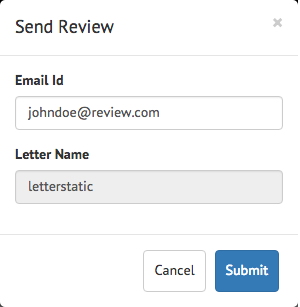

# 在建立通訊UI中新增自訂動作按鈕 {#add-custom-action-button-in-create-correspondence-ui}

## 概觀 {#overview}

「通訊管理」解決方案可讓您將自訂動作新增到「建立通訊」使用者介面。

本檔案中的案例說明如何在「建立通訊」使用者介面中建立按鈕，以共用信函作為附加到電子郵件的稽核PDF。

### 先決條件 {#prerequisites}

若要完成此案例，您需要下列專案：

* CRX和JavaScript的相關知識
* LiveCycle Server

## 案例：在「建立通訊使用者介面」中建立按鈕，以傳送信件以供複查 {#scenario-create-the-button-in-the-create-correspondence-user-interface-to-send-a-letter-for-review}

將具有動作的按鈕（在此傳送信件以供稽核）新增至「建立通訊」使用者介面包括：

1. 將按鈕新增至建立通訊使用者介面
1. 新增動作處理至按鈕
1. 新增LiveCycle程式以啟用動作處理

### 將按鈕新增至「建立通訊」使用者介面 {#add-the-button-to-the-create-correspondence-user-interface}

1. 前往`https://'[server]:[port]'/[ContextPath]/crx/de`並以管理員身分登入。
1. 在apps資料夾中，建立名為`defaultApp`的資料夾，其路徑/結構類似於defaultApp資料夾（在config資料夾中）。 使用下列步驟建立資料夾：

   1. 在下列路徑的&#x200B;**defaultApp**&#x200B;資料夾上按一下滑鼠右鍵，然後選取&#x200B;**覆蓋節點**：

      /libs/fd/cm/config/defaultApp/

      

   1. 請確定「覆蓋節點」對話方塊是否具備下列值：

      **路徑：** /libs/fd/cm/config/defaultApp/

      **覆蓋位置：** /apps/

      **符合節點型別：**&#x200B;已核取

      

   1. 按一下&#x200B;**「確定」**。
   1. 按一下&#x200B;**「儲存全部」**。

1. 複製/apps分支下的acmExtensionsConfig.xml檔案（存在於/libs分支下）。

   1. 前往「/libs/fd/cm/config/defaultApp/acmExtensionsConfig.xml」

   1. 以滑鼠右鍵按一下acmExtensionsConfig.xml檔案，然後選取&#x200B;**複製**。

      

   1. 以滑鼠右鍵按一下位於&quot;/apps/fd/cm/config/defaultApp/&quot;的&#x200B;**defaultApp**&#x200B;資料夾，然後選取&#x200B;**貼上**。
   1. 按一下&#x200B;**「儲存全部」**。

1. 連按兩下您在apps資料夾中新建立的acmExtentionsConfig.xml復本。 檔案會開啟以進行編輯。
1. 找到下列程式碼：

   ```xml
   <?xml version="1.0" encoding="utf-8"?>
   <extensionsConfig>
       <modelExtensions>
           <modelExtension type="LetterInstance">
     <customAction name="Preview" label="loc.letterInstance.preview.label" tooltip="loc.letterInstance.preview.tooltip" styleName="previewButton"/>
               <customAction name="Submit" label="loc.letterInstance.submit.label" tooltip="loc.letterInstance.submit.tooltip" styleName="submitButton" permissionName="forms-users"/>
               <customAction name="SaveAsDraft" label="loc.letterInstance.saveAsDraft.label" tooltip="loc.letterInstance.saveAsDraft.tooltip" styleName="submitButton" permissionName="forms-users"/>
               <customAction name="Close" label="loc.letterInstance.close.label" tooltip="loc.letterInstance.close.tooltip" styleName="closeButton"/>
           </modelExtension>
       </modelExtensions>
   </extensionsConfig>
   ```

1. 若要以電子郵件傳送信件，您可以使用LiveCycle Forms Workflow。 在acmExtensionsConfig.xml的modelExtension標籤下新增customAction標籤，如下所示：

   ```xml
    <customAction name="Letter Review" label="Letter Review" tooltip="Letter Review" styleName="" permissionName="forms-users" actionHandler="CM.domain.CCRCustomActionHandler">
         <serviceName>Forms Workflow -> SendLetterForReview/SendLetterForReviewProcess</serviceName>
       </customAction>
   ```

   

   modelExtension標籤有一組customAction子標籤，可用來設定動作、許可權和動作按鈕的外觀。 以下是customAction設定標籤的清單：

   | **名稱** | **說明** |
   |---|---|
   | 名稱 | 要執行的動作之英數字元名稱。 此標籤的值為必要項，必須是唯一值（在modelExtension標籤內），且必須以字母開頭。 |
   | 標籤 | 要顯示在動作按鈕上的標籤 |
   | 工具提示 | 按鈕的工具提示文字，當使用者將滑鼠懸停在按鈕上時顯示。 |
   | 樣式名稱 | 套用至動作按鈕的自訂樣式名稱。 |
   | permissionName | 只有當使用者具有permissionName所指定的許可權時，才會顯示對應的動作。 當您指定permissionName為`forms-users`時，所有使用者都能存取此選項。 |
   | actionHandler | 使用者按一下按鈕時所呼叫之ActionHandler類別的完整名稱。 |

   除了上述引數之外，還可以有其他與customAction相關聯的設定。 這些額外的設定可透過CustomAction物件供處理常式使用。

   | **名稱** | **說明** |
   |---|---|
   | serviceName | 如果customAction包含名為serviceName的子標籤，則按一下相關按鈕/連結時，會以由serviceName標籤代表的名稱呼叫程式。 確定此程式與信件PostProcess具有相同的簽章。 在服務名稱中新增「Forms Workflow ->」首碼。 |
   | 標籤名稱中包含cm_首碼的引數 | 如果customAction包含以名稱cm_開頭的子標籤，則在後置處理中（無論是信件後置處理或由serviceName標籤表示的特殊處理），這些引數可在相關標籤下方的輸入XML程式碼中使用，並會移除cm_前置詞。 |
   | actionName | 每當因點按而造成後處理時，提交的XML都會在標籤下包含具有名稱的特殊標籤，其名稱為使用者動作的名稱。 |

1. 按一下&#x200B;**「儲存全部」**。

#### 在/apps分支中建立具有屬性檔案的區域設定資料夾 {#create-a-locale-folder-with-properties-file-in-the-apps-branch}

ACMExtensionsMessages.properties檔案包含「建立通訊」使用者介面中各種欄位的標籤和工具提示訊息。 若要讓自訂動作/按鈕運作，請在/apps分支中製作此檔案的復本。

1. 用滑鼠右鍵按一下下列路徑的&#x200B;**地區設定**&#x200B;資料夾，然後選取&#x200B;**覆蓋節點**：

   /libs/fd/cm/config/defaultApp/locale

1. 請確定「覆蓋節點」對話方塊是否具備下列值：

   **路徑：** /libs/fd/cm/config/defaultApp/locale

   **覆蓋位置：** /apps/

   **符合節點型別：**&#x200B;已核取

1. 按一下&#x200B;**「確定」**。
1. 按一下&#x200B;**「儲存全部」**。
1. 用滑鼠右鍵按一下下列檔案，然後選取&#x200B;**複製**：

   `/libs/fd/cm/config/defaultApp/locale/ACMExtensionsMessages.properties`

1. 用滑鼠右鍵按一下下列路徑的&#x200B;**地區設定**&#x200B;資料夾，然後選取&#x200B;**貼上**：

   `/apps/fd/cm/config/defaultApp/locale/`

   ACMExtensionsMessages.properties檔案會複製到地區設定資料夾中。

1. 若要將新增的自訂動作/按鈕的標籤當地語系化，請在`/apps/fd/cm/config/defaultApp/locale/`中建立相關地區設定的ACMExtensionsMessages.properties檔案。

   例如，若要當地語系化本文中建立的自訂動作/按鈕，請使用下列專案建立名為ACMExtensionsMessages_fr.properties的檔案：

   `loc.letterInstance.letterreview.label=Revue De Lettre`

   同樣地，您可以在此檔案中新增更多屬性，例如工具提示和樣式。

1. 按一下&#x200B;**「儲存全部」**。

#### 重新啟動Adobe Asset Composer建置區塊套件 {#restart-the-adobe-asset-composer-building-block-bundle}

進行所有伺服器端變更後，請重新啟動Adobe資產撰寫器建置區塊套件組合。 在此案例中，會編輯伺服器端的acmExtensionsConfig.xml和ACMExtensionsMessages.properties檔案，因此Adobe資產撰寫器建置區塊套件組合需要重新啟動。

>[!NOTE]
>
>您可能需要清除瀏覽器快取。

1. 移至`https://[host]:'port'/system/console/bundles`。 如有必要，請以管理員身分登入。

1. 找出Adobe資產撰寫器建置區塊套件。 重新啟動套件：按一下[停止]，然後按一下[啟動]。

   

重新啟動Adobe資產撰寫器建置區塊套件組合後，「建立通訊」使用者介面中會顯示自訂按鈕。 您可以在建立通訊使用者介面中開啟信函以預覽自訂按鈕。

### 將動作處理新增至按鈕 {#add-action-handling-to-the-button}

根據預設，「建立通訊」使用者介面會在cm.domain.js檔案中的以下位置實施ActionHandler：

/libs/fd/cm/ccr/gui/components/admin/clientlibs/ccr/js/cm.domain.js

若要自訂動作處理，請在CRX的/apps分支中建立cm.domain.js檔案的覆蓋圖。

處理按一下動作/按鈕時的動作/按鈕包含下列邏輯：

* 將新增的動作設為visible/invisible：覆寫actionVisible()函式來完成。
* 啟用/停用新增的動作：覆寫actionEnabled()函式來完成。
* 使用者按一下按鈕時實際處理動作：覆寫handleAction()函式的實作來完成。

1. 移至`https://'[server]:[port]'/[ContextPath]/crx/de`。 如有必要，請以管理員身分登入。

1. 在apps資料夾中，在CRX的/apps分支中建立名為`js`的資料夾，其結構與下列資料夾類似：

   `/libs/fd/cm/ccr/gui/components/admin/clientlibs/ccrui/js`

   使用下列步驟建立資料夾：

   1. 在下列路徑的&#x200B;**js**&#x200B;資料夾上按一下滑鼠右鍵，然後選取&#x200B;**覆蓋節點**：

      `/libs/fd/cm/ccr/gui/components/admin/clientlibs/ccrui/js`

   1. 請確定「覆蓋節點」對話方塊是否具備下列值：

      **路徑：** /libs/fd/cm/ccr/gui/components/admin/clientlibs/crui/js

      **覆蓋位置：** /apps/

      **符合節點型別：**&#x200B;已核取

   1. 按一下&#x200B;**「確定」**。
   1. 按一下&#x200B;**「儲存全部」**。

1. 在js資料夾中，使用按鈕的動作處理程式碼，建立名為ccrcustomization.js的檔案，步驟如下：

   1. 在下列路徑的&#x200B;**js**&#x200B;資料夾上按一下滑鼠右鍵，然後選取&#x200B;**建立>建立檔案**：

      `/apps/fd/cm/ccr/gui/components/admin/clientlibs/ccrui/js`

      將檔案命名為ccrcustomization.js。

   1. 連按兩下ccrcustomization.js檔案，以在CRX中開啟。
   1. 在檔案中貼上下列程式碼，然後按一下[儲存全部] ****：

      ```javascript
      /* for adding and handling custom actions in Extensible Toolbar.
        * One instance of handler will be created for each action.
        * CM.domain.CCRCustomActionHandler is actionHandler class.
        */
      var CCRCustomActionHandler;
          CCRCustomActionHandler = CM.domain.CCRCustomActionHandler = new Class({
              className: 'CCRCustomActionHandler',
              extend: CCRDefaultActionHandler,
              construct : function(action,model){
              }
          });
          /**
           * Called when user user click an action
           * @param extraParams additional arguments that may be passed to handler (For future use)
           */
          CCRCustomActionHandler.prototype.handleAction = function(extraParams){
              if (this.action.name == CCRCustomActionHandler.SEND_FOR_REVIEW) {
                  var sendForReview = function(){
                      var serviceName = this.action.actionConfig["serviceName"];
                      var inputParams = {};
                      inputParams["dataXML"] = this.model.iccData.data;
                      inputParams["letterId"] = this.letterVO.id;
                      inputParams["letterName"] = this.letterVO.name;
                      inputParams["mailId"] = $('#email').val();
                      /*function to invoke the LivecyleService */
                      ServiceDelegate.callJSONService(this,"lc.icc.renderlib.serviceInvoker.json","invokeProcess",[serviceName,inputParams],this.onProcessInvokeComplete,this.onProcessInvokeFail);
                      $('#ccraction').modal("hide");
                  }
                  if($('#ccraction').length == 0){
                      /*For first click adding popup & setting letterName.*/
                      $("body").append(popUp);
                      $("input[id*='letterName']").val(this.letterVO.name);
                      $(document).on('click',"#submitLetter",$.proxy( sendForReview, this ));
                  }
                  $('#ccraction').modal("show");
              }
          };
          /**
           * Should the action be enabled in toolbar
           * @param extraParams additional arguements that may be passed to handler (For future use)
           * @return flag indicating whether the action should be enabled
           */
         CCRCustomActionHandler.prototype.actionEnabled = function(extraParams){
                  /*can be customized as per user requirement*/
                  return true;
          };
          /**
           * Should the action be visible in toolbar
           * @param extraParams additional arguments that may be passed to handler (For future use)
           * @return flag indicating whether the action should be enabled
           */
          CCRCustomActionHandler.prototype.actionVisible = function(extraParams){
              /*Check can be enabled for Non-Preview Mode.*/
              return true;
          };
          /*SuccessHandler*/
          CCRCustomActionHandler.prototype.onProcessInvokeComplete = function(response) {
              ErrorHandler.showSuccess("Letter Sent for Review");
          };
          /*FaultHandler*/
          CCRCustomActionHandler.prototype.onProcessInvokeFail = function(event) {
              ErrorHandler.showError(event.message);
          };
          CCRCustomActionHandler.SEND_FOR_REVIEW  = "Letter Review";
      /*For PopUp*/
          var popUp = '<div class="modal fade" id="ccraction" tabindex="-1" role="dialog" aria-hidden="true">'+
          '<div class="modal-dialog modal-sm">'+
              '<div class="modal-content">' +
                  '<div class="modal-header">'+
                      '<button type="button" class="close" data-dismiss="modal" aria-label="Close"><span aria-hidden="true">&times;</code></button>'+
                      '<h4 class="modal-title"> Send Review </h4>'+
                  '</div>'+
                  '<div class="modal-body">'+
                      '<form>'+
                          '<div class="form-group">'+
                              '<label class="control-label">Email Id</label>'+
                              '<input type="text" class="form-control" id="email">'+
                          '</div>'+
                          '<div class="form-group">'+
                              '<label  class="control-label">Letter Name</label>'+
                              '<input id="letterName" type="text" class="form-control" readonly>'+
                          '</div>'+
                          '<div class="form-group">'+
                              '<input id="letterData" type="text" class="form-control hide" readonly>'+
                          '</div>'+
                      '</form>'+
                  '</div>'+
                  '<div class="modal-footer">'+
                     '<button type="button" class="btn btn-default" data-dismiss="modal"> Cancel </button>'+
                     '<button type="button" class="btn btn-primary" id="submitLetter"> Submit </button>'+
                  '</div>'+
              '</div>'+
          '</div>'+
      '</div>';
      ```

### 新增LiveCycle處理序以啟用動作<span class="acrolinxCursorMarker"></code>處理 {#add-the-livecycle-process-to-enable-action-span-class-acrolinxcursormarker-span-handling}

在此案例中，請啟用下列元件，這些元件是附加的components.zip檔案的一部分：

* DSC元件jar (DSCSample.jar)
* 傳送信件以供稽核程式LCA (SendLetterForReview.lca)

下載並解壓縮components.zip檔案以取得DSCSample.jar和SendLetterForReview.lca檔案。 請依照下列程式使用這些檔案。
[取得檔案](assets/components.zip)

#### 設定LiveCycle Server執行LCA程式 {#configure-the-livecycle-server-to-run-the-lca-process}

>[!NOTE]
>
>只有在您進行OSGI設定時才需要此步驟，而且您正在實作的自訂型別需要LC整合。

LCA程式會在LiveCycle伺服器上執行，而且需要伺服器位址和登入認證。

1. 前往`https://'[server]:[port]'/system/console/configMgr`並以管理員身分登入。
1. 找到Adobe LiveCycle Client SDK設定，然後按一下&#x200B;**編輯** （編輯圖示）。 「組態」面板隨即開啟。

1. 輸入下列詳細資料，然後按一下&#x200B;**儲存**：

   * **伺服器URL**：動作處理常式程式碼所使用之「傳送以供檢閱」服務的LC伺服器URL。
   * **使用者名稱**： LC伺服器的管理員使用者名稱
   * **密碼**：管理員使用者名稱的密碼

   

#### 安裝LiveCycle Archive (LCA) {#install-livecycle-archive-lca}

啟用電子郵件服務程式的必要LiveCycle程式。

>[!NOTE]
>
>若要檢視此處理的功用或建立您自己的類似處理，您需要Workbench。

1. 以系統管理員身分登入`https:/[lc server]/:[lc port]/adminui`的LiveCycle® Server Adminui。

1. 瀏覽至&#x200B;**首頁>服務>應用程式及服務>應用程式管理**。

1. 如果SendLetterForReview應用程式已經存在，請略過此程式中的其餘步驟，否則繼續後續步驟。

   在UI中

1. 按一下&#x200B;**匯入**。

1. 按一下&#x200B;**選擇檔案**&#x200B;並選取SendLetterForReview.lca。

   

1. 按一下&#x200B;**預覽**。

1. 選取&#x200B;**當匯入完成時將資產部署到執行階段**。

1. 按一下&#x200B;**匯入**。

#### 正在新增ServiceName至允許清單服務清單 {#adding-servicename-to-the-allowlist-service-list}

在Experience Manager伺服器中提及您要存取Experience Manager伺服器的LiveCycle服務。

1. 以系統管理員身分登入`https:/[host]:'port'/system/console/configMgr`。

1. 找到並按一下&#x200B;**Adobe LiveCycle Client SDK設定**。 Adobe LiveCycle Client SDK設定面板隨即顯示。
1. 在服務名稱清單中，按一下+圖示並新增serviceName **SendLetterForReview/SendLetterForReviewProcess**。

1. 按一下「**儲存**」。

#### 設定電子郵件服務 {#configure-the-email-service}

在此案例中，若要讓「通訊管理」能夠傳送電子郵件，請在LiveCycle Server中設定電子郵件服務。

1. 使用管理員認證登入`https:/[lc server]:[lc port]/adminui`的LiveCycle Server Adminui。

1. 導覽至&#x200B;**首頁>服務>應用程式及服務>服務管理**。

1. 找到並按一下&#x200B;**電子郵件服務**。

1. 在&#x200B;**SMTP主機**&#x200B;中設定電子郵件服務。

1. 按一下「**儲存**」。

#### 設定DSC服務 {#configure-the-dsc-service}

若要使用Correspondence Management API，請下載DSCSample.jar （在本檔案中附加為components.zip的一部分），並將其上傳至LiveCycle伺服器。 將DSCSample.jar檔案上傳至LiveCycle伺服器後，Experience Manager伺服器會使用DSCSample.jar檔案來存取renderLetter API。

如需詳細資訊，請參閱[連線AEM Forms與Adobe LiveCycle](/help/forms/using/aem-livecycle-connector.md)。

1. 在DSCSample.jar的cmsa.properties中更新位於以下位置的Experience Manager伺服器URL：

   DSCSample.jar\com\adobe\livecycle\cmsa.properties

1. 在組態檔中提供下列引數：

   * **crx.serverUrl**=https:/host:port/[內容路徑]/[AEM URL]
   * **crx.username**= Experience Manager使用者名稱
   * **crx.password**= Experience Manager密碼
   * **crx.appRoot**=/content/apps/cm

   >[!NOTE]
   >
   >每次在伺服器端進行變更時，請重新啟動LiveCycle Server。

   DSCSample.jar檔案使用renderLetter API。 如需有關renderLetter API的詳細資訊，請參閱[介面LetterRenderService](https://www.adobe.io/experience-manager/reference-materials/6-5/forms/javadocs/index.html?com/adobe/icc/ddg/api/LetterRenderService.html)。

#### 將DSC匯入LiveCycle {#import-dsc-to-livecyle}

DSCSample.jar檔案使用renderLetter API從DSC提供作為輸入的XML資料將信函轉譯為PDF位元組。 如需有關renderLetter和其他API的詳細資訊，請參閱[信函轉譯服務](https://www.adobe.io/experience-manager/reference-materials/6-5/forms/javadocs/index.html?com/adobe/icc/ddg/api/LetterRenderService.html)。

1. 啟動Workbench並登入。
1. 選取&#x200B;**視窗>顯示檢視>元件**。 「元件」檢視會新增至Workbench ES2。

1. 用滑鼠右鍵按一下&#x200B;**元件**&#x200B;並選取&#x200B;**安裝元件**。

1. 透過檔案瀏覽器選取&#x200B;**DSCSample.jar**&#x200B;檔案，然後按一下&#x200B;**開啟**。
1. 用滑鼠右鍵按一下&#x200B;**RenderWrapper**，然後選取&#x200B;**啟動元件**。 如果元件啟動，元件名稱旁會出現綠色箭頭。

## 傳送信件以供檢閱 {#send-letter-for-review}

設定好傳送信件以供稽核的動作和按鈕後：

1. 清除瀏覽器快取。

1. 在建立通訊UI中，按一下&#x200B;**信件稽核**&#x200B;並指定稽核者的電子郵件識別碼。

1. 按一下「**提交**」。



稽核者會收到來自系統的電子郵件，其中包含信件作為PDF附件。
