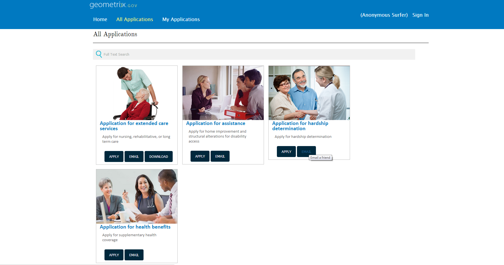

# 在表單製表器專案上新增自訂動作{#adding-custom-action-on-form-lister-items}

在AEM Forms中，您可以建立入口網站頁面，列出可用表單。 依預設，您可以在入口網站頁面上搜尋和列出表單。 您可以開啟表格以填寫並提交資訊。 對於入口網站頁面上列出的表單，僅會提供開箱即用的轉譯動作。 若要進一步瞭解入口網站頁面上可用的動作，請參閱[建立表單入口網站頁面](../../forms/using/creating-form-portal-page.md)。

您可以將其他選項新增至入口網站頁面。 自訂表單入口網站的範本，即可自訂這些選項或動作。

本文會示範如何建立按鈕，以直接從表單入口網站頁面傳送表單連結。 此自訂需要更新「搜尋與清單程式」元件的範本。

以下提供將動作新增至範本所需的程式碼。 程式碼片段中的`onclick`屬性具有指令碼，可透過電子郵件傳送表單的連結。

```html
<div class="__FP_boxes-container __FP_single-color">
    <div class="boxes __FP_boxes __FP_single-color" data-repeatable="true">
  <div class="__FP_boxes-thumbnail">
            
        </div>
        <h3 class="__FP_single-color" title="${name}" tabindex="0">${name}</h3>
        <p>${description}</p>
        <div class="boxes-icon-cont __FP_boxes-icon-cont">
            <div class="op-dow">
                <a href="${formUrl}" target="_blank" class="__FP_button ${htmlStyle}" title="${config-htmlLinkText}">Apply</a>
                <a class="__FP_button" title="Email a friend" href="#" onclick="javascript:window.location=&apos;mailto:?subject=Interesting information&body=I thought you might find {name} form helpful :  &apos;+window.location.protocol+window.location.host+&apos;${formUrl}&apos; ;">Email</a>
                <a href="${pdfUrl}" class="__FP_button ${pdfStyle}" title="${config-pdfLinkText}">Download</a>
            </div>
        </div>
    </div>
</div>
```

您可以在自訂範本中新增類似的動作。 若要定義JavaScript函式，請在頁面層級的指令碼上新增函式，並將其與必要的HTML元素連結。 在上述範例中，`onclick`運算式是連結函式。

對範本進行編輯後，範例入口網站頁面包含一個按鈕，可透過電子郵件傳送表單的連結，如下所示。


