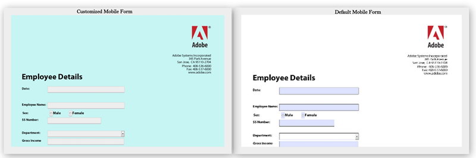

# 變更 HTML5 表單的預設樣式{#changing-default-styles-of-html-forms}

HTML5表單會使用HTML5功能轉譯，轉譯後的表單樣式會使用CSS完成。 HTML5表單的預設外觀類似於其PDF轉譯。 開發人員可使用自訂CSS來變更HTML5表單的預設外觀。

本文提供變更HTML5表單樣式的逐步資訊，並且[樣式簡介](/help/forms/using/css-styles.md)文章包含有關HTML5表單各種樣式方面的詳細資訊。 在執行本文所述的步驟之前，請務必閱讀樣式簡介一文。

下列兩個影像顯示預設樣式和自訂樣式之間的差異。

## 設定表單樣式 {#style-your-forms}

1. **選擇設定檔以新增自訂樣式**

   存取CRX DE介面，網址為： **https://&lt;server>：&lt;port>/crx/de**，然後建立設定檔或選擇現有的設定檔。 若要瞭解如何建立設定檔，請參閱[建立設定檔](/help/forms/using/custom-profile.md)

1. **建立CSS樣式表以設定HTML5表單的樣式**

   導覽至您已建立設定檔轉譯器的資料夾，並建立CSS樣式表檔案。 需遵循的步驟為

   1. 在資料夾上按一下滑鼠右鍵，然後從功能表中選取&#x200B;**建立** > **建立檔案**

   1. 在建立檔案對話方塊中，輸入樣式表的名稱。 請務必使用.css副檔名（例如stylesheet.css）
   1. 從導覽窗格中，開啟您已建立的CSS檔案。
   1. 定義您要樣式化之元件的CSS類別，並在這些類別中新增樣式。

   若要瞭解在HTML5表單中為特定元件建立哪些CSS類別，請參閱[樣式簡介](/help/forms/using/css-styles.md)。

1. **在設定檔轉譯器中包含樣式表**

   在CRX DE中開啟「設定檔轉譯器」頁面（jsp檔案），並將CSS檔案包含在XFA使用者端程式庫正下方的頁面中。 執行這些步驟，將CSS檔案納入設定檔中。

   1. 在轉譯器頁面中搜尋下列行：

      &lt;cq:includeClientLib類別=&quot;xfaforms.profile&quot; />

   1. 在上面的行下方插入下列內容，以包含樣式表：

      &lt;link href=&quot;/path/to/stylesheet&quot; rel=&quot;stylesheet&quot; type=&quot;text/css&quot;/>

   1. 儲存檔案。
