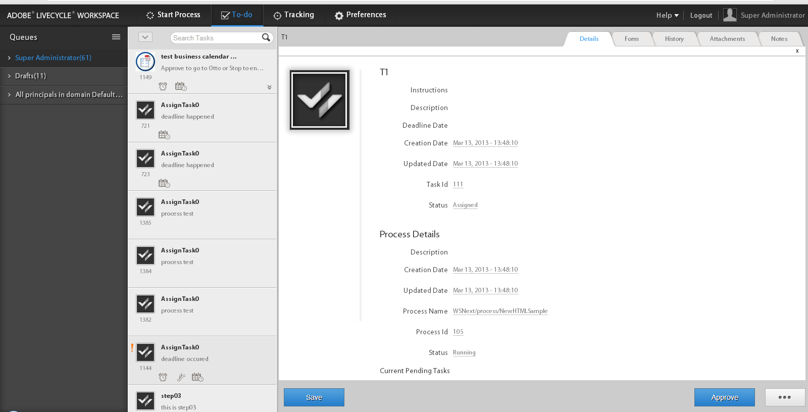

# 在待辦事項清單中顯示其他資料{#displaying-additional-data-in-todo-list}

依預設，AEM Forms工作區的待辦事項清單會顯示任務顯示名稱和說明。 不過，您可以新增其他資訊，例如建立日期、截止日期。 您也可以新增圖示並變更顯示樣式。



本文詳細說明為ToDo清單中的每個任務新增資訊的步驟。

## 可新增內容 {#what-can-be-added}

您可以新增伺服器所傳送的`task.json`中可用的資訊。 資訊可以純文字形式新增，也可以使用樣式來格式化資訊。

如需JSON物件描述的詳細資訊，請參閱[this](/help/forms/using/html-workspace-json-object-description.md)文章。

## 顯示任務的資訊 {#displaying-information-on-a-task}

1. 執行[AEM Forms工作區自訂的一般步驟](../../forms/using/generic-steps-html-workspace-customization.md)。
1. 若要顯示工作的其他資訊，必須在`translation.json`的工作區塊中新增對應的索引鍵/值組。

   例如，變更英文的`/apps/ws/locales/en-US/translation.json`：

   ```json
   "task" : {
           "reminder" : {
               "value" : "Reminder",
               "tooltip" : "This is reminder __reminderCount__, for this task."
           },
           "deadlined" : {
               "value" : "Deadlined",
               "tooltip" : "This task has deadlined"
           },
           "save" : {
               "message" : "Task has been saved successfully"
           },
           "status" : {
               "deadlined" : "Deadlined",
               "created" : "Created",
               "assignedsaved" : "Draft from assigned task",
               "terminated" : "Terminated",
               "assigned" : "Assigned",
               "unknown" : "Unknown",
               "createdsaved" : "Draft from created task",
               "completed" : "Completed"
           },
           "draft" : {
               "value" : "Saved",
               "tooltip" : "This task is marked as a draft"
           },
           "escalated" : {
               "value" : "Escalated",
               "tooltip" : "This task has been escalated"
           },
           "forward" : {
               "value" : "Forwarded",
               "tooltip" : "This task was forwarded"
           },
           "priority" : {
               "highest" : "Highest priority",
               "normal" : "Normal priority",
               "high" : "High priority",
               "low" : "Low priority",
               "lowest" : "Lowest priority"
           },
           "claimed" : {
               "value" : "Claimed",
               "tooltip" : "This task has been claimed"
           },
           "locked" : {
               "value" : "Locked",
               "tooltip" : "This task is locked"
           },
           "consulted" : {
               "value" : "Consulted",
               "tooltip" : "This task has been consulted"
           },
           "returned" : {
               "value" : "Returned",
               "tooltip" : "This task was returned back"
           },
           "multiplesubmitbuttons" : {
               "message" : "The form associated with this task has multiple submit buttons so the Workspace Complete button will be disabled. Click the appropriate button on the form to submit it."
           },
           "nosubmitbutton" : {
               "message" : "The form associated with this task does not appear to have submit buttons. You may need to upgrade your Adobe Reader version to 9.1 or greater and enable the Reader Submit option in your process."
           },
           "icon" : {
               "tooltip" : "open the task __taskName__"
           }
       }
   ```

   >[!NOTE]
   >
   >為所有支援的語言新增對應的機碼值組。

1. 例如，在工作區塊中新增資訊：

   ```json
   "stepname" : {
               "value" : "Step Name",
               "tooltip" : "This task belongs to __stepName__ step"
   }
   ```

## 定義新屬性的CSS {#defining-css-for-the-new-property}

1. 您可以將樣式套用至新增至工作的資訊（屬性）。 若要這麼做，您必須為新增至`/apps/ws/css/newStyle.css`的新屬性新增樣式資訊。

   例如，新增：

   ```css
   .task .taskProperties .stepname{
       width: 25px;
       background: url(../images/stepname.png) no-repeat; /*-------- Or just reuse background image / image-sprite defined .task .taskProperties span of style.css---------------------*/
       background-position: 0px 0px; /*-------- Dummy values, need to be configured as per user background image / image-sprite ---------------------*/
   }
   ```

## 在HTML範本中新增專案 {#adding-entry-in-the-html-template}

最後，您必須在開發套件中，針對您想要新增至工作的每個屬性加入專案。 若要建立工作區程式碼，請參閱建立AEM Forms工作區程式碼。

1. 複製`task.html`：

   * 從： `/libs/ws/js/runtime/templates/`
   * 至： `/apps/ws/js/runtime/templates/`

1. 新增資訊到`/apps/ws/js/runtime/templates/task.html`。

   例如，在`div class="taskProperties"`下新增：

   ```jsp
   <span class="stepname" alt="<%= $.t('task.stepname.value')%>" title = '<%= $.t("task.stepname.tooltip",{stepName:stepName})%>'/>
   ```
