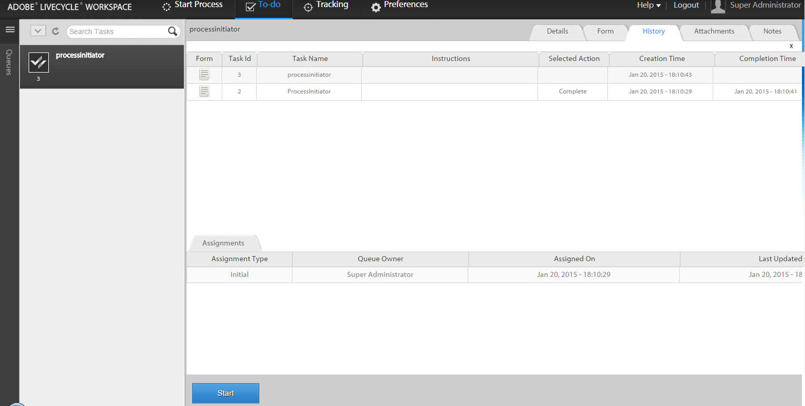

# 使用AEM Forms工作區中的現有程式資料啟動新程式{#initiating-a-new-process-with-existing-process-data-in-aem-forms-workspace}

您可以使用現有流&#39;b5&#39;7b資料的資料來啟動新流&#39;b5&#39;7b。 當我們必須經常使用相同的表單，而內容幾乎沒有像付費休假表單那樣變更時，就需要從現有的流程資料中啟動新的流程。 此功能可節省使用者的時間和精力，尤其是當流程需要填寫較長表格時。

以下是從現有流&#39;b5&#39;7b資料起始新流&#39;b5&#39;7b的步驟：-

1. 執行下列其中一項動作：

   * 在「追蹤」中，按一下您要使用其資料的程式例項。 從右窗格的「處理記錄」檢視中，按一下與起始點對應的工作列。
   * 在追蹤中，選取搜尋範本以顯示流程例項清單。 選取您要使用其資料的執行個體。
   * 在&#x200B;**[!UICONTROL 待辦事項]**&#x200B;索引標籤中，選取工作。 按一下「**[!UICONTROL 歷程記錄]**」標籤，然後選取啟動程式執行個體的工作。

    

1. 在[工作]動作工具列中按一下[開始]。****。 新程式執行個體的最適化表單會以預先填入的資料顯示。

1. 視需要更新資料，然後按一下&#x200B;**[!UICONTROL 完成]**&#x200B;或表單上的適當按鈕。
