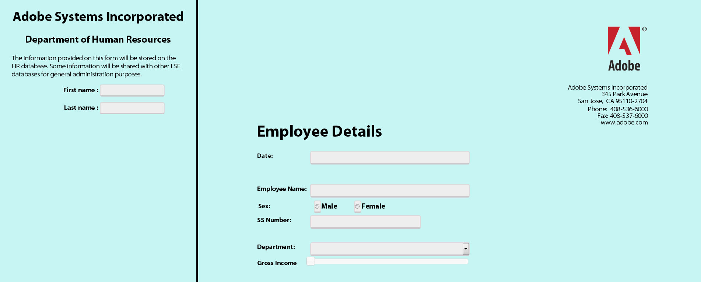

# 將 Form Bridge 與自訂入口網站進行整合以供 HTML5 表單使用{#integrating-form-bridge-with-custom-portal-for-html-forms}

FormBridge是HTML5 Forms Bridge API，可讓您與表單互動。 如需FormBridge API參考資訊，請參閱[FormBridge API參考資訊](/help/forms/using/form-bridge-apis.md)。

您可以使用FormBridge API從HTML頁面取得或設定表單欄位的值，並提交表單。 例如，您可以使用API來建置精靈般的體驗。

現有的HTML應用程式可使用FormBridge API與表單互動，並將其內嵌於HTML頁面。 您可以使用下列步驟，透過表單Bridge API來設定欄位的值。

## 將HTML5表單整合至網頁 {#integrating-html-forms-to-a-web-page}

1. **選擇設定檔或建立設定檔**

   1. 在CRX DE介面中，導覽至： `https://'[server]:[port]'/crx/de`。
   1. 使用系統管理員認證登入。
   1. 建立設定檔或選擇現有的設定檔。

      如需有關如何建立設定檔的詳細資訊，請參閱[建立設定檔](/help/forms/using/custom-profile.md)。

1. **修改HTML設定檔**

   在設定檔轉譯器中包含XFA執行階段、XFA地區設定程式庫和XFA表單HTML程式碼片段、設計您的網頁，並將表單放入網頁中。

   例如，使用下列程式碼片段，建立包含兩個輸入欄位的應用程式，並使用表單來示範表單與外部應用程式之間的互動。

   ```xml
   <%@ page session="false"
                  contentType="text/html; charset=utf-8"%><%
   %><%@ taglib prefix="cq" uri="https://www.day.com/taglibs/cq/1.0" %><%
   %><!DOCTYPE html>
   <html manifest="${param.offlineSpec}">
       <head>
          <cq:include script="formRuntime.jsp"/>
           <!-- Portal Scripts and Styles -->
          <cq:include script="portalheader.jsp"/>
       </head>
       <body>
           <div id="leftdiv" >
               <div id="leftdivcontentarea">
                   <!-- Portal Body -->
                 <cq:include script="portalbody.jsp"/>
               </div>
           </div>
           <div id="rightdiv">
               <div id="formBody">
               <cq:include script="config.jsp"/>
               <!-- Form body -->
               <cq:include script="formBody.jsp"/>
               <!  --To assist in page transitions -- add navigation, based on scrolling -->
               <cq:include  script="../nav/scroll/nav_footer.jsp"/>
               <cq:include script="footer.jsp"/>
               </div>
           </div>
       </body>
   </html>
   ```

   >[!NOTE]
   >
   >**第9**&#x200B;行，包含其他CSS樣式的JSP參考和JavaScript檔案來設計頁面。
   >
   >
   >**第18**&#x200B;行上的&lt;div id=&quot;rightdiv&quot;>標籤包含XFA表單的HTML程式碼片段。
   >
   >
   >此頁面已設定為兩個容器的樣式： **左**&#x200B;和&#x200B;**右**。 右邊的容器有表單。 左側容器有兩個輸入欄位和部分HTML外部頁面。
   >
   >
   >下列熒幕擷圖顯示表單在瀏覽器中的顯示方式。

   

   左側是&#x200B;**HTML頁面**&#x200B;的一部分。 包含欄位的右側是&#x200B;**xfa表單**。

1. **從頁面**&#x200B;存取表單欄位

   以下是範例指令碼，您可新增此指令碼以在表單欄位中設定值。

   例如，如果您要使用&#x200B;**名字**&#x200B;和&#x200B;**姓氏**&#x200B;欄位中的值設定&#x200B;**EmployeeName**，請呼叫&#x200B;**window.formBridge.setFieldValue**&#x200B;函式。

   同樣地，您可以呼叫&#x200B;**window.formBridge.getFieldValue** API來讀取值。

   ```javascript
   $(function() {
               $(".input").blur(function() {
                   window.formBridge.setFieldValue(
                               'xfa.form.form1.#subform[0].EmployeeName',
                                $("#lname").val()+' '+$("#fname").val()
                              )
                   });
           });
   ```
