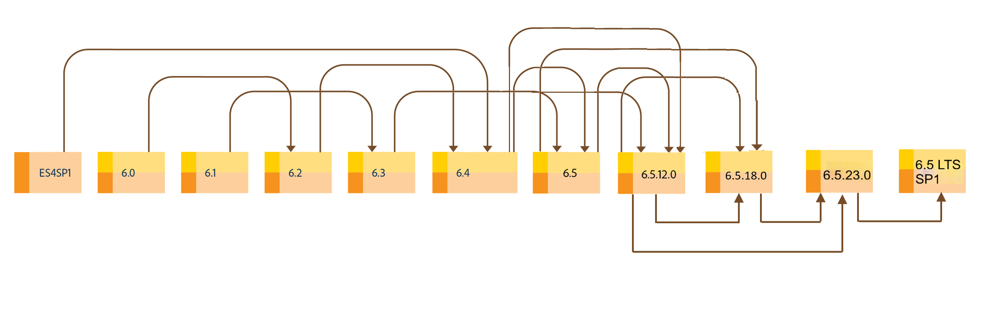

# 升級至AEM 6.5 Forms LTS {#upgrade-to-aem-forms}

## 套用至 {#applies-to}

本檔案適用於&#x200B;**AEM 6.5 LTS Forms**。

如需AEM as a Cloud Service檔案，請參閱Cloud Service[上的](https://experienceleague.adobe.com/docs/experience-manager-cloud-service/content/forms/setup-configure-migrate/migrate-to-forms-as-a-cloud-service.html?lang=zh-Hant)AEM Forms 。

AEM 6.5 LTS Forms包含多項新功能和增強功能，可簡化表單和對應之建立、管理和使用者體驗。 若要瞭解AEM 6.5 LTS的所有新功能和增強功能，請參閱[新功能摘要檔案](https://experienceleague.adobe.com/zh-hant/docs/experience-manager-65-lts/content/release-notes/release-notes)。

您可以升級現有的LiveCycle或AEM Forms安裝，以取得AEM 6.5 LTS Forms提供的新功能和增強功能，同時完整保留現有的資料、流程和資產。 升級時，也會保留處理序的中繼資料和狀態。 您可以選擇升級路徑以開始升級。

下圖顯示OSGi上AEM Forms LTS的可用升級路徑：

您可以從下列位置執行直接升級：

* AEM 6.5.23.0至AEM Forms 6.5 LTS

下圖顯示JEE上AEM Forms LTS的可用升級路徑：

您可以從下列位置執行直接升級：

* JEE上的AEM 6.5.23.0 Forms

<!--
AEM 6.5.18.0 Forms on JEE provides two types of installers: [Full installer](https://experienceleague.adobe.com/docs/experience-manager-release-information/aem-release-updates/forms-updates/aem-forms-releases.html?lang=zh-Hant) and [Patch installer](https://experienceleague.adobe.com/docs/experience-manager-release-information/aem-release-updates/forms-updates/aem-forms-releases.html?lang=zh-Hant).

**Full installer**: You can use the full installer to set up fresh AEM Forms instances or perform upgrades from AEM 6.5.x.x Forms on JEE to AEM 6.5.18.0 Forms on JEE.

**Patch installer**: Patch installer is for customers already using AEM 6.5.x.x versions. You can use the patch installer to upgrade to the latest version of AEM Forms.

The following image depicts senarios for using full and patch installer.

 

Refer to the [AEM 6.5 Forms Service Pack installation instructions](https://experienceleague.adobe.com/docs/experience-manager-65-lts/release-notes/aem-forms-current-service-pack-installation-instructions.html) article to install the latest Service Pack for JEE environment.

-->

<!--

[Work in Progress]

Migration involves moving only assets (PDF, XDP, images, adaptive forms, correspondence management assets) from one server to another - processes (LCA), settings, configurations, and a few other pieces of metadata are not migrated. Perform the following steps to migrate to AEM 6.3 Forms:

1. Set up a fresh environment of [AEM 6.3 Forms](https://adobe.com/go/learn_aemforms_documentation_63).
2. Move XDP or other compatible assets to the freshly set instance. For detailed instructions, see [Importing and exporting assets to AEM Forms](../../forms/using/import-export-forms-templates.md). [import templates](../../forms/using/import-export-forms-templates.md)
3. Build the required services, if any.

   For example, if you are using AEM Forms on JEE Document Services, changes are required in the code to use document services available in AEM Forms on OSGi.

4. Perform post-installation activities:

    * **Run Migration Utility**

      The migration utility makes the adaptive forms and correspondence management assets of earlier versions compatible with AEM 6.3 forms. You can download the utility from AEM Software Distribution. For step-by-step information to configure and use the migration utility, see [migration utility](../../forms/using/migration-utility.md) documentation.

    * **Reconfigure Adobe Sign**

      If you had Adobe Sign configured in the previous version of AEM Forms, then reconfigure Adobe Sign from AEM Cloud services. For more details, see [Integrate Adobe Sign with AEM Forms](../../forms/using/adobe-sign-integration-adaptive-forms.md).

      Moreover, AEM 6.3 Forms release has introduced many new Adobe Sign features. For step-by-step information to use Adobe Sign, see [Using Adobe Sign in an adaptive form](../../forms/using/working-with-adobe-sign.md).

    * **Reconfigure analytics and reports**

      In AEM 6.3 Forms, traffic variable for source and success event for impression are not available. So, when you upgrade to AEM 6.3 Forms, AEM Forms stops sending data to Adobe Analytics server and analytics reports for adaptive forms are not available. Moreover, AEM 6.3 Forms introduces traffic variable for the version of form analytics and success event for the amount of time spent on a field. So, reconfigure analytics and reports for your AEM Forms environment. For detailed steps, see [Configuring analytics and reports](../../forms/using/configure-analytics-forms-documents.md).

      Methods to calculate average fill time for forms and average read time for have changed. So, when you upgrade to AEM 6.3 forms, older data (data from previous AEM Forms release) for these metrics is available only in Adobe Analytics. It is not visible in AEM Forms analytics reports. For these metrics, AEM Forms analytics reports display data which is captured after performing the upgrade.

      
      -->
