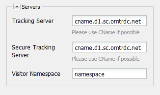

# 連線到Adobe Analytics並建立框架 {#connecting-to-adobe-analytics-and-creating-frameworks}

若要從Adobe Analytics中的AEM頁面追蹤網頁資料，請建立Adobe Analytics Cloud Services設定和Adobe Analytics架構：

* **Adobe Analytics設定：**&#x200B;您的Adobe Analytics帳戶相關資訊。 Adobe Analytics設定可讓AEM連線至Adobe Analytics。 為您使用的每個帳戶建立Adobe Analytics設定。
* **Adobe Analytics Framework：** Adobe Analytics報表套裝屬性與CQ變數之間的一組對應。 使用框架來設定網站資料如何填入Adobe Analytics報表。 架構與Adobe Analytics設定相關聯。 您可以為每個設定建立多個架構。

當您關聯網頁與框架時，框架會對該頁面以及該頁面的子系執行追蹤。 然後可以從Adobe Analytics擷取頁面檢視，並顯示於Sites Console中。

## 先決條件 {#prerequisites}

### Adobe Analytics帳戶 {#adobe-analytics-account}

若要在Adobe Analytics中追蹤AEM資料，您必須具備有效的Adobe Experience Cloud Adobe Analytics帳戶。

Adobe Analytics帳戶必須：

* 擁有&#x200B;**系統管理員**&#x200B;許可權
* 已指派給&#x200B;**Web服務存取**&#x200B;使用者群組。

>[!CAUTION]
>
>提供&#x200B;**管理員**&#x200B;許可權(在Adobe Analytics內)不足以讓使用者從AEM連線至Adobe Analytics。 帳戶也必須有&#x200B;**Web服務存取**&#x200B;許可權。

繼續之前，請確定您的憑證可讓您登入Adobe Analytics。 藉由下列其中一種方式：

* [Adobe Experience Cloud登入](https://experience.adobe.com/#/@login/home)

* [Adobe Analytics登入](https://sc.omniture.com/login/)

### 設定AEM以使用您的Adobe Analytics資料中心 {#configuring-aem-to-use-your-adobe-analytics-data-centers}

Adobe Analytics [資料中心](https://experienceleague.adobe.com/docs/analytics/analyze/reports-analytics/reporting-interface/overview-data-collection.html)會收集、處理和儲存與您的Adobe Analytics報表套裝相關聯的資料。 設定AEM以使用託管Adobe Analytics報表套裝的資料中心。 資料中心會在您的合約中提及。 如需此資訊，請聯絡貴組織的管理員。

如有必要，請使用下列專案以路由傳送至正確的資料中心： `https://api.omniture.com/`。

如果您的組織需要從特定資料中心收集或擷取資料，請使用下列專案：

| 資料中心 | URL |
|---|---|
| 倫敦 | `https://api3.omniture.com/` |
| 新加坡 | `https://api4.omniture.com/` |
| 俄勒岡 | `https://api5.omniture.com/` |

使用[網頁主控台設定OSGi套件](/help/sites-deploying/configuring-osgi.md#osgi-configuration-with-the-web-console) **Adobe AEM Analytics HTTP使用者端**。 新增資料中心的&#x200B;**資料中心URL**，該資料中心託管您的AEM頁面收集資料的報表套裝。

1. 在網頁瀏覽器中開啟Web主控台。 ([https://localhost:4502/system/console/configMgr](https://localhost:4502/system/console/configMgr))
1. 若要存取主控台，請輸入您的認證。

   >[!NOTE]
   >
   >若要瞭解您是否有此主控台的存取權，請連絡您的網站管理員。

1. 選取名為&#x200B;**Adobe AEM Analytics HTTP Client**&#x200B;的設定專案。
1. 若要新增資料中心的URL，請按下&#x200B;**資料中心URL**&#x200B;清單旁的+按鈕，然後在方塊中輸入URL。

1. 若要從清單中移除URL，請按一下URL旁邊的 — 按鈕。
1. 按一下「儲存」。

## 設定與Adobe Analytics的連線 {#configuring-the-connection-to-adobe-analytics}

>[!CAUTION]
>
>由於Adobe Analytics API中的安全性變更，AEM中包含的Activity Map版本已無法再使用。
>
>現在應該使用Adobe Analytics](https://experienceleague.adobe.com/docs/analytics/analyze/activity-map/getting-started/get-started-users/activitymap-install.html)提供的[ActivityMap外掛程式。

## 為Activity Map進行配置 {#configuring-for-the-activity-map}

>[!CAUTION]
>
>由於Adobe Analytics API中的安全性變更，AEM中包含的Activity Map版本已無法再使用。
>
>現在應該使用Adobe Analytics](https://experienceleague.adobe.com/docs/analytics/analyze/activity-map/getting-started/get-started-users/activitymap-install.html)提供的[ActivityMap外掛程式。

## 建立Adobe Analytics架構 {#creating-a-adobe-analytics-framework}

對於您正在使用的報表套裝ID (RSID)，您可以控制哪些伺服器執行個體（作者、發佈或兩者）會將資料貢獻至報表套裝：

* **全部**：來自作者和發佈執行個體的資訊會填入報表套裝。
* **作者**：只有作者執行個體的資訊會填入報表套裝。
* **發佈**：只有發佈執行個體的資訊會填入報表套裝。

>[!NOTE]
>
>選取伺服器執行個體的型別不會限制對Adobe Analytics的呼叫，而只是控制哪些呼叫包含RSID。
>
>例如，架構已設定為使用&#x200B;*diiweretail*&#x200B;報表套裝，而作者是選取的伺服器執行個體。 當頁面與框架一起發佈時，仍會呼叫Adobe Analytics，不過這些呼叫不包含RSID。 只有來自作者執行個體的呼叫包含RSID。

1. 使用&#x200B;**導覽**，選取&#x200B;**工具**、**雲端服務**，然後選取&#x200B;**舊版雲端服務**。
1. 捲動至&#x200B;**Adobe Analytics**&#x200B;並選取&#x200B;**顯示設定**。
1. 按一下Adobe Analytics設定旁的&#x200B;**[+]**&#x200B;連結。

1. 在&#x200B;**建立架構**&#x200B;對話方塊中：

   * 指定&#x200B;**標題**。
   * 您可以選擇為儲儲存儲存存庫框架詳細資訊的節點指定&#x200B;**名稱**。
   * 選取&#x200B;**Adobe Analytics Framework**

   然後按一下&#x200B;**建立**。

   隨即開啟框架進行編輯。

1. 在側邊窗格（主面板右側）的&#x200B;**報表套裝**&#x200B;區段中，按一下&#x200B;**新增專案**。 然後使用下拉式清單選取框架互動的報表套裝ID （例如`geometrixxauth`）。

   >[!NOTE]
   >
   >當您選取報表套裝ID時，左側的內容尋找器會填入Adobe Analytics變數（SiteCatalyst變數）。

1. 若要選取您要傳送資訊至報表套裝的伺服器執行個體，請使用&#x200B;**執行模式**&#x200B;下拉式清單（位於報表套裝ID旁）。

   

1. 若要讓架構可在您網站的發佈執行個體上使用，請在sidekick的&#x200B;**頁面**&#x200B;標籤上按一下&#x200B;**啟動架構。**

### 配置Adobe Analytics的伺服器設定 {#configuring-server-settings-for-adobe-analytics}

此框架系統可讓您變更每個Adobe Analytics框架中的伺服器設定。

>[!CAUTION]
>
>這些設定會決定您的資料傳送位置及方式，因此您&#x200B;*請勿竄改這些設定*，而讓您的Adobe Analytics代表進行設定。

從開啟面板開始。 按&#x200B;**伺服器**&#x200B;旁的向下箭頭：

* **追蹤伺服器**

   * 包含用來傳送Adobe Analytics呼叫的URL

      * `cname` — 預設為Adobe Analytics帳戶的&#x200B;*公司名稱*
      * `d1` — 對應至資訊傳送至的資料中心（`d1`、`d2`或`d3`）
      * `sc.omtrdc.net` — 網域名稱

* **安全追蹤伺服器**

   * 具有與追蹤伺服器相同的區段
   * 用於從安全頁面(`https://`)傳送資料

* **訪客名稱空間**

   * 名稱空間會決定追蹤URL的第一部分。
   * 例如，將名稱空間變更為&#x200B;**CNAME**&#x200B;會導致呼叫Adobe Analytics看起來像&#x200B;**CNAME.d1.omtrdc.net**，而不是預設值。

## 將頁面與Adobe Analytics框架建立關聯 {#associating-a-page-with-a-adobe-analytics-framework}

當頁面與Adobe Analytics框架相關聯時，頁面會在頁面載入時傳送資料至Adobe Analytics。 頁面填入的變數會進行對應，並從框架中的Adobe Analytics變數中擷取。 例如，頁面檢視是從Adobe Analytics中擷取。

頁面的子代會繼承與架構的關聯。 例如，將網站的根頁面與框架建立關聯時，網站的所有頁面都會與框架建立關聯。

1. 從&#x200B;**網站**&#x200B;主控台，選取您要設定追蹤的頁面。
1. 直接從主控台或頁面編輯器開啟&#x200B;**[頁面屬性](/help/sites-authoring/editing-page-properties.md)**。
1. 開啟** Cloud Services**標籤。

1. 使用&#x200B;**新增組態**&#x200B;下拉式清單，從可用選項中選取&#x200B;**Adobe Analytics**。 如果有繼承，請在選取器可供使用之前停用該繼承。

1. **Adobe Analytics**&#x200B;的下拉式選取器會附加至可用的選項。 選取所需的架構組態。

1. 選取「**儲存並關閉**」。
1. 若要啟動頁面及任何連線的組態/檔案，請&#x200B;**[發佈](/help/sites-authoring/publishing-pages.md)**&#x200B;頁面。
1. 最後一個步驟是瀏覽發佈執行個體的頁面，並使用&#x200B;**搜尋**&#x200B;元件來搜尋關鍵字（例如eggplant）。
1. 您可以使用適當的工具來檢查對Adobe Analytics進行的呼叫；例如[Adobe Experience Cloud Debugger](https://experienceleague.adobe.com/docs/experience-platform/debugger/home.html)。
1. 以提供的範例來說，呼叫應包含在eVar7中輸入的值（即茄子），而事件清單應包含event3。

### 頁面檢視 {#page-views}

當頁面與Adobe Analytics架構相關聯時，頁面檢視次數會顯示在Sites Console的「清單」檢視中。

如需詳細資訊，請參閱[檢視頁面分析資料](/help/sites-authoring/page-analytics-using.md)。

### 設定匯入間隔 {#configuring-the-import-interval}

設定&#x200B;**Adobe AEM Analytics Report Sling Importer**&#x200B;服務的適當執行個體：

* **擷取嘗試**：
嘗試擷取佇列報表的次數。
預設為 `6`。

* **擷取延遲**：
嘗試擷取已排入佇列的報表之間的毫秒數。
預設值為`10000`。 由於是以毫秒為單位，因此會對10秒。

* **擷取頻率**：
`cron`運算式，用於決定擷取Analytics報告的頻率。
預設值為`0 0 0/12 * * ?`；這對應到每小時12次擷取。

若要設定此OSGi服務，您可以使用存放庫](/help/sites-deploying/configuring-osgi.md#osgi-configuration-in-the-repository)中的[網頁主控台](/help/sites-deploying/configuring-osgi.md#osgi-configuration-with-the-web-console)或[osgiConfig節點（服務PID為`com.day.cq.analytics.sitecatalyst.impl.importer.ReportImporterScheduler`）。

## 編輯Adobe Analytics設定和/或架構 {#editing-adobe-analytics-configurations-and-or-frameworks}

建立Adobe Analytics組態或架構時，請瀏覽至（舊版） **雲端服務**&#x200B;畫面。 選取&#x200B;**顯示組態**，然後按一下您要更新之特定組態的連結。

編輯Adobe Analytics組態時，在組態頁面上按下&#x200B;**編輯**&#x200B;以開啟&#x200B;**編輯元件**&#x200B;對話方塊。

## 刪除Adobe Analytics Framework {#deleting-adobe-analytics-frameworks}

若要刪除Adobe Analytics架構，請先開啟[以進行編輯](#editing-adobe-analytics-configurations-and-or-frameworks)。

然後從sidekick的&#x200B;**頁面**&#x200B;索引標籤中選取&#x200B;**刪除架構**。
