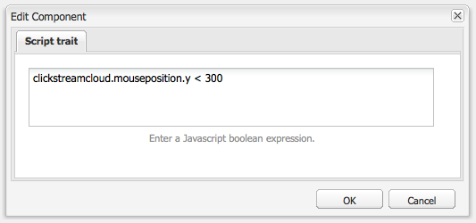

# 設定分段 {#configuring-segmentation}

>[!NOTE]
>
>本文介紹與Client Context搭配使用之區段的設定。 若要使用觸控式UI透過ContextHub設定區段，請參閱[使用ContextHub設定區段](/help/sites-administering/segmentation.md)。

細分是建立行銷活動時的關鍵考量。 請參閱[區段字彙表](/help/sites-authoring/segmentation-overview.md)，以取得區段如何運作和關鍵辭彙的相關資訊。

根據您已收集到的網站訪客相關資訊以及您想要達成的目標，您必須定義目標內容所需的區段和策略。

接著，這些區段可用來向訪客提供明確鎖定的目標內容。 此內容在網站的[行銷活動](/help/sites-classic-ui-authoring/classic-personalization-campaigns.md)區段中維護。 此處定義的Teaser頁面可包含在任何頁面上作為Teaser段落，並定義專用內容適用的訪客區段。

AEM可讓您輕鬆建立和更新區段、Teaser和促銷活動。 它也可讓您驗證定義的結果。

**區段編輯器**&#x200B;可讓您輕鬆定義區段：

您可以&#x200B;**編輯**&#x200B;每個區段以指定&#x200B;**標題**、**描述**&#x200B;和&#x200B;**提升**&#x200B;係數。 使用Sidekick，您可以新增&#x200B;**AND**&#x200B;和&#x200B;**OR**&#x200B;容器來定義&#x200B;**區段邏輯**，然後新增必要的&#x200B;**區段特徵**&#x200B;來定義選取條件。

## 提升因數 {#boost-factor}

每個區段都有一個&#x200B;**Boost**&#x200B;引數用來作為加權係數；數字越大，代表優先選取區段而不是數字較小的區段。

* 最小值： `0`
* 最大值： `1000000`

## 區段邏輯 {#segment-logic}

下列邏輯容器可立即使用，讓您建構區段選取的邏輯。 它們可以從sidekick拖到編輯者：

<table>
 <tbody>
  <tr>
   <td> AND容器  </td>
   <td> 布林值AND運運算元。  </td>
  </tr>
  <tr>
   <td> OR容器  </td>
   <td> 布林值OR運運算元。</td>
  </tr>
 </tbody>
</table>

## 區段特徵 {#segment-traits}

下列區段特徵現成可用；可將它們從Sidekick拖曳至編輯器：

<table>
 <tbody>
  <tr>
   <td> IP範圍  </td>
   <td>定義訪客可以擁有的IP位址範圍。  </td>
  </tr>
  <tr>
   <td> 頁面點選  </td>
   <td>要求頁面的頻率。  </td>
  </tr>
  <tr>
   <td> 頁面屬性  </td>
   <td>造訪頁面的任何屬性。  </td>
  </tr>
  <tr>
   <td> 轉介關鍵字  </td>
   <td>與引用網站的資訊相符的關鍵字。  </td>
  </tr>
  <tr>
   <td> 指令碼</td>
   <td>要評估的JavaScript運算式。  </td>
  </tr>
  <tr>
   <td> 區段參考  </td>
   <td>參考其他區段定義。  </td>
  </tr>
  <tr>
   <td> 標籤雲  </td>
   <td>要與造訪頁面中的標籤相符的標籤。  </td>
  </tr>
  <tr>
   <td> 使用者年齡  </td>
   <td>從使用者設定檔擷取。  </td>
  </tr>
  <tr>
   <td> 使用者屬性  </td>
   <td>使用者設定檔中可用的任何其他資訊。 </td>
  </tr>
 </tbody>
</table>

您可以使用布林運運算元OR和AND （請參閱[建立新區段](#creating-a-new-segment)）來組合這些特徵，以定義選取此區段的確切案例。

當整個陳述式評估為true時，表示此區段已解析。 如果有多個適用區段，則也會使用&#x200B;**[提升](/help/sites-administering/campaign-segmentation.md#boost-factor)**&#x200B;係數。

>[!CAUTION]
>
>區段編輯器不會檢查任何循環參照。 例如，區段A參考另一個區段B，而後者又參考區段A。請確認您的區段不含任何循環參考。

>[!NOTE]
>
>具有&#x200B;**_i18n**&#x200B;尾碼的內容是由指令碼設定，此指令碼是個人化UI clientlib的一部分。 所有與UI相關的clientlibs僅載入到作者中，因為發佈時不需要使用UI。
>
>因此，使用這類屬性建立區段時，通常必須依賴&#x200B;**browserFamily**&#x200B;執行個體，而非&#x200B;**browserFamily_i18n**。

### 建立新區段 {#creating-a-new-segment}

若要定義新區段，請執行下列動作：

1. 在邊欄中，選擇&#x200B;**工具>作業>組態**。
1. 按一下左窗格中的&#x200B;**分段**&#x200B;頁面，並導覽至所需位置。
1. 使用&#x200B;**區段**&#x200B;範本建立[新頁面](/help/sites-authoring/editing-content.md#creatinganewpage)。
1. 開啟新頁面以檢視區段編輯器：

   

1. 使用sidekick或內容功能表（通常是按一下滑鼠右鍵，然後選取&#x200B;**新增……**&#x200B;以開啟[插入新元件]視窗）來尋找您需要的區段特徵。 然後將其拖曳至&#x200B;**區段編輯器**，它將顯示在預設的&#x200B;**AND**&#x200B;容器中。
1. 按兩下新特徵以編輯特定引數；例如，滑鼠位置：

   

1. 按一下&#x200B;**確定**&#x200B;以儲存您的定義：
1. 您可以&#x200B;**編輯**&#x200B;區段定義，以賦予其&#x200B;**標題**、**描述**&#x200B;和&#x200B;**[提升](#boost-factor)**&#x200B;係數：

   

1. 如有必要，請新增更多特徵。 您可以使用&#x200B;**區段邏輯**&#x200B;下的&#x200B;**AND容器**&#x200B;和&#x200B;**OR容器**&#x200B;元件來制定布林運算式。 使用區段編輯器，您可以刪除不再需要的特徵或容器，或將它們拖曳至陳述式中的新位置。

### 使用AND和OR容器 {#using-and-and-or-containers}

您可以在AEM中建構複雜的區段。 瞭解一些基本要點會有所幫助：

* 定義的頂層一律為最初建立的AND容器；這無法變更，但不會影響區段定義的其餘部分。
* 確定容器的巢狀內嵌有意義。 容器可視為布林運算式的括弧。

下列範例可用來選取符合下列任一條件的訪客：

男性及16至65歲

或者

女性及16至62歲之間

因為主要運運算元是OR，所以您必須以&#x200B;**OR容器**&#x200B;開頭。 您有2個AND陳述式，每一個陳述式都需要&#x200B;**AND容器**，您可將個別特徵加入其中。

## 測試區段的應用 {#testing-the-application-of-a-segment}

定義區段後，可以在&#x200B;**[使用者端內容](/help/sites-administering/client-context.md)**&#x200B;的協助下測試潛在結果：

1. 選取要測試的區段。
1. 按下&#x200B;**[Ctrl-Alt-C](/help/sites-authoring/page-authoring.md#keyboardshortcuts)**&#x200B;以開啟&#x200B;**[使用者端內容](/help/sites-administering/client-context.md)**，其中會顯示已收集的資料。 為了測試目的，您可以&#x200B;**編輯**&#x200B;某些值，或&#x200B;**載入**&#x200B;另一個設定檔以檢視其影響。

1. 根據定義的特徵，目前頁面的可用資料可能與區段定義相符，也可能不相符。 相符的狀態會顯示在定義下方。

例如，簡單的區段定義可以根據使用者的年齡和性別。 載入特定設定檔會顯示已成功解析區段：

或非：

>[!NOTE]
>
>所有特徵會立即解析，但大多數只會隨著頁面重新載入而變更。 滑鼠位置的變更會立即顯示，因此可用於測試目的。

這類測試也可以在內容頁面上執行，並與&#x200B;**Teaser**&#x200B;元件結合。

將滑鼠游標停留在Teaser段落上會顯示套用的區段、目前是否解析以及選取目前Teaser例項的原因：

### 使用您的區段 {#using-your-segment}

區段目前用於[行銷活動](/help/sites-classic-ui-authoring/classic-personalization-campaigns.md)。 它們可用來控管特定目標對象看到的實際內容。 如需詳細資訊，請參閱[瞭解區段](/help/sites-authoring/segmentation-overview.md)。
