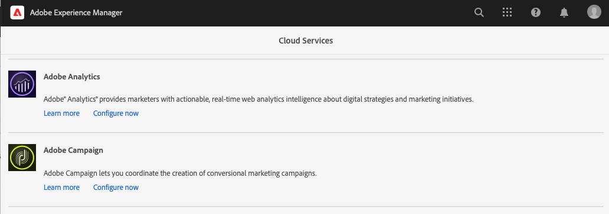

# 將AEM 6.5與Adobe Campaign Classic整合 {#integrating-campaign-classic}

將AEM與Adobe Campaign Classic (ACC)整合後，您就可以直接在AEM中管理電子郵件傳送、內容和表單。 若要在解決方案之間啟用雙向通訊，需同時執行Adobe Campaign Classic和AEM中的設定步驟。

此整合可讓AEM和Adobe Campaign Classic獨立使用。 行銷人員可以在Adobe Campaign中建立行銷活動並使用目標定位，而內容建立人員則可以同時在AEM中設計內容。 透過整合，Adobe Campaign可以鎖定在AEM中建立的行銷活動內容和設計，並加以傳送。

>[!INFO]
>
>本檔案詳細說明如何將Adobe Campaign Classic與AEM 6.5整合。如需其他Campaign整合，請參閱檔案[將AEM 6.5與Adobe Campaign整合。](campaign.md)

## 整合步驟 {#integration-steps}

AEM與Campaign的整合需要在這兩個解決方案中執行數個步驟。

1. [在Campaign中安裝AEM整合套件。](#install-package)
1. [在Campaign中為AEM建立運運算元](#create-operator)
1. [在AEM中設定Campaign整合](#campaign-integration)
1. [設定AEM Externalizer](#externalizer)
1. [在AEM中設定行銷活動遠端使用者](#configure-user)
1. [在Campaign中設定AEM外部帳戶](#acc-setup)

本檔案將詳細介紹每一個步驟。

## 先決條件 {#prerequisites}

* Adobe Campaign Classic的管理員存取權
   * 若要執行整合，您需要運作中的Adobe Campaign Classic執行個體，包括已設定的資料庫。
   * 如果您需要有關如何設定和設定Adobe Campaign Classic的更多詳細資訊，請參閱[Adobe Campaign Classic檔案，](https://experienceleague.adobe.com/docs/campaign-classic/using/campaign-classic-home.html)，特別是《安裝與設定指南》。
* AEM的管理員存取權

## 在Campaign中安裝AEM整合套件 {#install-package}

Adobe Campaign中的&#x200B;**AEM整合**&#x200B;套件包含連線至AEM所需的數個標準設定。

1. 以管理員身分，使用使用者端主控台登入Adobe Campaign執行個體。

1. 選取&#x200B;**工具** > **進階** > **匯入套件……**。

   

1. 按一下[安裝標準封裝]****，然後按一下[下一步]****。

1. 檢查&#x200B;**AEM整合**&#x200B;套件。

   

1. 按一下[下一步]****，然後按[開始]****&#x200B;開始安裝。

   

1. 安裝完成時，按一下&#x200B;**關閉**。

整合套件現已安裝。

## 在Campaign中建立AEM的運運算元 {#create-operator}

整合套件會自動建立AEM用來連線至Adobe Campaign的`aemserver`運運算元。 定義此運運算元的安全性區域並設定其密碼。

1. 使用使用者端主控台，以管理員身分登入Adobe Campaign。

1. 從功能表列選取&#x200B;**工具** > **總管**。

1. 在總管中，瀏覽至&#x200B;**管理** > **存取管理** > **操作員**&#x200B;節點。

1. 選取`aemserver`運運算元。

1. 在運運算元的&#x200B;**編輯**&#x200B;標籤上，選取&#x200B;**存取許可權**&#x200B;子標籤，然後按一下&#x200B;**編輯存取引數……**&#x200B;連結。

   

1. 選取適當的安全區域，並視需要定義信任的IP遮罩。

   >[!CAUTION]
   >
   >要設定的安全性區域是&#x200B;**私人公司網路(VPN+LAN)**。

1. 按一下「**儲存**」。

1. 登出Adobe Campaign使用者端。

1. 在Adobe Campaign伺服器的檔案系統上，導覽至Campaign安裝位置，並以管理員身分編輯`serverConf.xml`檔案。 此檔案通常位於下列位置：
   * Windows中的`C:\Program Files\Adobe\Adobe Campaign Classic v7\conf`。
   * Linux中的`/usr/local/neolane/nl6/conf/eng`。

1. 搜尋`securityZone`，並確定已為AEM運運算元的安全性區域設定下列引數。

   * `allowHTTP="true"`
   * `sessionTokenOnly="true"`
   * `allowUserPassword="true"`。

1. 儲存檔案。

1. 請確定安全區域不會被`config-<server name>.xml`檔案中的個別設定覆寫。

   * 如果組態檔包含個別的安全性區域設定，則將`allowUserPassword`屬性變更為`true`。

1. 如果您要變更Adobe Campaign Classic伺服器連線埠，請將`8080`取代為所需的連線埠。

   >[!CAUTION]
   >
   >依預設，運運算元沒有設定安全性區域。 若要讓AEM連線至Adobe Campaign，您必須選取區域，如先前步驟所述。
   >
   >Adobe強烈建議您為AEM建立專屬的安全區域，以避免任何安全性問題。 如需有關本主題的詳細資訊，請參閱[Adobe Campaign Classic檔案。](https://experienceleague.adobe.com/docs/campaign-classic/using/installing-campaign-classic/additional-configurations/security-zones.html)

1. 在Campaign使用者端中，返回`aemserver`運運算元並選取&#x200B;**一般**&#x200B;標籤。

1. 按一下&#x200B;**重設密碼……**&#x200B;連結。

1. 指定密碼並將其儲存在安全位置以供將來使用。

1. 按一下&#x200B;**確定**&#x200B;儲存`aemserver`運運算元的密碼。

## 在AEM中設定Campaign整合 {#campaign-integration}

AEM使用您在Campaign](#create-operator)中設定的[運運算元與Campaign通訊

1. 以管理員身分登入您的AEM編寫執行個體。

1. 從全域導覽側邊欄中，選取&#x200B;**工具** > **雲端服務** > **舊版雲端服務** > **Adobe Campaign**，然後按一下&#x200B;**立即設定**。

   

1. 在對話方塊中，輸入&#x200B;**標題**&#x200B;並按一下&#x200B;**建立**&#x200B;以建立Campaign服務設定。

   

1. 新視窗和對話方塊會開啟以編輯配置。 提供必要資訊。

   * **使用者名稱** — 這是[在上一步建立的Adobe Campaign AEM整合套件運運算元。](#create-operator)預設為`aemserver`。
   * **密碼** — 這是在上一步建立之[Adobe Campaign AEM整合套件運運算元的密碼。](#create-operator)
   * **API端點** — 這是Adobe Campaign執行個體URL。

   

1. 選取&#x200B;**連線至Adobe Campaign**&#x200B;以驗證連線，然後按一下&#x200B;**確定**。

AEM現在可以與Adobe Campaign通訊。

>[!NOTE]
>
>請確定您的Adobe Campaign伺服器可透過網際網路連線。 AEM無法存取私人網路。

## 設定復寫至AEM發佈執行個體的功能 {#replication}

Campaign內容是由內容作者在AEM編寫執行個體上建立。 此例項通常僅供貴組織內部使用。 為了讓行銷活動的收件者可存取影像和資產等內容，您需要發佈該內容。

復寫代理程式負責將您的內容從AEM製作執行個體發佈至發佈執行個體，且必須設定為讓整合正常運作。 此步驟也是將某些編寫執行個體設定復寫至發佈執行個體所必需的。

若要設定從您的AEM編寫執行個體到發佈執行個體的復寫：

1. 以管理員身分登入您的AEM編寫執行個體。

1. 從全域導覽側邊欄中，選取&#x200B;**工具** > **部署** > **復寫** > **作者上的代理程式**，然後按一下&#x200B;**預設代理程式（發佈）**。

   

1. 按一下&#x200B;**編輯**，然後選取&#x200B;**傳輸**&#x200B;標籤。

1. 將預設`localhost`值取代為AEM發佈執行個體的IP位址，以設定&#x200B;**URI**&#x200B;欄位。

   

1. 按一下&#x200B;**確定**&#x200B;儲存代理程式設定的變更。

您已設定復寫至AEM發佈執行個體，以便行銷活動收件者可以存取您的內容。

>[!NOTE]
>
>如果您不想使用復寫URL，而是使用公開顯示的URL，您可以透過OSGi在下列組態設定中設定公開URL
>
>從全域導覽側邊欄中，選取&#x200B;**工具** > **作業** > **網頁主控台** > **OSGi設定**，並搜尋&#x200B;**AEM Campaign整合 — 設定**。 編輯設定並變更欄位&#x200B;**公用URL** (`com.day.cq.mcm.campaign.impl.IntegrationConfigImpl#aem.mcm.campaign.publicUrl`)。

## 設定AEM Externalizer {#externalizer}

[Externalizer](/help/sites-developing/externalizer.md)是AEM中的OSGi服務，可將資源路徑轉換為外部和絕對URL，這是AEM提供Campaign可使用的內容所必需的。 進行設定，讓Campaign整合正常運作。

1. 以管理員身分登入AEM編寫執行個體。
1. 從全域導覽側邊欄中，選取&#x200B;**工具** > **作業** > **網頁主控台** > **OSGi組態**，並搜尋&#x200B;**Day CQ連結外部化器**。
1. 根據預設，**網域**&#x200B;欄位中的最後一個專案是針對發佈執行個體。 將URL從預設`http://localhost:4503`變更為您公開可用的發佈執行個體。

   

1. 按一下「**儲存**」。

您已設定Externalizer，且Adobe Campaign現在可以存取您的內容。

>[!NOTE]
>
發佈執行個體必須可以從Adobe Campaign伺服器存取。 如果影像指向`localhost:4503`或Adobe Campaign無法連線的其他伺服器，則來自AEM的影像不會出現在Adobe Campaign主控台中。

## 在AEM中設定行銷活動遠端使用者 {#configure-user}

為了讓Campaign與AEM通訊，您需要在AEM中為`campaign-remote`使用者設定密碼。

1. 以管理員身分登入AEM。
1. 在主要導覽主控台上，按一下左側邊欄中的&#x200B;**工具**。
1. 然後按一下[安全性]**** > [使用者]****&#x200B;以開啟使用者管理主控台。
1. 找到`campaign-remote`使用者。
1. 選取`campaign-remote`使用者，然後按一下&#x200B;**屬性**&#x200B;以編輯使用者。
1. 在&#x200B;**編輯使用者設定**&#x200B;視窗中，按一下&#x200B;**變更密碼**。
1. 為使用者提供新密碼，並將密碼記在安全位置以備將來使用。
1. 按一下&#x200B;**儲存**&#x200B;以儲存密碼變更。
1. 按一下&#x200B;**儲存並關閉**&#x200B;以儲存對`campaign-remote`使用者的變更。

## 在Campaign中設定AEM外部帳戶 {#acc-setup}

當[在Campaign中安裝&#x200B;**AEM整合**&#x200B;套件時，](#install-package)已為AEM建立外部帳戶。 透過設定此外部帳戶，Adobe Campaign可以連線至AEM，啟用解決方案之間的雙向通訊。

1. 使用使用者端主控台，以管理員身分登入Adobe Campaign。

1. 從功能表列選取&#x200B;**工具** > **總管**。

1. 在總管中，瀏覽至&#x200B;**管理** > **平台** > **外部帳戶**&#x200B;節點。

   

1. 找到外部AEM帳戶。 預設為包含下列值：

   * **型別** - `AEM`
   * **標籤** - `AEM Instance`
   * **內部名稱** - `aemInstance`

1. 在此帳戶的&#x200B;**一般**&#x200B;標籤上，輸入您在[設定行銷活動遠端使用者密碼](#set-campaign-remote-password)步驟中定義的使用者資訊。

   * **伺服器** - AEM作者伺服器位址
      * AEM作者伺服器必須可從Adobe Campaign Classic伺服器例項存取。
      * 確定伺服器位址&#x200B;**不是**&#x200B;以尾隨斜線結尾。
   * **帳戶** — 依預設，這是您在[設定行銷活動遠端使用者密碼](#set-campaign-remote-password)步驟中在AEM中設定的`campaign-remote`使用者。
   * **密碼** — 此密碼與您在[設定行銷活動遠端使用者密碼](#set-campaign-remote-password)步驟中於AEM中設定的`campaign-remote`使用者相同。

1. 選取&#x200B;**已啟用**&#x200B;核取方塊。

1. 按一下「**儲存**」。

Adobe Campaign現在可以與AEM通訊。

## 後續步驟 {#next-steps}

在設定Adobe Campaign Classic和AEM後，整合現已完成。

您現在可以繼續閱讀[此檔案，瞭解如何在Adobe Experience Manager中建立電子報。](/help/sites-authoring/campaign.md)
