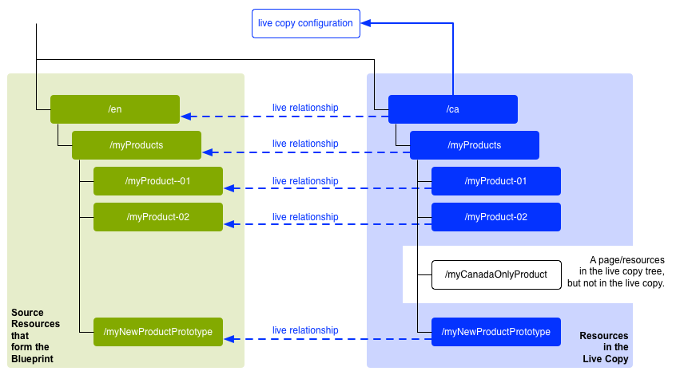

# 重複使用內容：多網站管理員和 Live Copy{#reusing-content-multi-site-manager-and-live-copy}

多網站管理員(MSM)可讓您在多個位置使用相同的網站內容。 MSM使用即時副本功能來達成此目的：

* 有了 MSM，您可以：

   * 建立內容一次，然後
   * 將此內容複製到相同網站或其他網站的其他區域（[即時副本](#live-copies)），並重複使用此內容。

* 然後，MSM會維護您的來源內容與其即時副本之間的（即時）關係，以便：

   * 當您變更來源內容時，來源和即時副本會同步（以將這些變更也套用至即時副本）。
   * 您可以中斷個別子頁面、元件或兩者的即時關係來調整即時副本的內容。 如此一來，對來源的變更就不會再套用至即時副本。

本頁與下列頁面涵蓋相關問題：

* [建立和同步 Live Copies](/help/sites-administering/msm-livecopy.md)
* [Live Copy 概觀主控台](/help/sites-administering/msm-livecopy-overview.md)
* [設定 Live Copy 同步](/help/sites-administering/msm-sync.md)
* [MSM 推出衝突](/help/sites-administering/msm-rollout-conflicts.md)
* [MSM 最佳做法](/help/sites-administering/msm-best-practices.md)

## 可能的案例 {#possible-scenarios}

MSM和即時副本有許多使用案例，某些案例包括：

* **跨國公司 - 全球公司到本地公司**

  MSM 支援的典型使用案例是在多個跨國同語言網站中重複使用內容。這樣可重複使用核心內容，同時可容許國家差異。

  例如，We.Retail參考網站範例的英文區段是為美國客戶建立的。 此網站的大部分內容也可用於其他We.Retail網站，以迎合不同國家/地區和文化的說英語的客戶。 所有網站的核心內容都保持不變，但可以進行區域性調整。

  以下結構可用於美國、英國、加拿大和澳洲的網站：

  ```xml
  /content
      |- we.retail
          |- language-masters
              |- en
      |- we.retail
          |- us
              |- en
      |- we.retail
          |- gb
              |- en
      |- we.retail
          |- ca
              |- en
      |- we.retail
          |- au
              |- en
  ```

  >[!NOTE]
  >
  >MSM 不翻譯內容。它用於建立所需結構和部署內容。
  >
  >
  >如果您想要延伸此範例，請參閱[翻譯多語言網站的內容](/help/sites-administering/translation.md)。

* **全國 - 總公司到地區分公司**

  或者，擁有經銷商網路的公司可能想要個別經銷商的個別網站，每個網站都是總公司所提供之主要網站的變體。 這可能適用於擁有多個區域辦公室的單一公司，或由特許加盟總部和多個地方加盟店組成的全國特許加盟系統。

  總公司可以提供核心資訊，而區域實體可以加入當地資訊，例如聯絡方式、營業時間和活動。

  ```xml
  /content
      |- head-office-Berlin
      |- branch-Hamburg
      |- branch-Stuttgart
      |- branch-Munich
      |- branch-Frankfurt
  ```

* **多個版本**

  或者，您可以使用MSM建立特定子分支的版本。 例如，一個支援子網站，內含特定產品不同版本的詳細資訊，其中基礎資訊保持不變，只有更新的功能必須變更：

  ```xml
  /content
      |- support
          |- product X
              |- v5.0
              |- v4.0
              |- v3.0
              |- v2.0
              |- v1.0
  ```

  >[!NOTE]
  >
  >在這種情況下，您必須決定是直接複製還是使用即時副本。
  >
  >兩者之間會取得平衡：
  >
  >  * 需要在多個版本上更新的核心內容量。
  >
  >對比：
  >
  >  * 必須調整的個別副本數量。

## 從 UI 存取 MSM {#msm-from-the-ui}

MSM可使用適當主控台中的各種選項直接在UI中存取。 為了提供簡介，以下列出主要位置：

* **建立網站**(**Sites**)

   * MSM 協助您管理共用共同內容的多個網站。例如，網站通常提供給國際受眾，因此大部分內容在所有國家都是相同的，只有個別國家/地區的特定內容子集。 MSM可讓您[建立即時副本，以根據您的來源網站](/help/sites-administering/msm-livecopy.md#creating-a-live-copy-of-a-site-from-a-blueprint-configuration)自動更新一或多個網站。 這也有助於您執行通用基礎結構、跨多個網站使用通用內容、維護通用外觀，以及專注於管理網站之間實際不同的內容。
   * 它需要預先定義的Blueprint設定來指定來源。
   * 建立（預先定義的）來源的即時副本。
   * 它提供使用者&#x200B;**轉出**&#x200B;按鈕。

* **建立 Live Copy** (**Sites**)

   * MSM可讓您[建立個別頁面或網站子分支的臨機（一次性）即時副本](/help/sites-administering/msm-livecopy.md#creating-a-live-copy-of-a-page)；例如，複製子分支以提供產品的新/更新版本相關資訊。
   * 建立臨機即時副本（無需Blueprint設定）。
   * 這可用於（立即）建立任何頁面/分支的即時副本。
   * 需要&#x200B;**同步** (不提供&#x200B;**推出**&#x200B;按鈕)。

* **檢視屬性** (**Sites**)

   * 在適當的情況下，此選項可提供相關&#x200B;**即時副本** y或&#x200B;**Blueprint**&#x200B;的資訊，以協助您[監視即時副本](/help/sites-administering/msm-livecopy.md#monitoring-your-live-copy)。

* **參考** (**Sites**)

   * [參考](/help/sites-authoring/basic-handling.md#references)邊欄提供關於 **Live Copy** 的資訊以及對適當動作的存取。

* **Live Copy 概觀** (**Sites**)

   * 此主控台可讓您[檢視和管理您的Blueprint及其即時副本](/help/sites-administering/msm-livecopy-overview.md)。

* **藍圖**(**工具** - **Sites**)

   * 此主控台可讓您[建立和管理您的Blueprint設定](/help/sites-administering/msm-livecopy.md#creating-a-blueprint-configuration)。

>[!NOTE]
>
>MSM可同時用於頁面和[體驗片段](/help/sites-authoring/experience-fragments.md)，因為這些片段是體驗（頁面）的一部分。

>[!NOTE]
>
>MSM功能的各方面可用於其他數個Adobe Experience Manager (AEM)功能（例如，啟動、目錄）；在這些情況下，即時副本由該功能管理。

### 使用的術語 {#terms-used}

作為簡介，下表提供MSM使用的主要術語的概觀；後續章節和頁面將更詳細地介紹這些術語：

<table>
 <tbody>
  <tr>
   <td><strong>術語</strong></td>
   <td><strong>定義</strong></td>
   <td><strong>更多詳細資料</strong></td>
  </tr>
  <tr>
   <td><strong>來源</strong></td>
   <td>原始頁面。</td>
   <td>與Blueprint和/或Blueprint頁面同義。</td>
  </tr>
  <tr>
   <td><strong>Live Copy</strong></td>
   <td>（來源的）副本，由轉出設定所定義的同步化動作來維護。 </td>
   <td> </td>
  </tr>
  <tr>
   <td><strong>Live Copy 設定</strong></td>
   <td>即時副本的設定詳細資料的定義。</td>
   <td> </td>
  </tr>
  <tr>
   <td><strong>即時關係</strong><br /> </td>
   <td>指定資源之繼承的有效定義；來源與即時副本之間的連線。<br /> </td>
   <td>確保對來源的變更可與即時副本同步。</td>
  </tr>
  <tr>
   <td><strong>藍圖</strong></td>
   <td>與Source同義。</td>
   <td>可由Blueprint設定定義。</td>
  </tr>
  <tr>
   <td><strong>藍圖設定</strong></td>
   <td>指定來源路徑的預定義設定。</td>
   <td>在Blueprint設定中參考Blueprint頁面時，「轉出」命令將變為可用。</td>
  </tr>
  <tr>
   <td><strong>同步</strong></td>
   <td>來源與即時副本之間內容同步的一般詞語（透過<strong>轉出</strong>和<strong>同步</strong>）。</td>
   <td> </td>
  </tr>
  <tr>
   <td><strong>推出</strong><br /> </td>
   <td>從來源同步至即時副本。<br />可由作者（在Blueprint頁面上）或系統事件（由轉出設定所定義）觸發。</td>
   <td> </td>
  </tr>
  <tr>
   <td><strong>推出設定</strong></td>
   <td>決定同步哪些屬性、同步方式和時間的規則。</td>
   <td> </td>
  </tr>
  <tr>
   <td><strong>同步</strong></td>
   <td>從即時副本頁面發出的手動同步請求。</td>
   <td> </td>
  </tr>
  <tr>
   <td><strong>繼承</strong></td>
   <td>發生同步時，即時副本頁面/元件會繼承其來源頁面/元件的內容。</td>
   <td> </td>
  </tr>
  <tr>
   <td><strong>暫停</strong></td>
   <td>暫時移除即時副本與其Blueprint頁面之間的即時關係。</td>
   <td> </td>
  </tr>
  <tr>
   <td><strong>分離</strong></td>
   <td>永久移除即時副本與其Blueprint頁面之間的即時關係。</td>
   <td> </td>
  </tr>
  <tr>
   <td><strong>重設</strong></td>
   <td><p>將即時副本頁面重設為：</p>
    <ul>
     <li>移除所有繼承取消和<br /> </li>
     <li>將頁面傳回與來源頁面相同的狀態。</li>
    </ul> <p>重設會影響您對頁面屬性、段落系統和元件所做的任何變更。</p> </td>
   <td> </td>
  </tr>
  <tr>
   <td><strong>淺層</strong></td>
   <td>單一頁面的即時副本。</td>
   <td> </td>
  </tr>
  <tr>
   <td><strong>深層</strong></td>
   <td>頁面的即時副本及其子頁面。</td>
   <td> </td>
  </tr>
 </tbody>
</table>

>[!NOTE]
>
>如需物件名稱，請參閱[Java™ API概觀](/help/sites-developing/extending-msm.md#overview-of-the-java-api)。

## Live Copy {#live-copies}

MSM即時副本是特定網站內容的副本，其維持與原始來源的即時關係：

* 即時副本會從其來源繼承內容。
* 當對來源進行變更時，同步功能會實際傳輸內容。
* 即時副本可視為下列其中一項：

   * 淺層：單一頁面
   * 深層：頁面及其子頁面

* 同步化規則（稱為轉出設定）會決定要同步化的屬性以及同步發生的時間。

在前面的範例中，`/content/we-retail/language-masters/en` 是全球主要英語網站。為了重複使用這個網站的內容，會建立MSM即時副本：

* `/content/we-retail/language-masters/en` 下面的內容是來源。

* `/content/we-retail/language-masters/en`下的內容複製到`/content/we-retail/us/en/`、`/content/we-retail/gb/en`、`/content/we-retail/ca/en`和`/content/we-retail/au/en`節點下。 這些是即時副本。

* 作者可以變更`/content/we-retail/language-masters/en`以下的頁面。
* 觸發時，MSM會將這些變更同步到即時副本。

### Live Copy - 組成項目 {#live-copies-composition}

>[!NOTE]
>
>本節中的圖表和說明代表潛在即時副本的快照。 提供的資訊並不全面，只是概要說明以強調特定的特性。

當您最初建立即時副本時，所選的來源頁面會以1:1的比例反映在即時副本中。 此後，新資源（頁面和/或段落）也可以直接在即時副本中建立，因此瞭解這些變體以及它們對同步的影響會很有用。 可能的組成項目包括：

* [含非 Live Copy 頁面的 Live Copy](#live-copy-with-non-live-copy-pages)
* [巢狀 Live Copy](#nested-live-copies)

即時副本的基本形式具有：

* 以1:1的比例反映所選來源頁面的即時副本頁面。
* 一個設定定義。
* 為每個資源定義的即時關係：

   * 將即時副本資源與其Blueprint/來源連結。
   * 用於實現繼承和轉出。

* 變更可以根據需要[同步](/help/sites-administering/msm-livecopy.md#synchronizing-your-live-copy)。


#### 含非 Live Copy 頁面的 Live Copy {#live-copy-with-non-live-copy-pages}

在AEM中建立即時副本時，您可以檢視和瀏覽即時副本分支，並在即時副本分支上使用一般AEM功能。 這表示您（或程式）可以在即時副本分支內建立資源（頁面、段落或兩者）。 例如，`myCanadaOnlyProduct`。

* 這類資源與來源/藍圖頁面沒有即時關係，並且不同步。
* 可能會發生MSM以特殊情況處理的案例。 例如，當您（或程式）在來源/Blueprint和即時副本分支中建立具有相同位置和名稱的頁面時。 對於這類情況，請參閱[MSM轉出衝突](/help/sites-administering/msm-rollout-conflicts.md)以取得詳細資訊。



#### 巢狀 Live Copy {#nested-live-copies}

當您（或程式）在現有即時副本](#live-copy-with-non-live-copy-pages)中建立[頁面時，此新頁面也可以設定為不同Blueprint的即時副本。 這稱為巢狀即時副本，其中第二個（內部）即時副本的行為會受到第一個（外部）即時副本的影響，影響方式如下：

* 為頂層即時副本觸發的深層轉出可以繼續進入巢狀即時副本（例如，如果觸發器相符）。
* 來源之間的任何連結會在即時副本中重寫。

  例如，從第二個到第一個Blueprint的連結會重寫為從巢狀/第二個即時副本到第一個即時副本的連結。


>[!NOTE]
>
>如果您在即時副本分支中移動/重新命名頁面，則（在內部）這會被視為巢狀即時副本，以讓AEM追蹤關係。

#### 堆疊 Live Copy {#stacked-live-copies}

即時副本建立為淺層即時副本的子項時，即稱為棧疊即時副本。 它的行為與[巢狀即時副本](#nested-live-copies)相同。

### Source、Blueprint和Blueprint設定 {#source-blueprints-and-blueprint-configurations}

任何頁面或頁面分支都可用作即時副本的來源。

然而，MSM 也可讓您定義指定來源路徑的藍圖設定。使用藍圖設定的好處是它們：

* 允許作者在Blueprint上使用&#x200B;**轉出**&#x200B;選項 — 以（明確）推送修改至從此Blueprint繼承的即時副本。
* 允許作者使用&#x200B;**建立網站**；這可讓使用者輕鬆選取語言並設定即時副本的結構。
* 為與Blueprint有關係的即時副本定義預設轉出設定。

即時副本的源可以是常規頁面或Blueprint設定包含的頁面 — 都是有效的使用案例。

來源會形成即時副本的Blueprint。 當您執行以下任一操作時，藍圖即已定義：

* [建立Blueprint設定](/help/sites-administering/msm-livecopy.md#creating-a-blueprint-configuration)

  此設定會（事前）定義要用來建立即時副本的頁面。

* [建立頁面的即時副本](/help/sites-administering/msm-livecopy.md#creating-a-live-copy-of-a-page)

  用來建立即時副本的頁面（來源頁面）是Blueprint頁面。

  Blueprint設定是否可參照來源頁面。

### 推出和同步 {#rollout-and-synchronize}

轉出是中心的MSM動作，可將即時副本與其來源同步。 您可以手動執行轉出，也可以自動進行轉出：

* 可以定義[推出設定](#rollout-configurations)，以便特定的[事件](/help/sites-administering/msm-sync.md#rollout-triggers)可以促使推出自動發生。
* 編寫Blueprint頁面時，您可以使用[轉出](/help/sites-administering/msm-livecopy.md#rolling-out-a-blueprint)命令來推送變更至即時副本。

  **轉出**&#x200B;命令適用於Blueprint設定所參考的Blueprint頁面。

  

* 編寫即時副本頁面時，您可以使用[同步](/help/sites-administering/msm-livecopy.md#synchronizing-a-live-copy)命令，將變更從來源提取到即時副本。

  **同步**&#x200B;命令一律可在即時副本頁面上使用（無論來源/Blueprint頁面是否由Blueprint設定包含）。

  

### 推出設定 {#rollout-configurations}

轉出設定會定義即時副本與來源內容同步的時間和方式。 推出設定由觸發器和一個或多個同步動作組成：

* **觸發器**

  觸發器是引發即時動作同步化的事件，例如來源頁面的啟動。 MSM 定義了您可以使用的觸發器。

* **同步處理動作**

  在即時副本上執行，以將其與來源同步。 範例動作包括複製內容、排序子節點及啟動即時副本頁面。 MSM提供數個同步動作。

  >[!NOTE]
  >
  >您可以使用Java™ API為您的執行個體建立自訂動作。

可以重複使用轉出設定，以便多個即時副本可以使用相同的轉出設定。 標準安裝中包含多個[推出設定](/help/sites-administering/msm-sync.md#installed-rollout-configurations)。

### 推出衝突 {#rollout-conflicts}

轉出可能會變得複雜，尤其是當作者同時編輯來源和即時副本中的內容時，因此瞭解AEM如何處理轉出](/help/sites-administering/msm-rollout-conflicts.md)期間可能發生的任何[衝突會很有用。

### 暫停和取消繼承與同步 {#suspending-and-cancelling-inheritance-and-synchronization}

即時副本中的每個頁面和元件都透過即時關係與其來源頁面和元件相關聯。 即時關係會設定來自來源的即時副本內容同步化。

您可以&#x200B;**暫停**&#x200B;即時副本頁面的即時副本繼承，以便變更頁面屬性和元件。 當您暫停繼承時，頁面屬性和元件將不再與來源同步。

在編輯個別頁面時，作者可以為元件&#x200B;**取消繼承**。取消繼承時，即時關係會暫停，且不會針對該元件進行同步。 當必須自訂內容的子區段時，取消繼承和同步會很有用。

### 分離 Live Copy {#detaching-a-live-copy}

您也可以[從其Blueprint分離即時副本](/help/sites-administering/msm-livecopy.md#detaching-a-live-copy)以移除所有連線。

>[!CAUTION]
>
>分離動作是永久性且無法復原。

分離會永久移除即時副本與其Blueprint頁面之間的即時關係。 所有MSM相關屬性會從即時副本中移除，而即時副本頁面會成為獨立副本。

>[!NOTE]
>
>如需完整詳細資訊，請參閱[分離即時副本](/help/sites-administering/msm-livecopy.md#detaching-a-live-copy)；包括對子頁面和父頁面的相關影響。

## MSM 標準使用步驟 {#standard-steps-for-using-msm}

下列步驟說明使用MSM重複使用內容並同步化即時副本變更的標準程式。

1. 開發源網站的內容。
1. 決定要使用的推出設定。

   1. MSM [安裝多個轉出設定](/help/sites-administering/msm-sync.md#installed-rollout-configurations)，可滿足各種使用案例。
   1. 您可以視需要[建立轉出設定](/help/sites-administering/msm-sync.md#creating-a-rollout-configuration)。

1. 決定您必須[指定要使用的轉出設定](/help/sites-administering/msm-sync.md#specifying-the-rollout-configurations-to-use)，並視需要設定。
1. 如有必要，[建立Blueprint設定](/help/sites-administering/msm-livecopy.md#creating-a-blueprint-configuration)，以識別即時副本的來源內容。
1. [建立即時副本](/help/sites-administering/msm-livecopy.md#creating-a-live-copy)。
1. 視需要變更來源內容。 採用貴組織已建立的一般內容稽核和核准程式。
1. [轉出](/help/sites-administering/msm-livecopy.md#rolling-out-a-blueprint) Blueprint，或[將即時副本](/help/sites-administering/msm-livecopy.md#synchronizing-a-live-copy)與變更同步。

## 自訂 MSM {#customizing-msm}

MSM提供工具，讓您的實作可適應共用內容時可能存在的特殊複雜性：

* **自訂轉出設定**
  [當安裝的轉出設定不符合您的需求時，請建立轉出設定](/help/sites-administering/msm-sync.md#creating-a-rollout-configuration)。 您可以使用任何可用的推出觸發器和同步動作。

* **自訂同步動作**
  [當安裝的動作不符合您的特定應用程式需求時，請建立自訂同步化動作](/help/sites-developing/extending-msm.md#creating-a-new-synchronization-action)。 MSM提供Java™ API來建立自訂同步動作。

## 最佳做法 {#best-practices}

[MSM 最佳做法](/help/sites-administering/msm-best-practices.md)頁面包含與您的實作相關的重要資訊。
