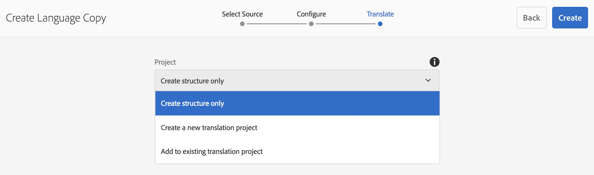

# 語言複製精靈{#language-copy-wizard}

語言複製精靈是建立和檢測多語言內容結構的引導式體驗。 現在建立語言副本會更簡單快速。

>[!NOTE]
>
>使用者必須是專案 — 管理員群組的成員，才能建立網站的語言副本。

若要存取此精靈：

1. 在網站中，選取頁面並按一下建立。

   

1. 選取語言複製，精靈隨即開啟。

   

1. 精靈的&#x200B;**選取Source**&#x200B;步驟可讓您新增/移除頁面。 您也可以選擇包含或排除子頁面。

   

1. 「**下一步**」按鈕將您帶往精靈的&#x200B;**設定**&#x200B;步驟。 您可以在此新增/移除語言並選取翻譯方法。

   

   >[!NOTE]
   >
   >依預設，只有一個翻譯設定。 若要能夠選取其他設定，您必須先設定雲端設定。 請參閱[設定翻譯整合架構](/help/sites-administering/tc-tic.md)。

1. **下一步**&#x200B;按鈕將帶您進入精靈的&#x200B;**翻譯**&#x200B;步驟。 您可以在此處選擇僅建立結構、建立翻譯專案或新增到現有翻譯專案。

   >[!NOTE]
   >
   >如果您在上一步選取了多種語言，將會建立多個翻譯專案。

   

1. **建立**&#x200B;按鈕會結束精靈。

   
