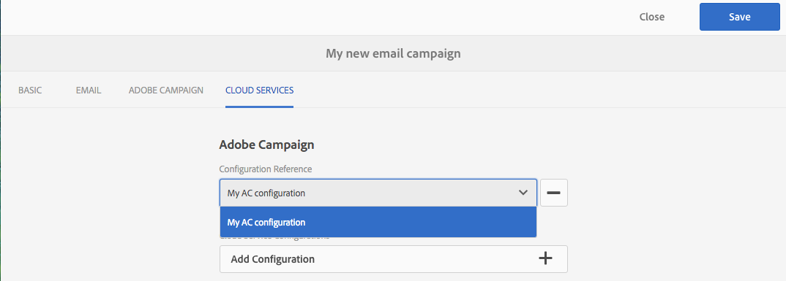
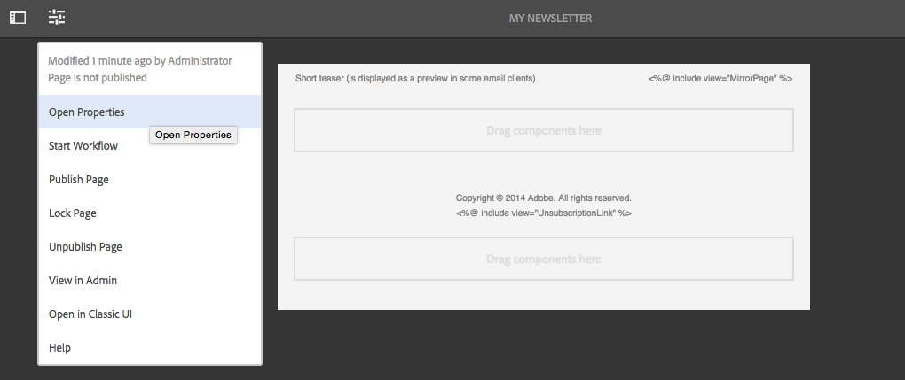

# 合作使用Adobe Campaign Classic與Adobe Campaign Standard{#working-with-adobe-campaign-classic-and-adobe-campaign-standard}

您可以在AEM中建立電子郵件內容，並在Adobe Campaign電子郵件中處理。 若要這麼做，您必須：

1. 從Adobe Campaign專屬的範本，在AEM中建立Newsletter。
1. 請先選取[Adobe Campaign服務](#selecting-the-adobe-campaign-cloud-service-and-template)，再編輯內容以存取所有功能。
1. 編輯內容。
1. 驗證內容。

然後，內容就可以與Adobe Campaign中的傳送同步。 本檔案將說明詳細說明。

另請參閱[在AEM中建立Adobe Campaign Forms](/help/sites-authoring/adobe-campaign-forms.md)。

>[!NOTE]
>
>您必須先設定AEM以與[Adobe Campaign](/help/sites-administering/campaignonpremise.md)或[Adobe Campaign Standard](/help/sites-administering/campaignstandard.md)整合，才能使用此功能。

## 透過Adobe Campaign傳送電子郵件內容 {#sending-email-content-via-adobe-campaign}

設定AEM和Adobe Campaign後，您可以直接在AEM中建立電子郵件傳遞內容，然後在Adobe Campaign中處理。

在AEM中建立Adobe Campaign內容時，您必須先連結至Adobe Campaign服務，才能編輯內容以存取所有功能。

有兩種可能的情況：

* 內容可以與Adobe Campaign的傳送同步。 這可讓您在傳送中使用AEM內容。
* (僅適用於Adobe Campaign Classic)內容可直接傳送至Adobe Campaign，其會自動產生新的電子郵件傳送。 此模式具有限制。

本檔案將說明詳細說明。

### 建立新電子郵件內容 {#creating-new-email-content}

>[!NOTE]
>
>新增電子郵件範本時，請務必在&#x200B;**/content/campaigns**&#x200B;底下新增範本，以便使用。

#### 建立新電子郵件內容 {#creating-new-email-content-1}

1. 在AEM中，依序選取&#x200B;**網站**、**行銷活動**，然後瀏覽至管理電子郵件行銷活動的位置。 在下列範例中，路徑是&#x200B;**網站** > **行銷活動** > **Geometrixx Outdoors** > **電子郵件行銷活動**。

   >[!NOTE]
   >
   >[電子郵件範例僅適用於Geometrixx](/help/sites-developing/we-retail.md)。 從封裝共用下載範例Geometrixx內容。

   

1. 選取&#x200B;**建立**，然後選取&#x200B;**建立頁面**。
1. 選取您連線至Adobe Campaign的特定可用範本之一，然後按一下[下一步] ****。 預設提供三個範本：

   * **Adobe Campaign Classic電子郵件**：可讓您在將內容傳送至Adobe Campaign Classic傳送之前，先新增內容至預先定義的範本（兩欄）。
   * **Adobe Campaign Standard電子郵件**：可讓您在將內容傳送至Adobe Campaign Standard傳送之前，先新增內容至預先定義的範本（兩欄）。

1. 填入&#x200B;**標題**&#x200B;和選擇性的&#x200B;**描述**，然後按一下&#x200B;**建立**。 除非您在編輯電子郵件時覆寫標題，否則標題會作為電子報/電子郵件的主旨。

### 選取Adobe Campaign雲端服務和範本 {#selecting-the-adobe-campaign-cloud-service-and-template}

若要與Adobe Campaign整合，您需要將Adobe Campaign雲端服務新增至頁面。 如此一來，您便可存取個人化及其他Adobe Campaign資訊。

此外，您可能還需要選取Adobe Campaign範本，並變更主旨，為不會在HTML中檢視電子郵件的使用者新增純文字內容。

您可以在建立雲端服務後，從&#x200B;**網站**&#x200B;標籤或電子郵件/電子報內選取雲端服務。

建議從&#x200B;**網站**&#x200B;標籤選取雲端服務。 若要從電子郵件/電子報選取雲端服務，您必須先採取因應措施。

從&#x200B;**網站**&#x200B;頁面：

1. 在AEM中選取電子郵件頁面，然後按一下&#x200B;**檢視屬性**。

   

1. 選取「**編輯**」，然後選取「**雲端服務**」標籤，向下捲動至底部並按一下+號以新增設定，然後選取「**Adobe Campaign**」。

   

1. 從下拉式清單中選取與您的Adobe Campaign執行個體相符的設定，然後按一下&#x200B;**儲存**&#x200B;進行確認。
1. 您可以按一下&#x200B;**Adobe Campaign**&#x200B;索引標籤，以檢視電子郵件已套用的範本。 如果要選取其他範本，您可以在編輯時從電子郵件中存取該範本。

   如果您想要套用預設郵件範本以外的特定電子郵件傳遞範本(來自Adobe Campaign)，請在「**屬性**」中選取「**Adobe Campaign**」標籤。 在相關的Adobe Campaign執行個體中輸入電子郵件傳遞範本的內部名稱。

   您選取的範本決定了Adobe Campaign提供的個人化欄位。

   

由於版面配置問題，您可能無法從製作中的電子報/電子郵件選取&#x200B;**頁面屬性**&#x200B;中的Adobe Campaign雲端服務設定。 您可以使用這裡所述的因應措施：

1. 在AEM中選取電子郵件頁面，然後按一下&#x200B;**編輯**。 按一下&#x200B;**開啟屬性**。

   

1. 選取&#x200B;**雲端服務**&#x200B;並按一下&#x200B;**+**&#x200B;以新增設定。 選取任何可見的設定（無論哪個設定）。 按一下&#x200B;**+**&#x200B;符號以新增其他組態，然後選取&#x200B;**Adobe Campaign**。

   >[!NOTE]
   >
   >或者，您也可以在&#x200B;**網站**&#x200B;索引標籤中選取&#x200B;**檢視屬性**，以選取雲端服務。

1. 從下拉式清單中選取與您的Adobe Campaign執行個體相符的設定，刪除您建立的不適用於Adobe Campaign的第一個設定，然後按一下核取標籤進行確認。
1. 繼續前一個程式中的步驟4，選取範本並新增純文字。

### 編輯電子郵件內容 {#editing-email-content}

若要編輯電子郵件內容：

1. 開啟電子郵件，並依預設進入編輯模式。

   

1. 如果您想要變更電子郵件的主旨，或為不會在HTML中檢視電子郵件的使用者新增純文字，請選取&#x200B;**電子郵件**&#x200B;並新增主旨與文字。 選取頁面圖示以從HTML自動產生純文字版本。 完成後，按一下核取記號。

   您可以使用Adobe Campaign個人化欄位來個人化Newsletter。 若要新增個人化欄位，請按一下顯示Adobe Campaign標誌的按鈕，開啟個人化欄位選擇器。 然後，您可以從此Newsletter可用的所有欄位中進行選擇。

   >[!NOTE]
   >
   >如果編輯器內屬性中的個人化欄位顯示為灰色，請重新檢查您的設定。

   

1. 開啟畫面左側的元件面板，然後從下拉式功能表中選取&#x200B;**Adobe Campaign Newsletter**&#x200B;以尋找這些元件。

   

1. 將元件直接拖曳至頁面上，並加以編輯。 例如，您可以拖曳&#x200B;**文字與Personalization （行銷活動）**&#x200B;元件，並新增個人化文字。

   

   如需每個元件的詳細說明，請參閱[Adobe Campaign元件](/help/sites-authoring/adobe-campaign-components.md)。

   

### 插入個人化 {#inserting-personalization}

編輯內容時，您可以插入：

* Adobe Campaign內容欄位。 這些欄位可插入文字中，並依據收件者的資料（例如名字、姓氏或目標維度的任何資料）進行調整。
* Adobe Campaign個人化區塊。 這些是與收件者資料無關的預先定義內容區塊，例如品牌標誌或映象頁面的連結。

如需Campaign元件的完整說明，請參閱[Adobe Campaign元件](/help/sites-authoring/adobe-campaign-components.md)。

>[!NOTE]
>
>* 只考慮Adobe Campaign **設定檔**&#x200B;目標維度的欄位。
>* 從&#x200B;**網站**&#x200B;檢視屬性時，您沒有Adobe Campaign內容欄位的存取權。 您可以在編輯時直接從電子郵件存取這些專案。

若要插入個人化：

1. 將新的&#x200B;**電子報** > **文字與Personalization （行銷活動）**&#x200B;元件拖曳到頁面上，以插入該元件。

   

1. 按一下「鉛筆」圖示以開啟元件。 就地編輯器隨即開啟。

   

   >[!NOTE]
   >
   >Adobe Campaign Standard的&#x200B;**：**
   >
   >* 可用的內容欄位對應至Adobe Campaign中的&#x200B;**設定檔**&#x200B;目標維度。
   >* 請參閱將AEM頁面連結至Adobe Campaign電子郵件](#linking-an-aem-page-to-an-adobe-campaign-email-adobe-campaign-standard)。[
   >
   >Adobe Campaign Classic的&#x200B;**：**
   >
   >* 可用的內容欄位會從Adobe Campaign **nms：seedMember**&#x200B;結構描述中動態復原。 目標擴充功能資料會從包含與內容同步之傳遞的工作流程中動態復原。 (請參閱[將AEM中建立的內容與Adobe Campaign的傳遞同步](#synchronizing-content-created-in-aem-with-a-delivery-from-adobe-campaign-classic)區段)。
   >
   >* 若要新增或隱藏個人化元素，請參閱[管理個人化欄位和區塊](/help/sites-administering/campaignonpremise.md#managing-personalization-fields-and-blocks)。
   >* **重要**：所有種子表格欄位也必須在收件者表格（或對應的聯絡人表格）中。

1. 透過輸入插入文字。 按一下Adobe Campaign元件並加以選取，插入內容欄位或個人化區塊。 完成後，選取核取記號。

   

   插入內容欄位或個人化區塊後，您可以預覽Newsletter並測試欄位。 請參閱[預覽電子報](#previewing-a-newsletter)。

### 預覽電子報 {#previewing-a-newsletter}

您可以預覽Newsletter的外觀並預覽個人化。

1. 在Newsletter開啟的狀態下，按一下AEM右上角的&#x200B;**預覽**。 AEM會顯示使用者收到Newsletter時的外觀。

   

   >[!NOTE]
   >
   >如果您使用Adobe Campaign Standard並使用範例範本，顯示初始內容的兩個個人化區塊 — **&quot;&lt;%@ include view=&quot;MirrorPage&quot; %>&quot;**&#x200B;和&#x200B;**&quot;&lt;%@ include view=&quot;UnsubscriptionLink&quot; %>&quot;** — 在傳送期間匯入內容時將會擲回錯誤。 您可以使用個人化區塊選擇器選取對應的區塊，以調整這些區塊。

1. 若要預覽個人化，請按一下/點選工具列中的對應圖示以開啟ContextHub。 個人化欄位標籤現在由所選角色的種子資料取代。 瞭解在ContextHub中切換角色時，變數如何調整。

   

1. 您可以檢視來自Adobe Campaign且與目前所選角色相關聯的種子資料。 若要這麼做，請按一下ContextHub列中的Adobe Campaign模組。 這會開啟一個對話方塊，顯示目前設定檔的所有種子資料。 同樣地，資料會在切換至不同角色時進行調整。

   

### 在AEM中核准內容 {#approving-content-in-aem}

內容完成後，您可以開始核准程式。 移至工具箱的&#x200B;**工作流程**&#x200B;標籤，並選取&#x200B;**核准Adobe Campaign**&#x200B;工作流程。

這個現成的工作流程有兩個步驟：依序修訂及核准，或依序修訂及拒絕。 然而，此工作流程可以延伸並適應更複雜的流程。

若要核准Adobe Campaign的內容，請選取&#x200B;**工作流程**&#x200B;並選取&#x200B;**核准Adobe Campaign**，然後按一下&#x200B;**開始工作流程**，以套用工作流程。 進行各個步驟並核准內容。 您也可以在最後一個工作流程步驟中選取&#x200B;**拒絕**，而非&#x200B;**核准**，以拒絕內容。

內容在核准後，會在Adobe Campaign中顯示為已核准。 然後可以傳送電子郵件。

在Adobe Campaign Standard中：

在Adobe Campaign Classic中：

>[!NOTE]
>
未核准的內容可以與Adobe Campaign中的傳遞同步，但傳遞無法執行。 只有已核准的內容才能透過Campaign傳遞傳送。

## 將AEM與Adobe Campaign Standard和Adobe Campaign Classic連結 {#linking-aem-with-adobe-campaign-standard-and-adobe-campaign-classic}

如何將AEM與Adobe Campaign連結或同步處理取決於您是使用訂閱式Adobe Campaign Standard還是內部部署Adobe Campaign Classic。

如需以您的Adobe Campaign解決方案為基礎的指示，請參閱下列章節：

* [將AEM頁面連結至Adobe Campaign電子郵件(Adobe Campaign Standard)](#linking-an-aem-page-to-an-adobe-campaign-email-adobe-campaign-standard)
* [將AEM中建立的內容與來自Adobe Campaign Classic的傳遞同步](#synchronizing-content-created-in-aem-with-a-delivery-from-adobe-campaign-classic)

### 將AEM頁面連結至Adobe Campaign電子郵件(Adobe Campaign Standard) {#linking-an-aem-page-to-an-adobe-campaign-email-adobe-campaign-standard}

Adobe Campaign Standard可讓您復原和連結在AEM中建立的內容，包含：

* 電子郵件。
* 電子郵件範本。

如此可讓您傳送內容。 您可以透過頁面上顯示的程式碼，檢視電子報是否連結至單一傳送。

>[!NOTE]
>
如果電子報連結至數個傳送，則會顯示連結的傳送數量（但不會顯示每個ID）。

若要將AEM中建立的頁面連結至Adobe Campaign的電子郵件：

1. 根據AEM專屬的電子郵件範本建立電子郵件。 如需詳細資訊，請參閱[在Adobe Campaign Standard中建立電子郵件](https://helpx.adobe.com/campaign/standard/channels/using/creating-an-email.html)。

   

1. 從傳遞儀表板開啟&#x200B;**Content**&#x200B;區塊。

   

1. 在工具列中選取&#x200B;**連結至Adobe Experience Manager內容**&#x200B;以存取AEM中可用的內容清單。

   >[!NOTE]
   >
   如果動作列中沒有&#x200B;**具有Adobe Experience Manager**&#x200B;選項的連結，請檢查電子郵件屬性中的&#x200B;**內容編輯模式**&#x200B;是否已正確設定為&#x200B;**Adobe Experience Manager**。

   

1. 選取您要在電子郵件中使用的內容。

   此清單指定：

   * AEM中內容的標籤。
   * AEM中內容的核准狀態。 如果內容未核准，您可以同步內容，但必須在傳送前核准。 不過，您可以執行特定操作，例如傳送校樣或預覽測試。
   * 上次修改內容的日期。
   * 任何內容皆已連結至傳遞。

   >[!NOTE]
   >
   依預設，已和傳送同步的內容會隱藏。 不過，您可以顯示並使用它。 例如，如果您想要將內容當做數個傳送的範本。

   當電子郵件連結至AEM內容時，無法在Adobe Campaign中編輯內容。

1. 從電子郵件的控制面板（受眾、執行排程）指定電子郵件的其他引數。
1. 執行電子郵件傳遞。 在傳遞分析期間，系統會擷取最新版本的AEM內容。

   >[!NOTE]
   >
   如果內容在連結至電子郵件時於AEM中更新，則會在分析期間於Adobe Campaign中自動更新。 同步處理也可以使用內容動作列中的&#x200B;**重新整理Adobe Experience Manager內容**&#x200B;來手動執行。
   >
   您可以使用&#x200B;**從內容動作列刪除含有AEM內容的連結**，來取消電子郵件與Adobe Experience Manager內容之間的連結。 此按鈕僅在內容已連結至傳遞時才能使用。 若要將不同的內容與傳送連結，您必須刪除目前的內容連結，才能建立新連結。
   >
   刪除連結後，本機內容會保留，並可在Adobe Campaign中編輯。 如果您在修改內容後再次連結內容，所有變更將會遺失。

### 將AEM中建立的內容與來自Adobe Campaign Classic的傳遞同步 {#synchronizing-content-created-in-aem-with-a-delivery-from-adobe-campaign-classic}

Adobe Campaign可讓您復原在AEM中建立的內容，並與以下內容同步：

* 行銷活動傳遞
* 行銷活動工作流程中的傳遞活動
* 循環傳遞
* 持續傳遞
* 訊息中心傳遞
* 傳遞範本

在AEM中，如果電子報連結至單一傳遞，則傳遞代碼會顯示在頁面上。

>[!NOTE]
>
如果Newsletter連結至數個傳送，則會顯示連結的傳送數量（但不會顯示每個ID）。
>
[!NOTE]
>
AEM 6.1已棄用工作流程步驟&#x200B;**發佈至Adobe Campaign**。此步驟是AEM 6.0與Adobe Campaign整合的一部分，已不再是必要步驟。

若要將AEM中建立的內容與來自Adobe Campaign的傳送同步：

1. 選取包含AEM內容(mailAEMContent)**傳遞範本的**&#x200B;電子郵件傳遞，以建立傳遞或將傳遞活動新增至行銷活動工作流程。

   

1. 在工具列中選取「**同步化**」以存取AEM中可用的內容清單。

   >[!NOTE]
   >
   如果&#x200B;**同步化**&#x200B;選項未出現在傳遞的工具列中，請選取&#x200B;**屬性** > **進階**，以檢查&#x200B;**內容編輯模式**&#x200B;欄位是否已在&#x200B;**AEM**&#x200B;中正確設定。

   

1. 選取您要與傳送同步的內容。

   此清單指定：

   * AEM中內容的標籤。
   * AEM中內容的核准狀態。 如果內容未核准，您可以同步內容，但必須在傳送前核准。 不過，您可以執行特定操作，例如傳送BAT或預覽測試。
   * 上次修改內容的日期。
   * 任何內容皆已連結至傳遞。

   >[!NOTE]
   >
   依預設，已和傳送同步的內容會隱藏。 不過，您可以顯示並使用它。 例如，如果您想要將內容當做數個傳送的範本。

   

1. 指定傳送的其他引數（目標等）
1. 如有必要，請在Adobe Campaign中開始傳遞核准流程。 除了在AEM中設定的核准（預算、目標等）之外，還需要Adobe Campaign中的內容核准。 只有內容已在Adobe Campaign中核準時，才能在AEM中核准內容。
1. 執行傳遞。 在傳遞分析期間，會復原最新版本的AEM內容。

   >[!NOTE]
   >
   * 在傳遞與內容同步之後，Adobe Campaign中的傳遞內容會變成唯讀。 無法再修改電子郵件主旨及其內容。
   * 如果內容在連結至Adobe Campaign中的傳送時在AEM中更新，則會在傳送分析期間在傳送中自動更新。 也可以使用&#x200B;**立即重新整理內容**&#x200B;按鈕手動執行同步處理。
   * 您可以使用&#x200B;**取消同步**&#x200B;按鈕，取消傳遞與AEM內容之間的同步。 唯有內容已與傳送同步時，才可使用此選項。 若要將不同的內容與傳送同步，您必須先取消目前的內容同步，才能建立新連結。
   * 如果取消同步，本機內容會保留並可在Adobe Campaign中編輯。 如果您在修改內容後重新同步內容，將會遺失所有變更。
   * 對於循環和持續傳遞，每次執行傳遞時都會停止與AEM內容的同步。
