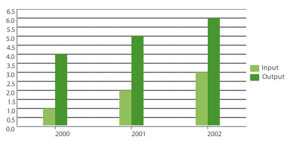
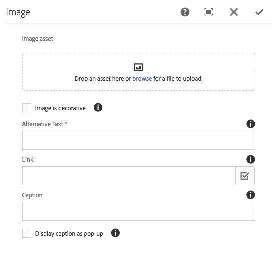
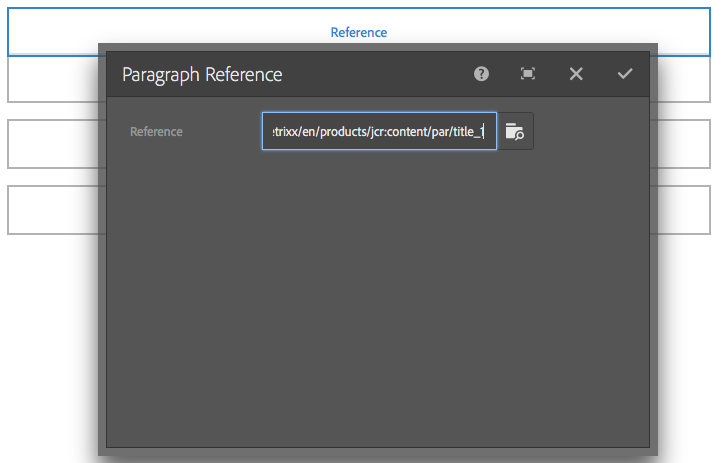

# 基礎元件 {#foundation-components}

>[!CAUTION]
>
>AEM 6.5已棄用大部分的基礎元件。Adobe建議在AEM專案中使用更現代且更可擴充的[核心元件](https://experienceleague.adobe.com/docs/experience-manager-core-components/using/introduction.html?lang=zh-hant)。 這些元件是[We.Retail範例內容](/help/sites-developing/we-retail.md)的一部分，也可以[單獨安裝，由您的管理員用於開發](https://experienceleague.adobe.com/docs/experience-manager-core-components/using/get-started/using.html)。
>
>您可以使用[AEM Modernize Tools Suite](https://opensource.adobe.com/aem-modernize-tools/)來重構基礎元件型網站，以使用核心元件。

基礎元件是專為製作標準網頁的內容所設計。 這些元件是適用於AEM標準安裝的現成可用元件子集。

有些可透過元件瀏覽器立即取得。 也可使用[設計模式](/help/sites-authoring/default-components-designmode.md) （如果頁面是以靜態範本為基礎）或[編輯範本](/help/sites-authoring/templates.md) （如果頁面是以可編輯的範本為基礎）來使用其他各種範本。

基礎元件的使用受到支援，但大部分已被核心元件取代並棄用，這些元件提供更大的擴充性和靈活性。

>[!NOTE]
>
>本節僅討論標準AEM安裝中現成可用的元件。
>
>根據您的執行個體，您可能已針對您的需求明確開發自訂元件。 這些自訂元件的名稱甚至可能與此處討論的部分元件相同。

當[編輯頁面](/help/sites-authoring/editing-content.md)時，元件可在頁面編輯器側面板的&#x200B;**元件**&#x200B;索引標籤上使用。

您可以選取元件並將其拖曳至頁面上的所需位置。 您接著可以使用下列專案加以編輯：

* [設定屬性](/help/sites-authoring/editing-page-properties.md)
* [編輯內容](/help/sites-authoring/editing-content.md)

* [編輯內容 — 全熒幕模式](/help/sites-authoring/editing-content.md#edit-content-full-screen-mode)

元件會根據各種稱為元件群組的類別排序，包括：

* [一般](#general)：包含基本元件，包括文字、影像、表格和圖表。
* [欄](#columns)：包含組織內容配置所需的元件。
* [表單](#formgroup)：包含建立表單所需的所有元件。

## 一般 {#general}

一般元件是您用來建立內容的基本元件。

### 帳戶項目 {#account-item}

>[!CAUTION]
>
>已棄用此基礎元件。 Adobe建議改用[核心元件](https://experienceleague.adobe.com/docs/experience-manager-core-components/using/introduction.html?lang=zh-Hant)。

您可以定義具有標題和說明的連結。


### 自我調整影像 {#adaptive-image}

>[!CAUTION]
>
>已棄用此基礎元件。 Adobe建議改用[影像核心元件](https://experienceleague.adobe.com/docs/experience-manager-core-components/using/wcm-components/image.html)。

最適化影像基礎元件會產生大小適合網頁開啟視窗的影像。 若要使用元件，您可以從檔案系統或DAM提供影像資源。 開啟網頁時，網頁瀏覽器會下載已調整大小的影像復本，以適合目前的視窗。

下列特性可決定視窗的大小：

* 裝置畫面：行動裝置通常會顯示網頁，以便橫跨整個熒幕。
* 網頁瀏覽器視窗大小：筆記型電腦和桌上型電腦的使用者可以調整網頁瀏覽器視窗的大小。

例如，在手機上開啟網頁時，元件會產生小影像，而在平板電腦上開啟網頁時，則會產生中等大小的影像。 在筆記型電腦上，當頁面在最大化的網頁瀏覽器中開啟時，元件會建立並傳送大型影像。 當網頁瀏覽器調整大小以符合熒幕的一部分時，元件會透過提供較小的影像進行調整，並重新整理檢視。

#### 支援的影像格式 {#supported-image-formats}

您可以將下列副檔名的影像檔案搭配最適化影像元件使用：

* .jpg
* .jpeg
* .png
* .gif &#42;&#42;

>[!CAUTION]
>
>AEM不支援動畫GIF檔案以進行最適化轉譯。

#### 影像大小和品質 {#images-sizes-and-quality}

下表列出針對指定檢視區寬度產生的影像寬度。 計算產生影像的高度是為了維持不變的外觀比例，影像邊緣內不會出現空白區域。 可使用裁切來避免留空格。

當影像為JPEG影像時，檢視區大小也會影響JPEG品質。 可以具備下列JPEG品質：

* 低(0.42)
* Medium (0.82)
* 高(1.00)

| **檢視區寬度範圍（畫素）** | **影像寬度（畫素）** | **JPEG品質** | **目標裝置型別** |
|---|---|---|---|
| 寬度&lt;= 319 | 320 | 低 |  |
| 寬度= 320 | 320 | 中 | 行動電話（直向） |
| 320 &lt;寬度&lt; 481 | 480 | 中 | 行動電話（橫向） |
| 480 &lt;寬度&lt; 769 | 476 | 高 | 平板電腦（縱向） |
| 768 &lt;寬度&lt; 1025 | 620 | 高 | 平板電腦（橫向） |
| 寬度&lt;= 1025 | 完整（原始大小） | 高 | 桌上型電腦 |

#### 屬性 {#properties}

此對話方塊可讓您編輯最適化影像元件例項的屬性，其中許多屬性與其所依據的影像元件相同。 屬性位於兩個標籤中：

* **影像**

   * **影像**
從內容尋找器拖曳影像，或按一下開啟瀏覽視窗，您可在此載入影像。 載入影像後，您可以裁切、旋轉或刪除影像。 若要放大和縮小影像，請使用影像下方的滑動列（在「確定」和「取消」按鈕上方）

   * **裁切**
裁剪部分影像。 拖曳邊框以裁切影像。

   * **旋轉**
重複按一下「旋轉」，直到視需要旋轉影像為止。

   * **清除**
移除目前的影像。

* **進階**

   * **標題**
最適化影像元件沒有使用此屬性。

   * **替代文字**
用於影像的替代文字。

   * **連結至**
最適化影像元件沒有使用此屬性。

   * **描述**
最適化影像元件沒有使用此屬性。

### 傳送 {#carousel}

>[!CAUTION]
>
>已棄用此基礎元件。 Adobe建議改用[轉盤核心元件](https://experienceleague.adobe.com/docs/experience-manager-core-components/using/wcm-components/carousel.html)。

轉盤元件可讓您顯示與個別頁面相關聯的影像：

* 一次一個
* 短時間
* 依您指定的順序
* 具有您指定的時間延遲

可點按的控制項也可讓使用者依需求即時循環瀏覽顯示的頁面。 選取目前可見的頁面影像會前往該頁面。 換言之，輪播會充當導覽控制項。

#### 屬性 {#properties-1}

這些屬性位於兩個標籤中：

* **輪播**
您可以在此處指定轉盤運作方式：

   * 播放速度
下一張投影片顯示前的毫秒時間。
   * 過渡時間
兩張幻燈片之間的過渡時間（毫秒）。
   * 控制項樣式
下拉式選單中有多種選項，例如「上一頁/下一頁」按鈕、「右上切換」。

* **清單**

  您可在此處指定轉盤中包含頁面的方式：

   * **使用**建置清單
建立頁面清單有數種方式 — 子頁面、固定清單、搜尋或進階搜尋（皆說明如下）。
無論您選擇哪種方法，您包含在清單中的頁面都應已有一個與頁面關聯的影像。 這是轉盤中顯示的影像。 如果特定頁面的頁面屬性下沒有影像，您應該先將影像與頁面建立關聯，然後再開始。 否則，轉盤會顯示大部分空白頁面。 請參閱[編輯頁面屬性](/help/sites-authoring/editing-page-properties.md)。
視您選擇的專案而定，會出現新面板：

      * 子頁面的&#x200B;**選項**

         * **父頁面**
手動或使用選取器指定路徑。 留空將使用目前頁面作為父頁面。

      * 固定清單的&#x200B;**選項**

         * **頁**
選取頁面清單。 使用`+`新增更多專案，並使用上/下按鈕調整順序。

      * 搜尋的&#x200B;**選項**

         * **開始於**
手動或使用選取器輸入開始路徑。

         * **搜尋查詢**
您可以輸入純文字搜尋查詢。

      * 進階搜尋的&#x200B;**選項**

         * **Querybuilder述詞記號**
您可以使用Querybuilder述詞記號來輸入搜尋查詢。 例如，您可以輸入&quot;fulltext=Marketing&quot;，讓內容中包含&quot;Marketing&quot;的所有頁面顯示在轉盤中。
請參閱[QueryBuilder API](/help/sites-developing/querybuilder-api.md)，以取得查詢運算式的完整討論和其他範例。

   * **排序依據**
從下拉式功能表中選取`jcr:title`、`jcr:created`、`cq:lastModified`或`cq:template`。

   * **限制**
選填。 您想在轉盤中使用的專案數上限。

>[!NOTE]
>
>您可以為Adobe Experience Manager建立自訂轉盤元件，該元件會在AEM DAM中顯示數位資產。 請參閱[建立Adobe Experience Manager的自訂轉盤元件](https://experienceleague.adobe.com/docs/experience-manager-learn/getting-started-wknd-tutorial-develop/overview.html)。

### 圖表 {#chart}

>[!CAUTION]
>
>已棄用此基礎元件。 Adobe建議改用[核心元件](https://experienceleague.adobe.com/docs/experience-manager-core-components/using/introduction.html?lang=zh-hant)。

圖表元件可讓您新增長條圖、折線圖或圓餅圖。 AEM會根據您提供的資料建立圖表。 您可以直接在「資料」標籤中輸入，或複製並貼上試算表來提供資料。

* **資料**

   * **圖表資料**
使用CSV格式輸入您的圖表資料；逗號分隔值格式使用逗號(&quot;，&quot;)作為欄位分隔符號。

* **進階**

   * **圖表型別**
從圓餅圖、折線圖和長條圖選取。

   * **替代文字**
顯示替代文字而非圖表。

   * **寬度**
圖表的寬度（畫素）。

   * **高度**
圖表的高度（畫素）。

以下顯示圖表資料的範例，後面接著產生的長條圖：

 

>[!NOTE]
>
>您可以建立自訂AEM圖表控制項，在AEM JCR中顯示資料。 如需詳細資訊，請參閱[在圖表中顯示Adobe Experience Manager資料](https://experienceleague.adobe.com/docs/experience-manager-learn/getting-started-wknd-tutorial-develop/overview.html)。

### 內容片段 {#content-fragment}

>[!CAUTION]
>
>已棄用此基礎元件。 Adobe建議改用[內容片段核心元件](https://experienceleague.adobe.com/docs/experience-manager-core-components/using/wcm-components/content-fragment-component.html)。

[內容片段](/help/sites-authoring/content-fragments.md)已建立並管理為不受頁面影響的資產。 接著，您就可以在編寫內容頁面時，使用這些片段及其變數。

### Design Importer {#design-importer}

>[!CAUTION]
>
>已棄用此基礎元件。 Adobe建議改用[核心元件](https://experienceleague.adobe.com/docs/experience-manager-core-components/using/introduction.html?lang=zh-hant)。

此元件可讓您上傳儲存設計封裝的zip檔案。

### 下載 {#download}

>[!CAUTION]
>
>已棄用此基礎元件。 Adobe建議改用[核心元件](https://experienceleague.adobe.com/docs/experience-manager-core-components/using/introduction.html?lang=zh-hant)。

下載元件會在選取的網頁上建立連結，以下載特定檔案。 您可以從「內容尋找器」拖曳資產或上傳檔案。

* **下載**

   * **描述**
與下載連結一起顯示的簡短說明。

   * **檔案**
可在產生的網頁上下載的檔案。 從內容尋找器拖曳資產或選取區域，方便您上傳要下載的檔案。

下列範例顯示Geometrixx中的下載元件：


### 外部 {#external}

>[!CAUTION]
>
>已棄用此基礎元件。 Adobe建議改用[核心元件](https://experienceleague.adobe.com/docs/experience-manager-core-components/using/introduction.html?lang=zh-hant)。

外部應用程式整合元件(**External**)可讓您使用iframe將外部應用程式內嵌至AEM頁面。

* **外部**

   * **目標應用程式**
指定要整合之Web應用程式的URL；例如：

     ```
     https://en.wikipedia.org/wiki/Main_Page
     ```

   * **傳遞引數**
核取方塊，讓引數在需要時傳遞至應用程式。

   * **寬度和高度
**定義iframe的大小

外部應用程式已整合至AEM頁面的段落系統；例如，使用`https://en.wikipedia.org/wiki/Main_Page`的目標應用程式時：


>[!NOTE]
>
>視您的使用案例而定，其他選項可用於整合外部應用程式，例如[整合Portlet](/help/sites-administering/aem-as-portal.md)。

### 閃光燈 {#flash}

>[!CAUTION]
>
>已棄用此基礎元件。 Adobe建議改用[核心元件](https://experienceleague.adobe.com/docs/experience-manager-core-components/using/introduction.html?lang=zh-hant)。

>[!CAUTION]
>
>若無廣泛的專案層級自訂，此元件就不能再正常運作。

Flash元件可讓您載入Flash影片。 您可以從內容尋找器將Flash資產拖曳至元件上，或者也可以使用對話方塊：

* **閃光燈**

   * **Flash影片**

     Flash影片檔案。 從內容尋找器拖曳資產，或按一下開啟瀏覽視窗。

   * **大小**

     容納影片的顯示區域的尺寸（畫素）。

* **替代影像**

  要顯示的替代影像

* **進階**

   * **內容功能表**

     指示要顯示或隱藏內容功能表。

   * **視窗模式**

     視窗的顯示方式，例如，不透明、透明，或作為不同的（實心）視窗。

   * **背景顏色**

     從提供的色彩圖表中選取的背景色彩。

   * **最低版本**

     執行影片所需的最低版本Adobe Flash Player。 預設值為9.0.0。

   * **屬性**

     需要任何進一步的屬性。

### 影像 {#image}

>[!CAUTION]
>
>已棄用此基礎元件。 Adobe建議改用[影像核心元件](https://experienceleague.adobe.com/docs/experience-manager-core-components/using/wcm-components/image.html)。

影像元件會根據指定的引數顯示影像和隨附文字。

您可以上傳影像，然後編輯和處理影像（例如，裁切、旋轉、新增連結/標題/文字）。

您可以從[Assets瀏覽器](/help/sites-authoring/author-environment-tools.md#assets-browser)將影像直接拖放到元件或其[設定對話方塊](/help/sites-authoring/editing-content.md#component-edit-dialog)上。 您也可以從「設定」對話方塊上傳影像；此對話方塊也會控制影像的所有定義與操作：



上傳影像後（而非之前），您可以視需要使用[就地編輯](/help/sites-authoring/editing-content.md#edit-content)來裁切/旋轉影像：


>[!NOTE]
>
>就地編輯器在編輯時會使用影像的原始大小和外觀比例。 您也可以指定高度和寬度屬性。 儲存編輯變更時，會套用屬性中定義的任何大小和外觀比例限制。
>
>根據您的執行個體，頁面](/help/sites-developing/designer.md)的[設計也可能施加最小和最大限制。 這些限制是在專案實施期間制定的。

全熒幕編輯模式中有數個其他選項可供使用；例如，地圖和縮放：


>[!NOTE]
>
>無法使用Internet Explorer監視上傳的進度。
>
>Internet Explorer使用者必須上傳影像並按一下&#x200B;**確定**，然後重新開啟影像以在預覽中檢視上傳的檔案，並能夠執行修改（即裁切）。
>
>如需AEM所使用HTML5功能的詳細資訊，請參閱[認證平台](/help/release-notes/release-notes.md#certifiedplatforms)一節。

載入影像時，您可以設定下列專案：

* **地圖**

  若要對應影像，請選取「對應」。 您可以指定建立影像地圖（矩形、多邊形等）的方式以及區域應指向的位置。

* **裁切**

  若要剪下影像的一部分，請選取「裁切」。 使用滑鼠裁切影像。

* **旋轉**

  若要旋轉影像，請選取「旋轉」。 重複使用，直到影像以您想要的方式旋轉。

* **清除**

  移除目前的影像。

* **標題**

  影像的標題。

* **替代文字**

  建立無障礙內容時使用的替代文字。

* **連結至**

  建立資產或網站內其他頁面的連結。

* **說明**

  影像的說明。

* **大小**

  設定影像的高度和寬度。

>[!NOTE]
>
>部分選項僅在全熒幕編輯器中可用。

最終影像（具有&#x200B;**Title**&#x200B;和&#x200B;**Description**）可能顯示為：


### 配置容器 {#layout-container}

此元件提供格線段落系統，可讓您在[回應式格線](/help/sites-authoring/responsive-layout.md)內新增及放置元件。 您可以根據目標裝置的寬度來定義不同的內容配置，包括手機、平板電腦和桌上型電腦等。


>[!NOTE]
>
>此元件已使用[HTML範本語言(HTL)](https://experienceleague.adobe.com/docs/experience-manager-htl/content/overview.html)實作。

### 清單 {#list}

>[!CAUTION]
>
>已棄用此基礎元件。 Adobe建議改用[清單核心元件](https://experienceleague.adobe.com/docs/experience-manager-core-components/using/wcm-components/list.html)。

「清單」元件可讓您設定顯示清單的搜尋條件：

* **清單**

   * **使用**&#x200B;建置清單

     您可在此指定清單擷取其內容的位置。 有幾種方法：

   * 視您選擇的專案而定，會出現新面板：

      * 子頁面的&#x200B;**選項**

         * **的**&#x200B;子項（父頁面）

           手動或使用選取器指定路徑。 留空將使用目前頁面作為父頁面。

      * 固定清單的&#x200B;**選項**

         * **頁**

           選取頁面清單。 使用+新增更多專案，並使用上/下按鈕調整順序。

      * 搜尋的&#x200B;**選項**

         * 開始

           手動或使用選取器輸入開始路徑。

         * 搜尋查詢

           您可以輸入純文字搜尋查詢。

      * 進階搜尋的&#x200B;**選項**

         * **Querybuilder述詞記號**

           您可以使用Querybuilder述詞記號來輸入搜尋查詢。 例如，您可以輸入&quot;fulltext=Marketing&quot;，讓內容中包含&quot;Marketing&quot;的所有頁面顯示在轉盤中。

           請參閱[QueryBuilder API](/help/sites-developing/querybuilder-api.md)，以取得查詢運算式的完整討論和其他範例。

      * **標籤**

        指定&#x200B;**父頁面**、**標籤/關鍵字**，以及您所需的符合條件。

   * **顯示為**

     您希望專案列出的方式；包括連結、Teaser和新聞。

   * **排序依據**

     是否要排序清單，如果是，則為用於排序的條件。 您可以輸入條件，或從提供的下拉式清單中選取條件。

   * **限制**

     指定您要在清單中顯示的最大專案數。

   * **啟用摘要**

     指出是否應為清單啟動RSS摘要。

   * **每頁顯示專案數**

     您可以在此處指定要一次顯示的清單專案數量。 專案數量超過指定數量的清單會使用分頁功能將清單分成數個部分顯示。

下列範例顯示&#x200B;**List**&#x200B;元件，其顯示子頁面清單的方式（設計是由網站設計的自訂CSS定義所控制）。


### 登入 {#login}

>[!CAUTION]
>
>已棄用此基礎元件。 Adobe建議改用[核心元件](https://experienceleague.adobe.com/docs/experience-manager-core-components/using/introduction.html?lang=zh-hant)。

>[!CAUTION]
>
>若無廣泛的專案層級自訂，此元件就不能再正常運作。

提供使用者名稱和密碼欄位。


您可以設定：

* 登入

   * 區域標籤

     輸入欄位的匯入文字。

   * 使用者名稱標籤

     標示使用者名稱欄位的文字。

   * 密碼標籤

     標籤密碼欄位的文字。

   * 登入按鈕標籤

     登入按鈕的文字。

   * 重新導向至

     您可以在您的網站上指定當使用者登入後應該開啟的頁面。

* 已登入

   * 繼續按鈕標籤

     表示使用者已登入的文字。

### 訂單狀態 {#order-status}

>[!CAUTION]
>
>若無廣泛的專案層級自訂，此元件就不能再正常運作。

* **標題**

   * **標題**

     指定您要顯示的標題文字。

   * **連結**

     指定應顯示訂單狀態的頁面（產品）。

   * **型別/大小**

     從提供的選取範圍中選取。


### 參考 {#reference}

>[!CAUTION]
>
>已棄用此基礎元件。 Adobe建議改用[內容片段核心元件](https://experienceleague.adobe.com/docs/experience-manager-core-components/using/wcm-components/content-fragment-component.html)。

**Reference**&#x200B;元件可讓您參考AEM網站其他頁面（在目前執行個體內）的文字。 參考段落的內容接著會出現在目前的頁面。 內容會在來源段落變更時更新（可能需要重新整理頁面）。

* **段落參考**

   * **參考**

     指定您要參考的頁面和段落的路徑（包含內容）。

若要指定段落的路徑，您必須在路徑（頁面）的結尾加上：

`.../jcr:content/par/<paragraph-ID>`

例如：

`/content/geometrixx-outdoors/en/equipment/biking/cajamara/jcr:content/par/similar-products`

除了參照特定段落之外，還可以修改路徑以指定整個段落系統。 您可以使用下列字尾來參照路徑：

`/jcr:content/par`

例如：

`/content/geometrixx-outdoors/en/equipment/biking/cajamara/jcr:content/par`

設定後，內容會完全顯示在來源頁面上。 只有在開啟元件進行編輯時，才會看到它是參照：



### 搜尋 {#searching}

>[!CAUTION]
>
>已棄用此基礎元件。 Adobe建議改用[快速搜尋核心元件](https://experienceleague.adobe.com/docs/experience-manager-core-components/using/wcm-components/quick-search.html)。

搜尋元件會將搜尋功能新增至您的頁面。

您可以設定：

* 搜尋

   * **節點型別**

     如果搜尋僅限於特定節點型別，請在此處列出它們；例如，`cq:Page`。

   * **在**&#x200B;中搜尋的路徑

     指定您要搜尋之分支的根頁面。

   * **搜尋按鈕文字**

     實際搜尋按鈕上顯示的名稱。

   * **統計資料文字**

     搜尋結果上方顯示的文字。

   * **沒有結果文字**

     如果沒有結果，則顯示在此處輸入的文字。

   * **拼字檢查文字**

     如果有人輸入類似的詞語，此文字會顯示在該詞語之前。
例如，如果您輸入`Geometrixxe`，系統顯示「您的意思是？ Geometrixx」。

   * **類似的頁面文字**

     在類似頁面的結果旁邊顯示的文字。 若要檢視具有類似內容的頁面，請按一下此連結。

   * **相關搜尋文字**

     旁邊顯示的文字會搜尋相關辭彙和主題。

   * **搜尋趨勢文字**

     使用者輸入的搜尋詞上方標題。

   * **結果頁面標籤**

     此清單底部顯示的文字，包含其他結果頁面的連結。

   * **上一個標籤**

     顯示在先前搜尋頁面連結上的名稱。

   * **下一個標籤**

     顯示在後續搜尋頁面連結上的名稱。

下列範例顯示從標準安裝的根目錄搜尋&#x200B;*`geometrixx`*&#x200B;之後的Search元件。 它也會說明結果的分頁：


下列範例顯示一個搜尋字詞，拼字錯誤且無法使用：


### Sitemap {#sitemap}

>[!CAUTION]
>
>已棄用此基礎元件。 Adobe建議改用[導覽](https://experienceleague.adobe.com/docs/experience-manager-core-components/using/wcm-components/navigation.html)、[語言導覽](https://experienceleague.adobe.com/docs/experience-manager-core-components/using/wcm-components/language-navigation.html)及[階層連結核心元件](https://experienceleague.adobe.com/docs/experience-manager-core-components/using/wcm-components/breadcrumb.html)。

自動網站地圖清單（使用預設設定）會列出目前網站中的所有頁面（作為作用中連結）。 例如，擷取會顯示：


如有需要，您可以設定下列專案：

* **網站地圖**

   * **根路徑**

     清單開始位置的路徑。

### Slideshow {#slideshow}

>[!CAUTION]
>
>已棄用此基礎元件。 Adobe建議改用[轉盤核心元件](https://experienceleague.adobe.com/docs/experience-manager-core-components/using/wcm-components/carousel.html)。

>[!CAUTION]
>
>若無廣泛的專案層級自訂，此元件就不能再正常運作。

此元件可讓您載入一系列影像，以便在頁面上以投影片形式顯示。 您可以新增或移除影像，並為每個影像指派標題。 在「進階」下，您也可以指定顯示區域的大小。

您可以設定：

* **張投影片**

   * **新增投影片**

     您可以使用&#x200B;**新增** （和&#x200B;**移除**）按鈕來指定投影片選項。

   * **標題**

     視需要指定標題。 標題覆蓋在適當的幻燈片上。

* **進階**

   * **大小**

     以畫素為單位指定寬度和高度。

然後幻燈片元件會依序重複顯示每個幻燈片，並停留一小段時間，最後淡入下一張幻燈片：


### 表格 {#table}

>[!CAUTION]
>
>已棄用此基礎元件。 Adobe建議改用[文字核心元件](https://experienceleague.adobe.com/docs/experience-manager-core-components/using/wcm-components/text.html)。

>[!NOTE]
>
>**Table** Foundation元件是以[RTF編輯器](/help/sites-authoring/rich-text-editor.md)為基礎，與&#x200B;**[Text](#text)** Foundation元件一樣。

**Table**&#x200B;元件已預先設定為可讓您建構、填入及格式化表格。 使用對話方塊，您可以透過以下任一方式設定表格並建立內容：

* 從頭開始
* 從外部編輯器（例如Excel、OpenOffice和Notepad）複製和貼上試算表或表格。

您可以使用內嵌編輯器對內容進行基本變更：


在全熒幕模式中，您可以設定表格版面配置：


下列熒幕擷圖顯示表格元件的範例；設計由網站特定的CSS決定：


### 標記雲 {#tag-cloud}

標籤雲會以圖形呈現選取的標籤，這些標籤已套用至您網站內的內容：


設定Tag Cloud元件時，您可以指定：

* **個要顯示的標籤**

  要顯示的標籤收集來源位置。 從頁面、具有所有子項或所有標籤的頁面中選取。

* **Page**

  選取要參考的頁面。

* **標籤上沒有連結**

  顯示的標籤是否應該做為連結。

如需套用標籤的詳細資訊，請造訪[使用標籤](/help/sites-authoring/tags.md)。

### 文字 {#text}

>[!CAUTION]
>
>已棄用此基礎元件。 Adobe建議改用[文字核心元件](https://experienceleague.adobe.com/docs/experience-manager-core-components/using/wcm-components/text.html)。

>[!NOTE]
>
>**Text** Foundation元件是以[RTF編輯器](/help/sites-authoring/rich-text-editor.md)為基礎，與&#x200B;**Table** Foundation元件一樣。

文字元件可讓您使用WYSIWYG編輯器輸入文字區塊，其功能由[RTF編輯器](/help/sites-authoring/rich-text-editor.md)提供。 選取的圖示可讓您設定文字的格式，包括字型特性、對齊、連結、清單和縮排。


開啟&#x200B;**設定**&#x200B;對話方塊時，您也可以設定：

* **分隔符號**
* **文字樣式**

格式化文字會顯示在頁面上。 實際設計取決於網站CSS：


如需有關文字元件和RTF編輯器所提供功能的詳細資訊，請參閱[RTF編輯器](/help/sites-authoring/rich-text-editor.md)頁面。

#### 就地編輯 {#inplace-editing}

除了對話方塊式RTF編輯模式外，AEM也提供[就地編輯](/help/sites-authoring/editing-content.md)，可讓您直接編輯顯示在頁面版面中的文字。

### 文字和影像 {#text-image}

>[!CAUTION]
>
>已棄用此基礎元件。 Adobe建議改用[影像](https://experienceleague.adobe.com/docs/experience-manager-core-components/using/wcm-components/image.html)和[文字核心元件](https://experienceleague.adobe.com/docs/experience-manager-core-components/using/wcm-components/text.html)。

文字與影像元件會新增文字區塊和影像。 您也可以分別新增及編輯文字和影像。 如需詳細資訊，請參閱[Text](#text)和[Image](#image)元件。


您可以設定：

* **元件樣式** （**樣式**）

  您可以在此左右對齊影像。 預設值為&#x200B;**靠左**，影像在左側。

* **影像屬性** （**進階影像屬性**）

  可讓您指定下列專案：

   * **影像資產**

     上傳所需的影像。

   * **標題**

     區塊標題，由mouseover顯示。

   * **替代文字**

     如果影像無法顯示，則會顯示替代文字。 如果留空，則使用標題。

   * **連結至**

     指定目標路徑。

   * **說明**

     影像的說明。

   * **大小**

     設定影像的高度和寬度。

下列範例顯示文字影像元件，該元件以左對齊方式顯示影像：


### 標題 {#title}

>[!CAUTION]
>
>已棄用此基礎元件。 Adobe建議改用[標題核心元件](https://experienceleague.adobe.com/docs/experience-manager-core-components/using/wcm-components/list.html)。

標題元件可以：

* 將「標題」欄位保留空白以顯示目前頁面的名稱。
* 顯示您在「標題」欄位中指定的文字。

您可以設定：

* **標題**

  如果您想使用頁面標題以外的名稱，請在此處輸入它。

* **連結**

  URI （如果標題要當作連結運作）。

* **型別/大小**

  從下拉式清單中選取「小」或「大」。 「小」會產生為影像。 大型會以文字形式產生。

下列範例顯示正在顯示的&#x200B;**Title**&#x200B;元件；設計是由網站特定的CSS所決定。


### 影片 {#video}

>[!CAUTION]
>
>已棄用此基礎元件。 Adobe建議改用[核心元件內嵌元件](https://experienceleague.adobe.com/docs/experience-manager-core-components/using/wcm-components/embed.html)。

>[!CAUTION]
>
>若無廣泛的專案層級自訂，此元件就不能再正常運作。

**視訊**&#x200B;元件可讓您在頁面上放置預先定義的現成視訊元素。

另請參閱[設定您的視訊設定檔](/help/sites-administering/config-video.md#configuringvideoprofiles)以搭配HTML5元素使用。

將元件的例項放到頁面上後，您就可以設定下列專案：

* 影片

   * **視訊資產**

     上傳或放置您的視訊資產。

   * **大小**

     視訊的原生大小（寬度x高度，以畫素為單位）會顯示在「大小」(Size)旁的方塊中（請參閱上方）。 如果您想要覆寫視訊的原生尺寸，請在此手動輸入寬度和高度尺寸。 選取&#x200B;**確定**&#x200B;會關閉對話方塊。

>[!NOTE]
>
>支援的格式包括：
>
>* `.mp4`
>* `Ogg`
>* `FLV` （Flash視訊）

## 欄 {#columns}

欄是控制AEM中內容配置的機制。 在標準安裝中，會提供用於建立兩或三欄的元件。

下列範例顯示使用中的兩個Columns元件。 您可以使用新元件的預留位置：


### 2 欄 {#columns-1}

預設為兩個相等欄的「欄控制」元件。

### 3 欄 {#columns-2}

預設為三個相等欄的「欄控制」元件。

### 欄控制項 {#column-control}

欄控制元件可讓使用者選擇要如何將網頁主面板中的內容分割成多欄。 使用者可以選取所需的欄數（從預先定義的清單中），然後在每個欄中建立、刪除或移動內容。

* **資料行控制項**

   * **資料行配置**

     選取您要轉譯的欄數。 建立後，每欄都有自己的連結，可在新增內容時拖曳元件或資產。

## 表單 {#form}

>[!CAUTION]
>
>已棄用基礎元件。 Adobe建議改用[核心元件](https://experienceleague.adobe.com/docs/experience-manager-core-components/using/introduction.html?lang=zh-hant)。

表單元件可用來建立表單，以供訪客提交輸入。 Forms和表單元件可用來收集包含使用者意見回饋（例如客戶滿意度問卷）和使用者資訊（例如使用者註冊）的資訊。

>[!NOTE]
>
>如需AEM Forms的相關資訊，請參閱[AEM Forms說明](/help/forms/using/introduction-aem-forms.md)。

Forms是由數個不同元件所建置：

* **表單**

  表單元件會定義頁面上新表單的開頭和結尾。 然後，其他元件可置於這些元素之間，例如表格和下載。

* **表單欄位和元素**

  表單欄位和元素可包含文字方塊、選項按鈕和影像。 使用者通常會在表單欄位中完成動作，例如輸入文字。 如需詳細資訊，請參閱個別表單元素。

* **設定檔元件**

  個人資料元件與用於社交合作和其他需要訪客個人化區域的訪客個人資料有關。

以下顯示範例表單。 它由&#x200B;**Form**&#x200B;元件（開始和結束）組成，其中兩個&#x200B;**Form** **Text**&#x200B;欄位用於輸入，**General** **Text**&#x200B;欄位用於匯入文字，以及&#x200B;**Submit**&#x200B;按鈕。


>[!NOTE]
>
>開發和自訂表單的相關資訊可在[開發Forms頁面](/help/sites-developing/developing-forms.md)上取得。 此功能包括新增動作、限制、預先載入欄位，以及使用指令碼來呼叫服務以進行動作等。

### （眾多）表單元件的通用設定 {#settings-common-to-many-form-components}

雖然每個表單元件的用途不同，但許多表單元件是由類似的選項和引數所組成。

設定任何表單元件時，對話方塊中會有下列索引標籤：

* **標題與文字**

  您必須在此指定基本資訊，例如表單標題及任何隨附文字。 在適當的情況下，它也可讓您定義其他關鍵資訊，例如欄位是否可多重選取及專案是否可供選取。

* **初始值**

  可讓您指定預設值。

* **限制**

  您可以在此指定是否需要欄位，並將限制放置在該欄位上（例如，必須為數字）。

* **樣式**

  指示欄位的大小和樣式。

>[!NOTE]
>
>您看到的欄位會依個別元件而有很大的差異。

這些標籤會提供您必要的引數。 標籤視個別元件型別而定，但可包括下列專案：

* **標題與文字**

   * **元素名稱**

     表單元素的名稱。 它指出資料在存放庫中的儲存位置。
此欄位為必要欄位，僅可包含下列字元：

      * 英數字元
      * `_ . / : -`

   * **標題**

     欄位顯示的標題。 如果保留為空白，則會顯示預設標題。

   * **說明**

     可讓您視需要為使用者提供其他資訊。 在表單上，它會以小於標題的字型顯示在欄位下方。

   * **顯示/隱藏**

     決定欄位何時可見。

* **初始值**

   * **預設值**

     開啟表單時顯示在欄位中的值。 也就是說，在使用者完成任何輸入之前。

* **限制**

   * **必要**

     限制取決於表單元件型別，但會提供一或多個按一下方塊來指示此欄位為必要欄位，或此欄位的某些部分為必要欄位。

   * **必要訊息**

     通知使用者此欄位為必填欄位的訊息。 必填欄位也會以星號標幟。

   * **限制**

     可供選取的限制取決於表單元件型別。

   * **限制訊息**

     通知使用者所需內容的訊息。

* **樣式**

   * **大小**

     列與欄中。

   * **寬度**

     以像素顯示。

   * **CSS**

### 表單（元件） {#form-component}

>[!CAUTION]
>
>已棄用此基礎元件。 Adobe建議改用[表單容器核心元件](https://experienceleague.adobe.com/docs/experience-manager-core-components/using/wcm-components/forms/form-container.html)。

表單元件使用&#x200B;**表單開頭**&#x200B;和&#x200B;**表單結尾**&#x200B;元素來定義表單的開頭和結尾。 開始和結束一律成對，以確保表單已正確定義。


在表單的開頭和結尾之間，您可以新增表單元件，以定義使用者的實際輸入欄位。

>[!NOTE]
>
>基礎元件表單元件僅支援使用其他基礎元件表單元件（按鈕、文字、隱藏等等）。 不支援在基礎元件表單中使用[核心元件](https://experienceleague.adobe.com/docs/experience-manager-core-components/using/introduction.html?lang=zh-hant)表單元件（反之）。

#### 表單開始 {#start-of-form}

此元件定義頁面上新表單的開頭。 您可以設定：

* **表單**

   * **感謝頁面**

     要參照以感謝訪客提供其輸入的頁面。 如果保留為空白，表單會在提交後重新顯示。

   * **開始工作流程**

     決定表單提交後要觸發的工作流程。

* **進階**

   * **動作型別**

     表單需要動作。 動作會定義在使用使用者提交的資料執行時觸發的操作(類似於HTML中的action= )。 有些需要對應的&#x200B;**動作組態**。
標準AEM安裝包含一系列動作型別：

      * **帳戶要求**
      * **建立內容**
      * **建立銷售機會**
      * **建立和更新帳戶**
      * **電子郵件服務：建立訂閱者並新增至清單**
      * **電子郵件服務：傳送自動回應的電子郵件**
      * **電子郵件服務：從清單中取消訂閱使用者**
      * **編輯社群**
      * **編輯資源**
      * **編輯工作流程控制的資源**
      * **郵件**
      * **已下單的訂單詳細資料**
      * **設定檔更新**
      * **重設密碼**
      * **設定密碼**
      * **存放區內容**

        預設動作型別。

      * **儲存上傳的內容**
      * **提交訂單**
      * **取消訂閱者的訂閱**
      * **更新順序**

   * **表單識別碼**

     表單識別碼可唯一識別表單。 如果您在單一頁面上有數個表單，請使用表單識別碼；請確定它們有不同的識別碼。

   * **載入路徑**

     節點屬性的路徑，用於將預先定義的值載入表單欄位。

     選擇性欄位，指定存放庫中節點的路徑。 當此節點具有符合欄位名稱的屬性時，則表單上的適當欄位將使用這些屬性的值預先載入。 如果不存在相符專案，則欄位會包含預設值。

     使用&#x200B;**載入路徑**，您可以預先載入包含必要欄位值的表單。 請參閱[預先載入表單值](/help/sites-developing/developing-forms.md#preloading-form-values)。

   * **使用者端驗證**

     指出此表單是否需要使用者端驗證（伺服器驗證&#x200B;*一律為*&#x200B;發生）。 可以使用&#x200B;**Forms Captcha**&#x200B;元件完成使用者端驗證。

   * **驗證資源型別**

     如果您想要驗證整個表單（而不是個別欄位），請定義表單驗證資源型別。 如果您要驗證完整的表單，請一併包含下列其中一項：

      * 使用者端驗證的指令碼：

        `/apps/<*myApp*>/form/<*myValidation*>/formclientvalidation.jsp`

      * 伺服器端驗證的指令碼：

        `/apps/<*myApp*>/form/<*myValidation*>/formservervalidation.jsp`

   * **動作設定**

     **動作組態**&#x200B;中可用的選項取決於選取的&#x200B;**動作型別**：

      * **帳戶要求**

         * **建立帳戶頁面**

           建立帳戶時使用的頁面。

      * **建立內容**

         * 内容路徑

           表單傾印的任何內容的內容路徑。 輸入以斜線`/`結尾的路徑。 斜線表示對於每個表單連線埠，會在指定位置建立新節點；例如：

           `/forms/feedback/`

         * **類型**

           選取所需的型別。

         * **表單**

           指定表單。

         * **使用**&#x200B;呈現

           從清單中選取所需的選項。

         * **資源型別**

           如果設定，則會將其新增至每個註解作為`sling:resourceType`

         * **檢視選擇器**

      * **建立銷售機會**

         * **銷售機會已新增至此清單**

           指定必要的潛在客戶清單。

      * **建立和更新帳戶**

         * **初始群組**

           要指派新使用者的群組。

         * **首頁**

           成功登入後顯示的頁面。

         * **路徑**

           建立和儲存新帳戶的相對路徑。

         * **檢視資料……**

           選取此按鈕可存取「大量編輯器」中有關表單結果的資訊。 從這裡，您可以將資訊匯出至`.tsv` （以Tab分隔）檔案（例如用於Excel試算表）。

      * **郵件**

         * **來自**

           輸入電子郵件的來源電子郵件地址。

         * **Mailto**

           輸入一或多個傳送表單的電子郵件地址。

         * **副本**

           輸入一或多個CC電子郵件地址。

         * **密件副本**

           輸入一或多個密件副本電子郵件地址。

         * **主旨**

           輸入電子郵件的主旨。

      * **重設密碼**

         * **變更密碼頁面**

           變更密碼時使用的頁面。

      * **存放區內容**

         * **內容路徑**

           表單傾印的任何內容的內容路徑。 輸入以斜線`/`結尾的路徑。 斜線表示對於每個表單連線埠，會在指定位置建立新節點；例如：
           `/forms/feedback/`

         * **檢視資料……**

           按一下此按鈕，即可在「大量編輯器」中存取有關表單結果的資訊。 從這裡，您可以將資訊匯出至.tsv （以Tab分隔）檔案（例如用於Excel試算表）。

      * **儲存上載內容**

        具有與&#x200B;**存放區內容**&#x200B;相同的選項。

      * **取消訂閱者的訂閱**

         * **銷售機會已從此清單中刪除**

           指定必要的潛在客戶清單。

#### 表單結尾 {#end-of-form}

標籤表單的結尾。 您可以設定下列專案：

* **表單結尾**

   * **顯示提交按鈕**

     指示是否應該顯示提交按鈕。

   * **提交名稱**

     識別碼（如果您在表單中使用多個提交按鈕）。

   * **提交標題**

     按鈕上顯示的名稱，例如「提交」或「傳送」。

   * **顯示重設按鈕**

     選取核取方塊可顯示「重設」按鈕。

   * **重設標題**

     顯示在[重設]按鈕上的名稱。

   * **說明**

     顯示在按鈕下方的資訊。

### 帳戶名稱 {#account-name}

>[!CAUTION]
>
>已棄用此基礎元件。 Adobe建議改用[表單文字核心元件](https://experienceleague.adobe.com/docs/experience-manager-core-components/using/wcm-components/forms/form-text.html)。

讓使用者輸入帳戶名稱：


### 地址 {#address}

>[!CAUTION]
>
>已棄用此基礎元件。 Adobe建議改用[表單文字核心元件](https://experienceleague.adobe.com/docs/experience-manager-core-components/using/wcm-components/forms/form-text.html)。

可讓您新增具有以下格式的國際位址列位：


元件已設定為立即使用，但您可以視需要變更設定。 例如，可以為地址的個別元素新增限制。 若將欄位保留為空白，表示使用預設設定。

### 驗證碼 {#captcha}

>[!CAUTION]
>
>已棄用此基礎元件。 Adobe建議改用[核心元件](https://experienceleague.adobe.com/docs/experience-manager-core-components/using/introduction.html?lang=zh-hant)。

>[!CAUTION]
>
>若無廣泛的專案層級自訂，此元件就不能再正常運作。

驗證碼元件會要求使用者輸入熒幕上顯示的英數字串。 字串會隨著每次重新整理而變更。


您可以為此元件設定各種引數，包括驗證碼字串無效時顯示的訊息。

### 核取方塊群組 {#checkbox-group}

>[!CAUTION]
>
>已棄用此基礎元件。 Adobe建議改用[表單選項核心元件](https://experienceleague.adobe.com/docs/experience-manager-core-components/using/wcm-components/forms/form-options.html)。

核取方塊可讓您建立多個核取方塊之一的清單，其中多個核取方塊可同時選取。


您可以指定各種引數，包括標題、說明和元素名稱。 您可以使用+和 — 按鈕來新增或移除專案，然後使用向上和向下箭頭來放置它們。

>[!NOTE]
>
>使用&#x200B;**專案載入路徑**，您可以預先載入含有值的核取方塊群組清單。
>
>請參閱[預先載入具有多個值的表單欄位](/help/sites-developing/developing-forms.md#preloading-form-fields-with-multiple-values)。

### 信用卡詳細資料 {#credit-card-details}

>[!CAUTION]
>
>已棄用此基礎元件。 Adobe建議改用[核心元件](https://experienceleague.adobe.com/docs/experience-manager-core-components/using/introduction.html?lang=zh-hant)。

可讓您提供輸入信用卡詳細資料所需的欄位。 您可以將其設定為指定接受的卡片型別和所需的資訊（例如安全碼）。


### 下拉式清單 {#dropdown-list}

>[!CAUTION]
>
>已棄用此基礎元件。 Adobe建議改用[表單選項核心元件](https://experienceleague.adobe.com/docs/experience-manager-core-components/using/wcm-components/forms/form-options.html)。

下拉式清單可設定為您提供一系列的值供您選取：


您可以指定要顯示在清單中的標題和專案。 您可以使用+和 — 按鈕來新增或移除清單專案，然後使用「向上」和「向下」按鈕來放置它們。 您可以指定是否允許使用者從清單中選取數個專案，以及在第一次開啟清單時應該自動選取的任何專案（初始值）。

>[!NOTE]
>
>使用&#x200B;**專案載入路徑**，您可以預先載入含有值的下拉式清單。
>
>請參閱[預先載入具有多個值的表單欄位](/help/sites-developing/developing-forms.md#preloading-form-fields-with-multiple-values)。

### 檔案上傳 {#file-upload}

>[!CAUTION]
>
>已棄用此基礎元件。 Adobe建議改用[核心元件](https://experienceleague.adobe.com/docs/experience-manager-core-components/using/introduction.html?lang=zh-hant)。

檔案上傳元件為使用者提供了一種選擇和上傳檔案的機制。


>[!NOTE]
>
>您可以建立自訂上傳元件以將檔案上傳到Sling Servlet。 如需詳細資訊，請參閱[將檔案上傳至Adobe Experience Manager](https://experienceleaguecommunities.adobe.com/t5/adobe-experience-manager/aem-cloud-service-create-asset-servlet-for-uploading-small-files/td-p/404276)。

### 隱藏欄位 {#hidden-field}

>[!CAUTION]
>
>已棄用此基礎元件。 Adobe建議改用[表單隱藏核心元件](https://experienceleague.adobe.com/docs/experience-manager-core-components/using/wcm-components/forms/form-hidden.html)。

可讓您建立隱藏欄位。 這些隱藏欄位可用於各種用途。 例如，在提交表單後必須執行動作，或在後處理中需要隱藏資料時。


>[!NOTE]
>
>您也可以自訂表單，以根據表單中其他欄位的值顯示或隱藏特定表單元件。 只有在特定條件下才需要表單欄位時，變更欄位的可見度會很有用。
>
>請參閱[顯示和隱藏表單元件](/help/sites-developing/developing-forms.md#showing-and-hiding-form-components)。

### 影像按鈕 {#image-button}

>[!CAUTION]
>
>已棄用此基礎元件。 Adobe建議改用[表單按鈕核心元件](https://experienceleague.adobe.com/docs/experience-manager-core-components/using/wcm-components/forms/form-button.html)。

影像按鈕可讓您建立具有自己影像和文字的按鈕：


### 影像上載 {#image-upload}

>[!CAUTION]
>
>已棄用此基礎元件。 Adobe建議改用[核心元件](https://experienceleague.adobe.com/docs/experience-manager-core-components/using/introduction.html?lang=zh-hant)。

影像上傳元件為使用者提供選取和上傳影像檔案的機制。


### 連結欄位 {#link-field}

>[!CAUTION]
>
>已棄用此基礎元件。 Adobe建議改用[核心元件](https://experienceleague.adobe.com/docs/experience-manager-core-components/using/introduction.html?lang=zh-hant)。

連結欄位可讓使用者指定URL：


最常用於日曆事件表單，其中用於事件的URL/連結欄位。

### 密碼欄位 {#password-field}

>[!CAUTION]
>
>已棄用此基礎元件。 Adobe建議改用[核心元件](https://experienceleague.adobe.com/docs/experience-manager-core-components/using/introduction.html?lang=zh-hant)。

允許使用者輸入密碼：


### 密碼重設 {#password-reset}

>[!CAUTION]
>
>已棄用此基礎元件。 Adobe建議改用[核心元件](https://experienceleague.adobe.com/docs/experience-manager-core-components/using/introduction.html?lang=zh-hant)。

此元件為使用者提供以下兩個欄位：

* 密碼的輸入
* 重複輸入密碼以檢查輸入是否正確。

使用預設設定時，元件會顯示如下：


### 選項按鈕群組 {#radio-group}

>[!CAUTION]
>
>已棄用此基礎元件。 Adobe建議改用[表單選項核心元件](https://experienceleague.adobe.com/docs/experience-manager-core-components/using/wcm-components/forms/form-options.html)。

選項群組會提供您一或多個選項核取方塊的清單，其中只有一個選項核取方塊可以在任何特定時間選取。

您可以指定元素名稱以及標題和說明。 您可以使用+和 — 按鈕來新增或移除專案、使用向上和向下箭頭來放置專案，並視需要指定預設值：


>[!NOTE]
>
>使用&#x200B;**專案載入路徑**，您可以使用值預先載入選項群組。
>
>請參閱[預先載入具有多個值的表單欄位](/help/sites-developing/developing-forms.md#preloading-form-fields-with-multiple-values)。

### 提交按鈕 {#submit-button}

>[!CAUTION]
>
>已棄用此基礎元件。 Adobe建議改用[表單按鈕核心元件](https://experienceleague.adobe.com/docs/experience-manager-core-components/using/wcm-components/forms/form-button.html)。

此元件可讓您建立具有預設文字的提交按鈕：


或是使用您自己的文字：


### 標記欄位 {#tags-field}

>[!CAUTION]
>
>已棄用此基礎元件。 Adobe建議改用[核心元件](https://experienceleague.adobe.com/docs/experience-manager-core-components/using/introduction.html?lang=zh-hant)。

此欄位可讓您選取標籤：


您可以使用專用標籤來指定各種引數，包括可以使用的名稱空間：

* **標籤欄位**

   * **允許的名稱空間**

      * **Geometrixx Outdoors**
      * **工作流程**
      * **論壇**
      * **Stock Photography**
      * **Geometrixx Media**
      * **標準標籤**
      * **行銷**
      * **資產屬性**
      * **寬度（以畫素為單位）**
      * **快顯視窗大小**

### 文字欄位 {#text-field}

>[!CAUTION]
>
>已棄用此基礎元件。 Adobe建議改用[表單文字核心元件](https://experienceleague.adobe.com/docs/experience-manager-core-components/using/wcm-components/forms/form-text.html)。

標準文字欄位可設定為您所需的大小，並在訊息中擁有您自己的銷售機會：


### 工作流程提交按鈕 {#workflow-submit-button-s}

>[!CAUTION]
>
>已棄用此基礎元件。 Adobe建議改用[表單按鈕核心元件](https://experienceleague.adobe.com/docs/experience-manager-core-components/using/wcm-components/forms/form-button.html)。

可讓您建立用於工作流程的提交按鈕。


