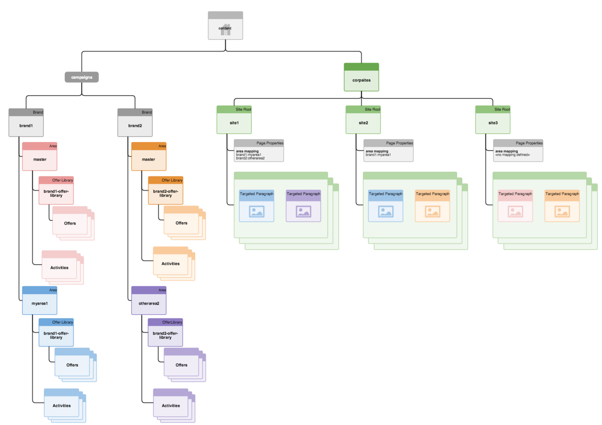

# 如何架構目標內容的多網站管理{#how-multisite-management-for-targeted-content-is-structured}

下圖顯示如何架構目標內容的多網站支援。

**/content/campaigns/&lt;brand>**&#x200B;下方會顯示區域，依預設，每個品牌都有自動建立的主區域。 每個區域都包含自身的一組活動、體驗和選件。

若要查詢目標內容，頁面或網站可以對應至某個區域。 如果沒有設定區域，AEM會退回此特定品牌的主區域。

下圖是該邏輯如何為三個網站（稱為site1、site2及site3）運作的範例。

* 網站1會根據區域對應查詢myarea1以尋找brand1，並查詢otherarea2以尋找brand2。
* 網站2會查詢brand1的myarea1和brand2的主區域，因為只有brand1的區域對應已定義。
* 網站3會查詢brand1和brand2的主要區域，因為此網站完全沒有定義其他區域對應。
