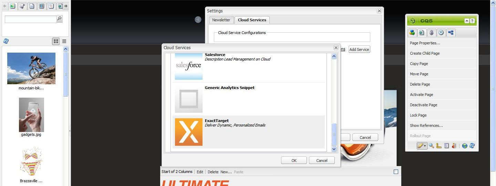

# 發佈電子郵件給電子郵件服務提供者{#publishing-an-email-to-email-service-providers}

您可以將電子報發佈到電子郵件服務，例如ExactTarget和Silverpop Engage。 本檔案說明如何設定AEM以向這些電子郵件服務發佈電子報。

>[!NOTE]
>
>您必須先設定服務提供者，才能建立和發佈電子郵件。 如需詳細資訊，請參閱[設定ExactTarget](/help/sites-administering/exacttarget.md)和[設定Silverpop Engage](/help/sites-administering/silverpop.md)。

若要將電子郵件發佈至電子郵件服務提供者，您必須執行下列步驟：

1. 建立電子郵件。
1. 將電子郵件服務設定套用至電子郵件。
1. 發佈電子郵件。

>[!NOTE]
>
>如果您更新電子郵件提供者、進行快速測試或傳送電子報，如果未先將電子報發佈至發佈執行個體，或發佈執行個體無法使用，則這些作業會失敗。 請務必發佈您的Newsletter，並確認發佈執行個體已啟動且在執行中。

## 建立電子郵件 {#creating-an-email}

您可以使用&#x200B;**Geometrixx電子報**&#x200B;範本，在行銷活動下建立您要發佈至電子郵件服務的電子郵件或電子報。 您也可以使用&#x200B;**Geometrixx Outdoors電子郵件**&#x200B;範本。 **Geometrixx Outdoors電子郵件**&#x200B;範本的電子郵件/電子報範例可在`https://<hostname>:<port>/cf#/content/campaigns/geometrixx-outdoors/e-mails.html`取得。

若要建立已發佈至已設定電子郵件服務的電子郵件：

1. 前往&#x200B;**網站**，然後前往&#x200B;**行銷活動**。 選取行銷活動。
1. 按一下&#x200B;**新增**&#x200B;以開啟&#x200B;**建立頁面**&#x200B;視窗。
1. 輸入標題、名稱，然後從可用的範本清單中選取&#x200B;**Geometrixx Newsletter**&#x200B;範本。
1. 按一下&#x200B;**建立**。
1. 開啟已建立的電子郵件。
1. 切換到設計模式以選取您要顯示在Sidekick中的元件。
1. 切換到編輯模式，並開始將內容（文字、影像、[電子郵件工具](#adding-exacttarget-email-tools-to-your-email)、[個人化變數](#adding-text-and-personalization-tool-to-your-e-mail)等）新增至您的電子郵件。

### 將ExactTarget電子郵件工具新增至您的電子郵件 {#adding-exacttarget-email-tools-to-your-email}

>[!NOTE]
>
>本節專屬於ExactTarget服務。

ExactTarget的&#x200B;**電子郵件工具**&#x200B;元件可為您的電子郵件/電子報新增更多電子郵件功能。

1. 開啟電子郵件以發佈至ExactTarget。
1. 使用Sidekick將元件&#x200B;**ET — 電子郵件工具**&#x200B;新增到您的頁面。 在「編輯」模式中開啟元件。

   

1. 從&#x200B;**選項**&#x200B;功能表選取選項：

<table>
 <tbody>
  <tr>
   <td>郵寄地址（必要）</td>
   <td>此元件會在您的電子郵件中插入組織的實體郵寄地址。</td>
  </tr>
  <tr>
   <td>設定檔中心 (必要)</td>
   <td>設定檔中心是一個網頁，訂閱者可在此輸入並維護您保留的相關個人資訊。</td>
  </tr>
  <tr>
   <td>以網頁的形式檢視電子郵件</td>
   <td>此元件可讓使用者以網頁的形式檢視電子郵件。</td>
  </tr>
  <tr>
   <td>隱私權原則</td>
   <td>此元件會在電子郵件中插入隱私權原則的連結。  </td>
  </tr>
  <tr>
   <td>取消訂閱中心</td>
   <td>為使用者提供取消訂閱郵寄清單的選項。</td>
  </tr>
  <tr>
   <td>訂閱中心</td>
   <td>訂閱中心是一個網頁，訂閱者可在此控制從您的組織收到的訊息。</td>
  </tr>
  <tr>
   <td>追蹤電子郵件開啟次數</td>
   <td>可讓您使用ExactTarget追蹤功能的隱藏元件。  </td>
  </tr>
 </tbody>
</table>

>[!NOTE]
>
>**選項**&#x200B;下拉式功能表只有在將ExactTarget組態套用至電子郵件時才會填入。 如需詳細資訊，請參閱[將電子郵件服務組態套用至電子郵件設定](#applying-e-mail-service-configuration-to-e-mail-settings)。

1. 將電子郵件發佈到ExactTarget。

   包含電子郵件工具的電子郵件可用於已設定的ExactTarget帳戶。

>[!NOTE]
>
>* 只有當使用&#x200B;**簡單傳送**&#x200B;或&#x200B;**引導式傳送**&#x200B;而非&#x200B;**測試傳送**&#x200B;來傳送電子郵件時，電子郵件工具中的URL才會被其實際值取代（在已接收的電子郵件中）。
>
>* 需要兩個電子郵件工具： **實體郵寄地址（必要）**&#x200B;和&#x200B;**設定檔中心（必要）**。 將電子郵件發佈至ExactTarget時，這兩個電子郵件工具會預設新增至每封郵件的底部。
>

### 新增文字和Personalization工具至您的電子郵件 {#adding-text-and-personalization-tool-to-your-e-mail}

您可以新增&#x200B;**文字和Personalization**&#x200B;元件至頁面，在電子郵件中新增個人化欄位：

1. 開啟要發佈至電子郵件服務的電子郵件。
1. 若要啟用電子郵件服務中的個人化欄位，請在設定電子郵件服務時新增框架設定。 如需詳細資訊，請參閱[設定Silverpop Engage](/help/sites-administering/silverpop.md)和[設定精確目標](/help/sites-administering/exacttarget.md)。
1. 從Sidekick新增元件&#x200B;**Text &amp; Personalization**。 此元件是Newsletter群組的一部分。 在編輯模式中開啟此元件。

   

1. 從下拉式選單中選取欄位並按一下&#x200B;**插入**，將必要的個人化欄位新增至文字。
1. 按一下&#x200B;**確定**&#x200B;完成。

## 將電子郵件服務組態套用至電子郵件設定 {#applying-e-mail-service-configuration-to-e-mail-settings}

若要將您的電子郵件服務設定套用至電子報：

1. 建立電子郵件服務設定。
1. 開啟您的電子郵件/電子報。
1. 按一下&#x200B;**設定**&#x200B;或按一下Sidekick **中的**&#x200B;頁面屬性，開啟電子郵件/電子報設定。
1. 按一下&#x200B;**雲端服務**&#x200B;索引標籤中的&#x200B;**新增服務**。 您會看到服務清單。 從下拉式清單中選取您所需的設定 — **ExactTarget**&#x200B;或&#x200B;**Silverpop**。

   

1. 按一下&#x200B;**「確定」**。

## 發佈電子郵件至電子郵件服務 {#publishing-emails-to-email-service}

電子郵件/電子報可以透過以下步驟發佈至您的電子郵件服務：

1. 開啟電子郵件。
1. 發佈電子郵件之前，請確定您已套用正確的設定至電子郵件。
1. 點擊&#x200B;**發佈**。這會開啟&#x200B;**將Newsletter發佈到電子郵件服務提供者**&#x200B;視窗。
1. 填寫&#x200B;**Newsletter名稱**&#x200B;欄位。 電子郵件/電子報會以此名稱發佈至電子郵件服務提供者。 如果未提供電子郵件名稱，則會使用AEM中電子報的頁面名稱來發佈電子郵件。
1. 點擊&#x200B;**發佈**。

   

   如果成功，AEM會確認您可以在ExactTarget或Silverpop Engage中檢視電子郵件。

   如果有ExactTarget，則按一下&#x200B;**檢視已發佈的電子郵件**&#x200B;即可檢視已發佈的電子郵件。 這會將您直接帶到ExactTarget ([https://members.exacttarget.com/](https://members.exacttarget.com/).)中已發佈的Newsletter。

>[!NOTE]
>
>如果電子郵件/電子報的發佈名稱與電子郵件/電子報的發佈名稱相同，則不會取代先前的電子郵件/電子報。 相反地，系統會以相同名稱建立新電子郵件/電子報（但兩份電子報的ID不同）。
>
>將電子郵件/電子報發佈至電子郵件服務提供者，也會將電子郵件/電子報發佈至AEM發佈執行個體。
>

### 更新已發佈的電子郵件 {#updating-a-published-e-mail}

「發佈」對話方塊上的「**更新**」按鈕可讓您更新已發佈至電子郵件服務提供者的電子報。 如果尚未發佈Newsletter且按一下&#x200B;**更新**&#x200B;按鈕，則不會發佈&#x200B;**Newsletter**&#x200B;訊息。

若要更新已發佈的電子郵件：

1. 開啟先前已發佈至電子郵件服務提供者（您要在變更電子郵件/電子報後重新發佈）的電子郵件/電子報。
1. 點擊&#x200B;**發佈**。會顯示&#x200B;**發佈Newsletter至電子郵件服務提供者**&#x200B;視窗。 按一下&#x200B;**更新**。

   若要檢查是否已在ExactTarget上更新電子郵件/電子報，請按一下&#x200B;**檢視已發佈的電子郵件**。 這會帶您前往ExactTarget中已發佈的電子郵件。

   若要檢查Silverpop電子郵件服務上的電子郵件/電子報是否已更新，請造訪Silverpop Engage網站。
