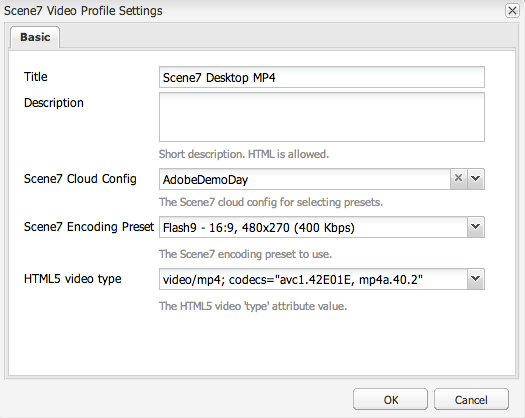

# 影片{#video}

Assets提供集中式視訊資產管理，讓您可以直接將視訊上傳到Assets，以自動編碼至Dynamic Media Classic，並直接從Assets存取Dynamic Media Classic視訊以進行頁面製作。

Dynamic Media Classic視訊整合將最佳化視訊的範圍延伸至所有熒幕（自動裝置和頻寬偵測）。

* Dynamic Media Classic視訊元件會自動執行裝置和頻寬偵測，以在桌上型電腦、平板電腦和行動裝置上播放正確格式和正確品質的視訊。
* Assets — 您可以包含最適化視訊集，而不只是單一視訊資產。 自我調整視訊集是所有視訊轉譯的容器，必須在多個熒幕上無縫播放視訊。 「最適化視訊集」會將使用不同位元速率和格式（例如400 kbps、800 kbps和1000 kbps）編碼的相同視訊版本分組。 您可使用最適化視訊集和S7視訊元件，在多個熒幕(包括桌上型電腦、iOS、Android™、BlackBerry®和Windows行動裝置)上執行最適化視訊串流。 如需詳細資訊，請參閱有關最適化視訊集的[Dynamic Media Classic檔案](https://experienceleague.adobe.com/docs/dynamic-media-classic/using/video/quick-start-video.html?lang=zh-Hant#video)。

## 關於FFMPEG和Dynamic Media Classic {#about-ffmpeg-and-scene}

預設的視訊編碼程式是以FFMPEG型整合與視訊設定檔整合為基礎。 因此，現成可用的[!UICONTROL DAM更新資產]工作流程包含下列兩個ffmpeg型工作流程步驟：

* FFMPEG縮圖
* FFMPEG編碼

啟用和設定Dynamic Media Classic整合不會從現成可用的[!UICONTROL DAM更新資產]擷取工作流程中自動移除或停用這兩個工作流程步驟。 如果您已在Adobe Experience Manager中使用FFMPEG型視訊編碼，則您的編寫環境很可能已安裝FFMPEG。 在此情況下，使用Experience Manager Assets擷取的新視訊會編碼兩次：一次來自FFMPEG編碼器，另一次來自Dynamic Media Classic整合。

如果您已設定Experience Manager中的FFMPEG視訊編碼並安裝FFMPEG，Adobe建議您從[!UICONTROL DAM更新資產]工作流程中移除兩個FFMPEG工作流程。

### 支援的格式 {#supported-formats}

Dynamic Media Classic視訊元件支援下列格式：

* F4V H.264
* MP4 H.264

### 決定上傳視訊的位置 {#deciding-where-to-upload-your-video}

要決定上傳視訊資產的位置，須視下列專案而定：

* 您是否需要視訊資產的工作流程？
* 您是否需要視訊資產的版本控制？

如果以上任一或兩個問題的答案皆為「是」，則直接將影片上傳至Adobe DAM。 如果這兩個問題的答案都為「否」，則直接將您的影片上傳到Dynamic Media Classic。 下節將說明每個案例的工作流程。

#### 如果您直接將影片上傳至Adobe Assets {#if-you-are-uploading-your-video-directly-to-adobe-assets}

如果您的資產需要工作流程或版本設定，應先上傳至Adobe Assets。 以下是建議的工作流程：

1. 將視訊資產上傳至Adobe Assets，並自動編碼和發佈至Dynamic Media Classic。
1. 在Experience Manager中，存取「內容尋找器」之&#x200B;**[!UICONTROL 影片]**&#x200B;索引標籤中WCM的視訊資產。
1. 使用Dynamic Media Classic視訊或foundation視訊元件進行創作。

#### 如果您要將影片上傳至Dynamic Media Classic {#if-you-are-uploading-your-video-to-scene}

如果您不需要針對資產執行工作流程或版本設定，您應將資產上傳至Dynamic Media Classic。 以下是建議的工作流程：

1. 在Dynamic Media Classic案頭應用程式中，[設定已排程的FTP上傳和編碼至Dynamic Media Classic （系統自動化）](https://experienceleague.adobe.com/docs/dynamic-media-classic/using/upload-publish/uploading-files.html?lang=zh-Hant#upload-options)。
1. 在Experience Manager中，存取「內容尋找器」之&#x200B;**[!UICONTROL Dynamic Media Classic]**&#x200B;索引標籤中WCM的視訊資產。
1. 使用Dynamic Media Classic視訊元件創作。

### 設定與Dynamic Media Classic影片整合 {#configuring-integration-with-scene-video}

1. 在&#x200B;**[!UICONTROL 雲端服務]**&#x200B;中，導覽至您的&#x200B;**[!UICONTROL Dynamic Media Classic]**&#x200B;設定，並選取&#x200B;**[!UICONTROL 編輯]**。
1. 選取&#x200B;**[!UICONTROL 視訊]**&#x200B;標籤。

   >[!NOTE]
   >
   >如果頁面沒有雲端設定，就不會顯示&#x200B;**[!UICONTROL 視訊]**&#x200B;索引標籤。 請參閱[為WCM](#enablingscene7forwcm)啟用Dynamic Media Classic。

1. 選取最適化視訊編碼設定檔、現成可用的單一視訊編碼設定檔，或自訂視訊編碼設定檔。

   >[!NOTE]
   >
   >如需視訊預設集含義的詳細資訊，請參閱[視訊檔案編碼的視訊預設集](https://experienceleague.adobe.com/docs/dynamic-media-classic/using/setup/application-setup.html?lang=zh-Hant#video-presets-for-encoding-video-files)。
   >
   >Adobe建議您在設定通用預設集時同時選取兩個最適化視訊集，或選取&#x200B;**[!UICONTROL 最適化視訊編碼]**&#x200B;選項。

1. 選取的編碼設定檔會自動套用至上傳至您為此Dynamic Media Classic雲端設定所設定CQ DAM目標資料夾的所有影片。 您可以使用不同的目標資料夾來設定多個Dynamic Media Classic雲端設定，以視需要套用不同的編碼設定檔。

### 更新檢視器和編碼預設集 {#updating-viewer-and-encoding-presets}

如果在Experience Manager中更新預設集，請更新Dynamic Media Classic中視訊的檢視器和編碼預設集。 在這種情況下，請導覽至雲端設定中的Dynamic Media Classic設定，然後選取「**更新檢視器和編碼預設集**」。

### 上傳您的主要來源影片 {#uploading-your-master-video}

若要從Adobe DAM將主要來源影片上傳至Dynamic Media Classic：

1. 導覽至CQ DAM目標資料夾，您已在該資料夾中使用Dynamic Media Classic編碼設定檔設定您的雲端設定。
1. 選取&#x200B;**[!UICONTROL 上傳]**&#x200B;以上傳主要來源視訊。 [!UICONTROL DAM更新資產]工作流程完成且&#x200B;**[!UICONTROL 發佈至Dynamic Media Classic]**&#x200B;有核取記號之後，視訊上傳和編碼即已完成。

   >[!NOTE]
   >
   >產生視訊縮圖可能需要一些時間。

   將DAM主要來源視訊拖曳至視訊元件時，會存取&#x200B;*所有*&#x200B;個Dynamic Media Classic編碼的Proxy轉譯專案以進行傳送。

### Foundation視訊元件與Dynamic Media Classic視訊元件 {#foundation-video-component-versus-scene-video-component}

使用Experience Manager時，您可以同時存取Sites中可用的視訊元件和Dynamic Media Classic視訊元件。 這些元件不可互換。

Dynamic Media Classic視訊元件僅適用於Dynamic Media Classic視訊。 基礎元件可處理從Experience Manager （使用ffmpeg）儲存的視訊和Dynamic Media Classic視訊。

下列矩陣說明何時應使用哪個元件：

>[!NOTE]
>
>Dynamic Media Classic視訊元件可立即使用通用視訊設定檔。 不過，您可以取得HTML5型影片播放程式，以供Experience Manager使用。 在Dynamic Media Classic中，複製現成HTML5視訊播放器的內嵌程式碼，並將其放入您的Experience Manager頁面中。
>

## Experience Manager視訊元件 {#aem-video-component}

即使建議使用Dynamic Media Classic視訊元件來檢視Dynamic Media Classic視訊，本節也說明如何將Dynamic Media Classic視訊與Experience Manager中的[!UICONTROL Foundation視訊元件]搭配使用，以完整呈現。

### Experience Manager影片和Dynamic Media Classic影片比較 {#aem-video-and-scene-video-comparison}

下表提供Experience Manager Foundation視訊元件與Dynamic Media Classic視訊元件之間支援功能的高階比較：

|   | Experience Manager Foundation影片 | Dynamic Media Classic影片 |
|---|---|---|
| 方法 | HTML5的第一個方法。 Flash僅用於非HTML5後援。 | 大多數桌上型電腦均採用Flash技術。 HTML5適用於行動裝置和平板電腦。 |
| 傳遞 | 漸進式 | 最適化串流 |
| 追蹤 | 是 | 是 |
| 擴充性 | 是 | 否 |
| 行動視訊 | 是 | 是 |

### 設定 {#setting-up}

#### 建立視訊設定檔 {#creating-video-profiles}

各種視訊編碼會根據在Dynamic Media Classic雲端設定中選取的Dynamic Media Classic編碼預設集而建立。 若要讓foundation視訊元件使用這些視訊設定檔，您必須為每個選取的Dynamic Media Classic編碼預設集建立視訊設定檔。 它可讓視訊元件據以選取DAM轉譯。

>[!NOTE]
>
>新視訊設定檔及其變更必須啟動才能發佈。

1. 在Experience Manager中，移至&#x200B;**[!UICONTROL 工具]**，然後選取&#x200B;**[!UICONTROL 設定主控台]**。
1. 在設定主控台中，導覽至導覽樹狀結構中的&#x200B;**[!UICONTROL 工具]** > **[!UICONTROL Assets]** > **[!UICONTROL 視訊設定檔]**。
1. 建立Dynamic Media Classic視訊設定檔。 在&#x200B;**[!UICONTROL 新增]**&#x200B;功能表中，選取&#x200B;**[!UICONTROL 建立頁面]**。
1. 選取Dynamic Media Classic視訊設定檔範本。 為新的視訊設定檔頁面命名，並選取&#x200B;**[!UICONTROL 建立]**。

   

1. 編輯新的視訊設定檔。 請先選取雲端設定。 接著，選取在雲端設定中選取的相同編碼預設集。

   

   | 屬性 | 說明 |
   |---|---|
   | Dynamic Media Classic雲端設定 | 用於編碼預設集的雲端設定。 |
   | Dynamic Media Classic編碼預設集 | 對應此視訊設定檔的編碼預設集。 |
   | HTML5 視訊類型 | 此屬性可讓您設定HTML5視訊來源元素的type屬性值。 Dynamic Media Classic編碼預設集並未提供這項資訊，但使用HTML5視訊元素正確轉譯視訊時需要此資訊。 提供常見格式的清單，但其他格式可以覆寫。 |

   對雲端設定中選取要用於視訊元件的所有編碼預設集重複此步驟。

#### 設定設計 {#configuring-design}

foundation視訊元件必須瞭解哪些視訊設定檔可用來建立視訊來源清單。 開啟視訊元件設計對話方塊，並使用新的視訊設定檔來設定元件設計。

>[!NOTE]
>
>如果您在行動版頁面上使用基礎視訊元件，請在行動版頁面的設計上重複這些步驟。

>[!NOTE]
>
>對設計所做的變更需要啟動設計才能在發佈時生效。

1. 開啟Foundation視訊元件的[設計]對話方塊，並變更為&#x200B;**[!UICONTROL 設定檔]**&#x200B;索引標籤。 然後刪除現成可用的設定檔，並新增新的Dynamic Media Classic視訊設定檔。 「設計」對話方塊中的設定檔清單順序，以及轉譯時視訊來源元素的順序。
1. 對於不支援HTML5的瀏覽器，視訊元件可讓您設定快閃遞補。 開啟視訊元件設計對話方塊，並變更至&#x200B;**[!UICONTROL Flash]**&#x200B;索引標籤。 設定Flash Player設定並指派Flash Player的遞補設定檔。

#### 檢查清單 {#checklist}

1. 建立Dynamic Media Classic雲端設定。 請確定已設定視訊編碼預設集，且匯入工具在執行中。
1. 針對在雲端設定中選取的每個視訊編碼預設集，建立Dynamic Media Classic視訊設定檔。
1. 必須啟動視訊設定檔。
1. 在頁面上設定基礎視訊元件的設計。
1. 完成設計變更後啟動設計。
