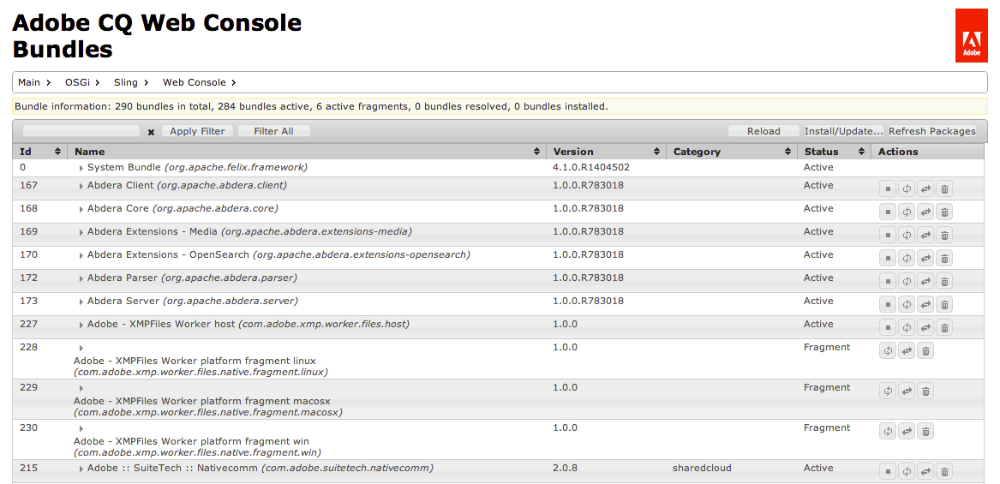

# Web 控制台{#web-console}

Adobe Experience Manager (AEM)中的Web主控台是以[Apache Felix Web管理主控台](https://felix.apache.org/documentation/subprojects/apache-felix-web-console.html)為基礎。 Apache Felix是社群努力實施OSGi R4服務平台，其中包括OSGi架構和標準服務。

>[!NOTE]
>
>在Web主控台上，提及預設設定的任何說明都與Sling預設值有關。
>
>AEM有其本身的預設值，因此預設集可能會與主控台上的記錄不同。

Web主控台提供一系列用於維護OSGi套裝的標籤，包括：

* [組態](#configuration)：用於設定OSGi組合，因此是設定AEM系統引數的基礎機制
* [組合](#bundles)：用於安裝組合
* [元件](#components)：用於控制AEM所需元件的狀態

所做的任何變更都會立即套用至執行中的系統。 不需要重新啟動。

可以從`../system/console`存取主控台；例如：

`http://localhost:4502/system/console/components`

## 設定 {#configuration}

**組態**&#x200B;索引標籤是用來設定OSGi組合，因此是設定AEM系統引數的基礎機制。

>[!NOTE]
>
>如需詳細資訊，請參閱使用Web主控台[OSGi設定](/help/sites-deploying/configuring-osgi.md#osgi-configuration-with-the-web-console)。

**組態**&#x200B;索引標籤可由以下任一方式存取：

* 下拉式功能表：

  **OSGi >**

* URL；例如：

  `http://localhost:4502/system/console/configMgr`

隨即顯示設定清單：

此畫面上的下拉式清單提供兩種型別的設定：

* **組態**

  可讓您更新現有的組態。 這些具有持續性身分(PID)，可以是：

   * AEM的標準與整合功能；若刪除這些值，會傳回預設設定，則需使用這些功能。
   * 從「工廠組態」建立的執行處理；這些執行處理是由使用者建立的，刪除會移除執行處理。

* **工廠組態**

  建立所需功能物件的例項。

  這會配置給「持續性身分」，並列在「組態」下拉式清單中。

從清單中選取任何專案時，會顯示與該組態相關的引數：

之後，您可以視需要更新引數，並且：

* **儲存**

  儲存所做的變更。

  對於「工廠組態」，這會建立具有持續識別的執行個體。 新執行個體會列在「設定」底下。

* **重設**

  將熒幕上顯示的引數重設為上次儲存的引數。

* **刪除**

  刪除目前的設定。 若為standard，引數會傳回預設設定。 如果是從「工廠組態」建立，則會刪除特定的執行處理。

* **解除繫結**

  從套件組合解除繫結目前組態。

* **取消**

  取消任何目前的變更。

## 組合 {#bundles}

**組合**&#x200B;索引標籤是安裝AEM所需OSGi組合的機制。 可透過下列任一方法來存取標籤：

* 下拉式功能表：

  **OSGi >**

* URL；例如：

  `http://localhost:4502/system/console/bundles`

隨即顯示套件組合清單：

您可以使用此標籤：

* **安裝或更新**

  您可以&#x200B;**瀏覽**&#x200B;以尋找包含您的套件組合的檔案，並指定它是否應該立即&#x200B;**啟動**，以及應該從哪個&#x200B;**啟動層級**。

* **重新載入**

  重新整理顯示的清單。

* **重新整理封裝**

  這會檢查所有套件的參考，並在必要時重新整理。

  例如，在更新後，由於先前的參照，舊版本和新版本可能仍在執行。 此選項會檢查並移動新版本的所有參照，讓舊版本停止。

* **啟動**

  根據指定的起始層級啟動束。

* **停止**

  停止束。

* **解除安裝**

  從系統解除安裝套件。

* **檢視狀態**

  清單會指定束的狀態；按一下包含進一步資訊的特定束名稱。

>[!NOTE]
>
>在&#x200B;**更新**&#x200B;之後，Adobe建議您執行&#x200B;**重新整理封裝**。

## 元件 {#components}

**元件**&#x200B;索引標籤可讓您啟用和/或停用各種元件。 您可透過以下任一方式存取該區域：

* 下拉式功能表：

  **主要>**

* URL；例如：

  `http://localhost:4502/system/console/components`

隨即顯示元件清單。 有各種圖示可讓您啟用、停用或（在適當時）開啟特定元件的組態詳細資訊。

按一下特定元件的名稱會顯示其狀態的進一步資訊。 您也可以在此處啟用、停用或重新載入元件。

>[!NOTE]
>
>啟用或停用元件只適用於AEM/CRX重新啟動之前。
>
>開始狀態是在元件描述項中定義，在開發期間產生並在套件建立時儲存在套件中。
