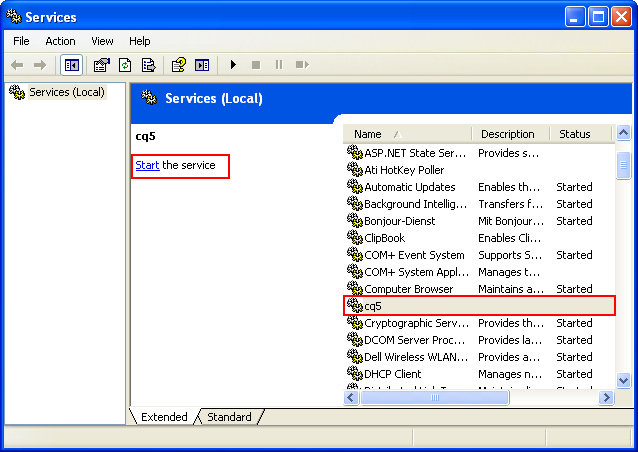
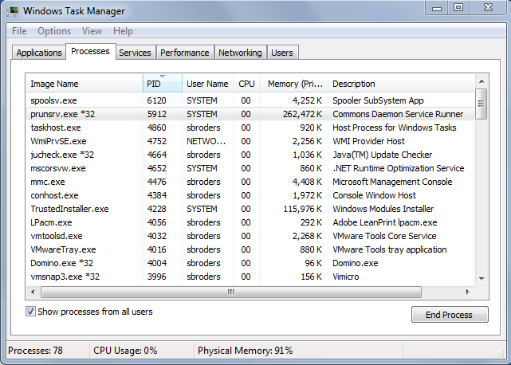

# 自訂獨立安裝{#custom-standalone-install}

本節說明安裝獨立AEM執行個體時可用的選項。 您也可以閱讀[儲存體元素](/help/sites-deploying/storage-elements-in-aem-6.md)，以瞭解全新安裝AEM 6後選擇後端儲存體型別的詳細資訊。

## 重新命名檔案以變更連線埠號碼 {#changing-the-port-number-by-renaming-the-file}

AEM的預設連線埠為4502。 如果該連線埠無法使用或已使用，Quickstart會自動設定為使用第一個可用的連線埠號碼，如下所示：4502、8080、8081、8082、8083、8084、8085、8888、9362、`<*random*>`。

您也可以重新命名快速入門jar檔案來設定連線埠號碼，讓檔案名稱包含連線埠號碼；例如，`cq5-publish-p4503.jar`或`cq5-author-p6754.jar`。

重新命名快速入門jar檔案時，有多種規則需要遵循：

* 當您重新命名檔案時，必須以`cq;`開頭，如`cq5-publish-p4503.jar`所示。

* 建議您&#x200B;*一律*&#x200B;在連線埠號碼前面加上 — p；例如cq5-publish-p4503.jar或cq5-author-p6754.jar。

>[!NOTE]
>
>這是為了確保您不需要擔心要執行用來擷取連線埠號碼的規則：
>
>* 連線埠號碼必須是4或5位數
>* 這些數字必須位於破折號之後
>* 如果檔案名稱中有任何其他數字，則連線埠號碼必須以`-p`為前置詞
>* 檔案名稱開頭的「cq5」首碼會被忽略
>

>[!NOTE]
>
>您也可以使用start指令中的`-port`選項來變更連線埠號碼。

### Java 17考量事項 {#java-considerations}

如果您執行Oracle Java 17，啟動AEM時必須在命令列中新增其他引數。

以下範例說明在Java 17上啟動AEM時，其他JVM引數的外觀：

```shell
-XX:+UseG1GC --add-opens=java.desktop/com.sun.imageio.plugins.jpeg=ALL-UNNAMED --add-opens=java.base/sun.net.www.protocol.jrt=ALL-UNNAMED --add-opens=java.naming/javax.naming.spi=ALL-UNNAMED --add-opens=java.xml/com.sun.org.apache.xerces.internal.dom=ALL-UNNAMED --add-opens=java.base/java.lang=ALL-UNNAMED --add-opens=java.base/jdk.internal.loader=ALL-UNNAMED --add-opens=java.base/java.net=ALL-UNNAMED --add-opens=java.base/java.lang=org.apache.sling.commons.threads -Djdk.util.zip.disableZip64ExtraFieldValidation=true
```

## 執行模式 {#run-modes}

**執行模式**&#x200B;可讓您針對特定目的調整AEM執行個體；例如，製作或發佈、測試、開發、內部網路等。 這些模式也可讓您控制範例內容的使用。 此範例內容是在建置快速入門之前定義，可包含套件、設定等。 如果您想要讓安裝保持精簡且沒有範例內容，這對於生產就緒型安裝特別有用。 如需詳細資訊，請參閱：

* [執行模式](/help/sites-deploying/configure-runmodes.md)

## 新增檔案安裝提供者 {#adding-a-file-install-provider}

依預設，會監看資料夾`crx-quickstart/install`的檔案。
此資料夾不存在，但只可在執行階段建立。

如果將套件、設定或內容套件放入此目錄中，則會自動擷取並安裝。 如果移除，則會解除安裝。
這是將套件組合、內容套件或設定放入存放庫的另一種方式。

以下幾種使用案例特別有趣：

* 在開發期間，將內容放入檔案系統可能會更容易。
* 如果發生錯誤，將無法存取Web主控台和存放庫。 透過此功能，您可以將其他套件組合放入此目錄中，並且應該安裝這些套件。
* 可以在快速入門開始之前建立`crx-quickstart/install`資料夾，並且可以將其他套件放在該資料夾中。

>[!NOTE]
>
>另請參閱[如何在伺服器啟動時自動安裝CRX套件](https://helpx.adobe.com/experience-manager/kb/HowToInstallPackagesUsingRepositoryInstall.html)以取得範例。

## 安裝和啟動Adobe Experience Manager as a Windows Service {#installing-and-starting-adobe-experience-manager-as-a-windows-service}

>[!NOTE]
>
>請務必在以系統管理員身分登入時執行下列程式，或使用&#x200B;**以系統管理員身分執行**&#x200B;內容功能表選取專案來啟動/執行這些步驟。
>
>以具有系統管理員許可權的使用者登入&#x200B;**不足**。 如果您在完成這些步驟時未以系統管理員身分登入，則會收到&#x200B;**拒絕存取**&#x200B;錯誤。

若要安裝並啟動AEM as a Windows服務：

1. 以文字編輯器開啟crx-quickstart\opt\helpers\instsrv.bat檔案。
1. 如果您正在設定64位元Windows伺服器，請根據您的作業系統，使用下列其中一個命令來取代所有prunsrv執行個體：

   * prunsrv_amd64
   * prunsrv_ia64

   這個命令會叫用適當的指令碼，以啟動64位元Java而不是32位元Java中的Windows服務精靈。

1. 開啟命令提示字元，將目前目錄變更為AEM安裝的crx-quickstart/opt/helpers資料夾，然後輸入以下命令以建立服務：

   `instsrv.bat cq5`

   若要確認服務已建立，請開啟[系統管理工具]控制檯中的[服務]，或在命令提示字元中輸入`start services.msc`。 cq5服務會出現在清單中。

1. 執行下列任一項作業來啟動服務：

   * 在「服務」控制檯中，按一下cq5並按一下「開始」。

   

   * 在命令列中，輸入net start cq5。

   

1. Windows指出服務正在執行。 AEM會啟動，且prunsrv可執行檔會出現在工作管理員中。 在您的網頁瀏覽器中，導覽至AEM （例如，`https://localhost:4502`）以開始使用AEM。

   

>[!NOTE]
>
>建立Windows服務時會使用instsrv.bat檔案中的屬性值。 如果您在instsrv.bat中編輯屬性值，則必須解除安裝再重新安裝服務。

>[!NOTE]
>
>安裝AEM即服務時，您必須從Configuration Manager為`com.adobe.xmp.worker.files.ncomm.XMPFilesNComm`中的記錄檔目錄提供絕對路徑。

若要解除安裝服務，請在&#x200B;**服務**&#x200B;控制檯中按一下&#x200B;**停止**，或在命令列中，瀏覽至資料夾並輸入`instsrv.bat -uninstall cq5`。 當您輸入`net start`時，服務會從&#x200B;**服務**&#x200B;控制檯的清單或命令列的清單中移除。

## 重新定義臨時工作目錄的位置 {#redefining-the-location-of-the-temporary-work-directory}

Java電腦暫存資料夾的預設位置為`/tmp`。 例如，AEM在建置套件時也會使用此資料夾。

如果您想要變更暫存資料夾的位置（例如，如果您需要更多可用空間的目錄），請新增JVM引數以定義* `<new-tmp-path>`*：

`-Djava.io.tmpdir="/<*new-tmp-path*>"`

變更為：

* 伺服器啟動命令列
* serverctl或啟動指令碼中的CQ_JVM_OPTS環境引數

## 快速入門檔案中可用的其他選項 {#further-options-available-from-the-quickstart-file}

快速入門說明檔案中會說明其他選項和重新命名慣例，可透過 — help選項取得該檔案。 若要存取說明，請輸入：

* `java -jar <jar-name>.jar -help`

>[!CAUTION]
>
>這些選項自AEM 6.5 LTS原始版本起有效。 更新的Service Pack版本可能有變更。

```shell
Loading quickstart properties: default
Loading quickstart properties: instance
Setting properties from filename '/Users/Desktop/AEM/<jar-name>.jar'
--------------------------------------------------------------------------------
Adobe Experience Manager Quickstart (build 20241127)                            
--------------------------------------------------------------------------------
Usage:                                                                          
 Use these options on the Quickstart command line.                              
--------------------------------------------------------------------------------

-help (--help,-h)
         Show this help message                                                 
-quickstart.server.port (-p,-port) <port>
         Set server port number                                                 
-contextpath (-c,-org.apache.felix.http.context_path) <contextpath>
         Set context path                                                       
-debug <port>
         Enable Java Debugging on port number; forces forking                   
-gui 
         Show GUI if running on a terminal                                      
-nobrowser (-quickstart.nobrowser)
         Do not open browser at startup                                         
-unpack
         Unpack installation files only, do not start the server (implies       
         -verbose)                                                              
-v (-verbose)
         Do not redirect stdout/stderr to files and do not close stdin          
-nofork
         Do not fork the JVM, even if not running on a console                  
-fork
         Force forking the JVM if running on a console, using recommended       
         default memory settings for the forked JVM.                            
-forkargs <args> [<args> ...]
         Additional arguments for the forked JVM, defaults to '-Xmx1024m        
         -XX:MaxPermSize=256m '.  Use -- to specify values starting with -,     
         example: '-forkargs -- -server'                                        
-a (--interface) <interface>
         Optional IP address (interface) to bind to                             
-pt <string>
         Process type (main/fork) - do not use directly, used when forking a    
         process                                                                
-r <string> [<string> [<string> [<string> [<string> [<string> [<string> [<string> [<string> [<string>]]]]]]]]]
         Runmode(s) - Use this to define the run mode(s)                        
-b <string>
         Base folder - defines the path under which the quickstart work folder  
         is created                                                             
-low-mem-action <string>
         Low memory action - what to do if memory is insufficient at startup    
-use-control-port
         Start a control port                                                   
-nointeractive
         Start with no interactivity                                            
-ll <level>
         Define launchpad log level (1 = error...4 = debug)                     
-n   
         Do not install shutdown hook                                           
-D<property>=<value>
         Additional framework properties.                                       
-listener-port <listener-port>
         Set listener port number                                               
-x <string>
         Run a Quickstart extension.                                            
  Options for executing Quickstart extensions:
                                                                                
    -xargs <arg> [<arg> ...]
         Construct an arguments list for a Quickstart extension (for example, -xargs -- 
         -arg1 val1 -arg2 val2).                                                
--------------------------------------------------------------------------------
Quickstart filename options                                                     
--------------------------------------------------------------------------------
Usage:                                                                          
 Rename the jar file, including one of the patterns shown below, to set the     
corresponding option. Command-line options have priority on these filename      
patterns.                                                                       
--------------------------------------------------------------------------------

-NNNN
         Include -NNNN.jar or -pNNNN in the renamed jar filename to run on port 
         NNNN, for example: quickstart-8085.jar                                 
-nobrowser
         Include -nobrowser in the renamed jar filename to avoid opening the    
         browser at startup, example: quickstart-nobrowser-8085.jar             
-publish
         Include -publish in the renamed jar filename to run in "publish" mode, 
         example: cq-publish-7502.jar                                           
-dynamicmedia
         Include -dynamicmedia in the renamed jar filename to run in            
         "dynamicmedia" mode, example: quickstart-dynamicmedia-4502.jar         
-dynamicmedia_scene7
         Include -dynamicmedia_scene7 in the renamed jar filename to run in     
         "dynamicmedia_scene7" mode, example:                                   
         quickstart-dynamicmedia_scene7-p4502.jar                               
--------------------------------------------------------------------------------
The license.properties file
--------------------------------------------------------------------------------
  The license.properties file stores licensing information, created from the    
  licensing form displayed on first startup and stored in the folder from where 
  Quickstart is run.                                                            
--------------------------------------------------------------------------------
Log files
--------------------------------------------------------------------------------
  Once Quickstart has been unpacked and started, log files can be found under   
  /Users/aemdocs/CQInstallationKits/AEM-65150-L8/crx-quickstart/logs.           
--------------------------------------------------------------------------------
```

## 在Amazon EC2環境中安裝AEM {#installing-aem-in-the-amazon-ec-environment}

在Amazon Elastic Compute Cloud (EC2)執行個體上安裝AEM時，如果您在EC2執行個體上同時安裝author和publish，請依照[安裝AEM Manager執行個體](#installinginstancesofaemmanager)上的程式正確安裝Author執行個體；不過，Publish執行個體會變成Author。

在EC2環境中安裝Publish執行個體之前，請先執行下列動作：

1. 在第一次啟動執行個體之前，先解壓縮發佈執行個體的jar檔案。 若要解壓縮檔案，請使用下列命令：

   ```xml
   java -jar quickstart.jar -unpack
   ```

   >[!NOTE]
   >
   >如果您在第一次啟動執行個體後&#x200B;**變更模式**，則無法變更執行模式。

1. 執行以啟動執行個體：

   ```xml
   java -jar quickstart.jar -r publish
   ```

   >[!CAUTION]
   >
   >請務必先執行上述命令，在解壓縮執行個體之後再執行它。 否則，將不會產生quickstart.properties填色。 若沒有此檔案，任何未來的AEM升級都將失敗。

1. 在&#x200B;**bin**&#x200B;資料夾中，開啟&#x200B;**start**&#x200B;指令碼並檢查下列區段：

   ```xml
   # runmode(s)
   if [ -z "$CQ_RUNMODE" ]; then
    CQ_RUNMODE='author'
   fi
   ```

1. 將執行模式變更為&#x200B;**發佈**&#x200B;並儲存檔案。

   ```xml
   # runmode(s)
   if [ -z "$CQ_RUNMODE" ]; then
    CQ_RUNMODE='publish'
   fi
   ```

1. 執行&#x200B;**start**&#x200B;指令碼以停止執行個體並重新啟動它。

## 驗證安裝 {#verifying-the-installation}

下列連結可用來確認您的安裝是否可正常運作(所有範例均以執行個體在localhost的連線埠8080上執行、CRX安裝在/crx下、Launchpad安裝在/下為基礎)：

* `https://localhost:8080/crx/de`
CRXDE Lite主控台。

* `https://localhost:8080/system/console`
網頁主控台。

## 安裝後的動作 {#actions-after-installation}

雖然設定AEM WCM有許多可能性，但您應執行某些動作，或至少在安裝後立即檢閱：

* 請參閱[安全性檢查清單](/help/sites-administering/security-checklist.md)，瞭解確保系統安全所需的工作。
* 檢閱隨AEM WCM安裝的預設使用者和群組清單。 檢查您是否要對任何其他帳戶執行動作 — 如需詳細資訊，請參閱[安全性與使用者管理](/help/sites-administering/security.md)。

## 存取CRXDE Lite和Web主控台 {#accessing-crxde-lite-and-the-web-console}

AEM WCM啟動後，您也可存取：

* [CRXDE Lite](#accessing-crxde-lite) — 用於存取和管理存放庫
* [網頁主控台](#accessing-the-web-console) — 用來管理或設定OSGi組合（也稱為OSGi主控台）

### 存取CRXDE Lite {#accessing-crxde-lite}

若要開啟CRXDE Lite，您可以從歡迎畫面選取&#x200B;**CRXDE Lite**，或使用瀏覽器導覽至

```
 https://<<i>host</i>>:<<i>port</i>>/crx/de/index.jsp
```

例如：
`https://localhost:4502/crx/de/index.jsp`


#### 存取Web主控台 {#accessing-the-web-console}

若要存取Adobe CQ Web主控台，您可以從歡迎畫面選取&#x200B;**OSGi主控台**，或使用瀏覽器導覽至

```
 https://<host>:<port>/system/console
```

例如：
`https://localhost:4502/system/console`
或適用於「組合」頁面
`https://localhost:4502/system/console/bundles`


如需詳細資訊，請參閱使用Web主控台[OSGi設定](/help/sites-deploying/configuring-osgi.md#osgi-configuration-with-the-web-console)。

## 疑難排解 {#troubleshooting}

如需有關處理安裝期間可能出現問題的資訊，請參閱：

* [疑難排解](/help/sites-deploying/troubleshooting.md)

## 解除安裝Adobe Experience Manager {#uninstalling-adobe-experience-manager}

由於AEM會安裝在單一目錄中，因此不需要解除安裝公用程式。 雖然解除安裝AEM的方式取決於您要達成的目標以及您使用的永久儲存體，但解除安裝可能會像刪除整個安裝目錄一樣簡單。

如果永久儲存裝置內嵌於安裝目錄中（例如，在預設的TarPM安裝中），則刪除資料夾也會移除資料。

>[!NOTE]
>
>Adobe強烈建議您先備份存放庫，然後再刪除AEM。 如果您刪除整個&lt;cq-installation-directory>，則會刪除存放庫。 若要在刪除之前保留存放庫資料，請先將&lt;cq-installation-directory>/crx-quickstart/repository資料夾移動或複製到其他資料夾，然後再刪除其他資料夾。

如果您安裝的AEM使用外部儲存（例如資料庫伺服器），移除資料夾不會自動移除資料，但會移除儲存設定，因此還原JCR內容相當困難。
