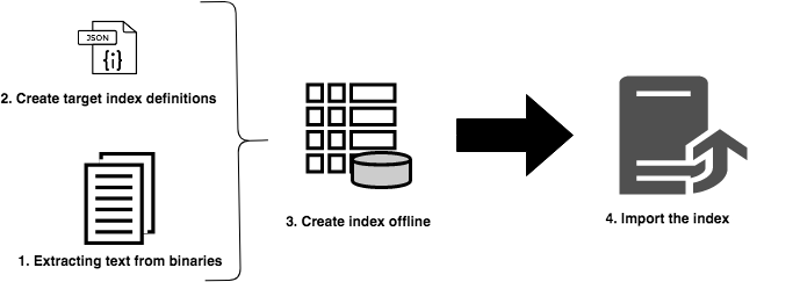

# AEM的離線重新索引 {#offline-reindexing-for-aem}

## 簡介 {#introduction}

AEM Assets專案通常有大型資料存放區和高層級的資產上傳，重新索引Oak索引可能需要相當長的時間。

本節說明如何使用Oak執行工具來執行離線重新索引。 顯示的步驟可套用至AEM 6.4及更高版本的[Lucene](https://jackrabbit.apache.org/oak/docs/query/lucene.html)索引。

## 概觀 {#overview}

AEM存放庫經常會因為各種原因需要重新索引，例如索引定義變更、效能最佳化或重大內容變更後。 由於資產中的文字(例如PDF檔案中的文字)會被擷取及編制索引，因此重新索引對於資產部署而言成本較高。 使用MongoMK存放庫時，資料會透過網路持續存在，進一步增加重新索引所花費的時間。 解決方案是使用Oak執行的工具執行重新索引&#x200B;**離線**，然後將預先建立的索引匯入執行中的AEM執行個體。 此方法可最大限度地縮短重新索引時間，並提供更好的資源管理。

## 方法 {#approach}



其想法是使用[Oak-run](/help/sites-deploying/indexing-via-the-oak-run-jar.md)工具離線建立索引，然後將其匯入執行中的AEM執行個體。 上圖顯示離線重新索引方法。

此外，這是方法中所述的步驟順序：

1. 系統會先擷取二進位檔中的文字
2. 索引定義已建立或已更新
3. 已建立離線索引
4. 然後，索引會匯入執行中的AEM例項

### 文字提取 {#text-extraction}

若要在AEM中啟用完整索引，會擷取二進位檔(例如PDF)的文字，並將其新增至索引。 在索引過程中，這通常是昂貴的步驟。 文字擷取是特別建議用於重新索引資產存放庫（當它們儲存大量二進位檔時）的最佳化步驟。


使用Oak-run工具搭配Tika程式庫，即可擷取儲存在系統中的二進位檔文字。 您可以複製生產系統，並用於此文字擷取程式。 此程式接著會透過下列步驟建立文字存放區：

**1. 周遊存放庫並收集二進位檔的詳細資料**

此步驟會產生一個包含二進位檔案元組的CSV檔案，其中包含路徑和blob ID。

從您想要建立索引的目錄執行下列命令。 以下範例假設是存放庫主目錄。

```
java java -jar oak-run.jar tika <nodestore path> --fds-path <datastore path> --data-file text-extraction/oak-binary-stats.csv --generate
```

其中`nodestore path`是`mongo_uri`或`crx-quickstart/repository/segmentstore/`

使用`--fake-ds-path=temp`引數而非`–fds-path`來加速處理序。

**2. 重複使用現有索引**&#x200B;中可用的二進位文字存放區

從現有系統傾印索引資料並擷取文字存放區。

您可以使用以下命令傾印現有的索引資料：

```
java -jar oak-run.jar index <nodestore path> --fds-path=<datastore path> --index-dump
```

其中`nodestore path`是`mongo_uri`或`crx-quickstart/repository/segmentstore/`

然後，使用上述索引傾印來填入存放區：

```
java -jar oak-run.jar tika --data-file text-extraction/oak-binary-stats.csv --store-path text-extraction/store --index-dir ./indexing-result/index-dumps/<oak-index-name>/data populate
```

其中`oak-index-name`是全文檢索索引的名稱，例如「lucene」。

**3. 針對上述步驟**&#x200B;中遺漏的二進位檔案，使用Tika程式庫執行文字擷取程式

```
java -cp oak-run.jar:tika-app-*.jar org.apache.jackrabbit.oak.run.Main tika --data-file text-extraction/oak-binary-stats.csv --store-path text-extraction/store --fds-path <datastore path> extract
```

>[!NOTE]
>
>使用與AEM中使用的相同Tika版本。

其中`datastore path`是二進位資料存放區的路徑。

建立的文字存放區可以更新，並重複用於未來的重新索引情境。

如需文字擷取程式的詳細資訊，請參閱[Oak執行檔案](https://jackrabbit.apache.org/oak/docs/query/pre-extract-text.html)。

### 離線重新索引 {#offline-reindexing}


離線建立Lucene索引。 若使用MongoMK，建議直接在其中一個MongoMK節點上執行，因為這可避免網路額外負荷。

若要離線建立索引，請遵循下列步驟：

**1. 產生Oak Lucene索引定義**

傾印現有的索引定義。 索引定義可使用Adobe Granite存放庫套件組合和Oak-run產生。

若要從AEM執行個體傾印索引定義，請執行此命令：

>[!NOTE]
>
>如需有關轉儲索引定義的詳細資訊，請參閱[Oak檔案](https://jackrabbit.apache.org/oak/docs/query/oak-run-indexing.html#async-index-data)。

```
java -jar oak-run.jar index --fds-path <datastore path> <nodestore path> --index-definitions
```

其中`datastore path`和`nodestore path`來自AEM執行個體。

然後，使用適當的Granite存放庫套件組合來產生索引定義。

```
java -cp oak-run.jar:bundle-com.adobe.granite.repository.jar org.apache.jackrabbit.oak.index.IndexDefinitionUpdater --in indexing-definitions_source.json --out merge-index-definitions_target.json --initializer com.adobe.granite.repository.impl.GraniteContent
```

>[!NOTE]
>
>只有從`oak-run-1.12.0`版本開始才支援上述索引定義建立程式。 目標定位已使用Granite存放庫套件`com.adobe.granite.repository-x.x.xx.jar`完成。

上述步驟會建立名為`merge-index-definitions_target.json`的JSON檔案，其中包含索引定義。

**2. 在存放庫中建立查核點**

在生產AEM執行個體中建立具有長存留期的查核點。 這應在複製存放庫之前完成。

透過位於`http://serveraddress:serverport/system/console/jmx`的JMX主控台，前往`CheckpointMBean`並建立存留期夠長的查核點（例如200天）。 對此，請叫用`CheckpointMBean#createCheckpoint`並將`17280000000`作為存留期持續時間的引數（以毫秒為單位）。

完成此操作後，複製新建立的查核點ID，並使用JMX `CheckpointMBean#listCheckpoints`驗證存留期。

>[!NOTE]
>
>稍後匯入索引時，會刪除此查核點。

如需詳細資訊，請參閱Oak檔案中的[檢查點建立](https://jackrabbit.apache.org/oak/docs/query/oak-run-indexing.html#out-of-band-create-checkpoint)。

**為產生的索引定義執行離線索引**

Lucene重新索引可以使用Oak-run離線完成。 此程式會在`indexing-result/indexes`下的磁碟上建立索引資料。 它&#x200B;**不會**&#x200B;寫入存放庫，因此不需要停止執行中的AEM執行個體。 建立的文字存放區會傳入此程式：

```
java -Doak.indexer.memLimitInMB=500 -jar oak-run.jar index <nodestore path> --reindex --doc-traversal-mode --checkpoint <checkpoint> --fds-path <datastore path> --index-definitions-file merge-index-definitions_target.json --pre-extracted-text-dir text-extraction/store

Sample <checkpoint> looks like r16c85700008-0-8
—fds-path: path to data store.
--pre-extracted-text-dir: Directory of pre-extracted text.
merge-index-definitions_target: JSON file having merged definitions for the target AEM instance. indexes in this file will be re-indexed.
```

在MongoMK安裝中使用`--doc-traversal-mode`引數很方便，因為透過將存放庫內容多工緩衝到本機一般檔案，它可大幅改善重新索引時間。 但是，它需要儲存庫大小兩倍的額外磁碟空間。

如果存在MongoMK，則在更接近MongoDB執行個體的執行個體中執行此步驟時，可加速此程式。 如果在同一台電腦上執行，可以避免網路額外負荷。

在[Oak-run檔案中可找到索引編制](https://jackrabbit.apache.org/oak/docs/query/oak-run-indexing.html)的其他技術細節。

### 匯入索引 {#importing-indexes}

透過AEM 6.4及更新版本，AEM具有在啟動順序從磁碟匯入索引的內建功能。 啟動期間會觀察資料夾`<repository>/indexing-result/indexes`是否有索引資料。 在啟動AEM執行個體之前，您可以將預先建立的索引複製到上述位置。 AEM會將其匯入存放庫，並從系統中移除對應的查核點。 因此，完全避免重新索引。

## 其他秘訣和疑難排解 {#troubleshooting}

在下方，您會找到一些實用的提示和疑難排解指示。

### 減少對即時生產系統的影響 {#reduce-the-impact-on-the-live-production-system}

建議複製生產系統，並使用複製建立離線索引。 如此可消除對生產系統的任何潛在影響。 不過，生產系統中需要呈現匯入索引所需的查核點。 因此，在複製前先建立查核點非常重要。

### 準備Runbook並試用執行 {#prepare-a-runbook-and-trial-run}

建議先準備Runbook並執行一些試驗，然後在生產中執行重新索引程式。

### 具有離線索引的檔案周遊模式 {#doc-traversal-mode-with-offline-indexing}

離線索引需要遍訪整個存放庫。 使用MongoMK安裝時，會透過網路存取存放庫，影響索引程式的效能。 其中一個選項是對MongoDB復本本身執行離線索引程式，這將消除網路負荷。 另一個選項是使用檔案周遊模式。

可將命令列引數`—doc-traversal`新增至Oak-run命令以套用檔案周遊模式，以進行離線索引。 此模式會將本機磁碟中整個存放庫的復本卷製成平面檔案，並使用它來執行索引。
