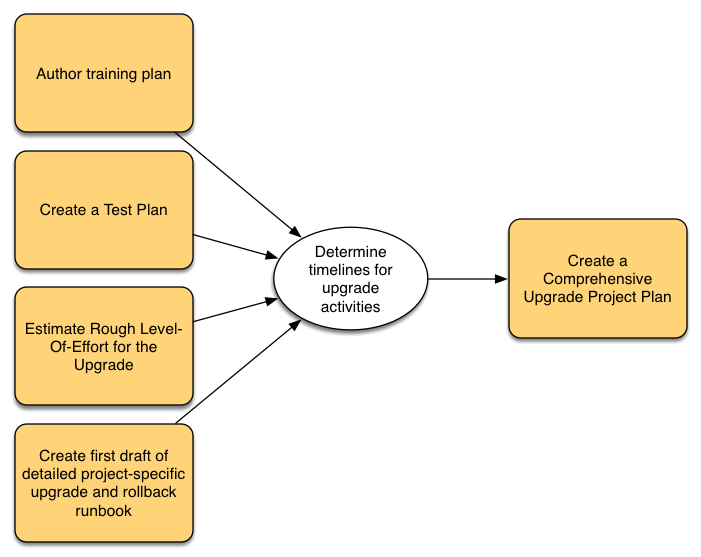

# 規劃升級 {#planning-your-upgrade}

## AEM升級概觀 {#aem-upgrade-overview}

AEM通常用於高影響力的部署，可能會為數百萬使用者提供服務。 通常，執行個體上會部署自訂應用程式，這會增加複雜性。 任何升級此類部署的工作都必須有條不紊地處理。

本指南有助於在規劃升級時建立明確的目標、階段和交付專案。 其重點在於整體升級執行和指南。 雖然提供實際升級步驟的概觀，但會視情況參考可用的技術資源。 應搭配檔案中提及的可用技術資源使用。

AEM升級程式需要謹慎處理規劃、分析和執行階段，並為每個階段定義關鍵交付專案。

>[!NOTE]
>
>最新6個Service Pack支援升級至AEM 6.5 LTS

請務必確保您執行的是支援的作業系統、Java™執行階段、httpd和Dispatcher版本。 如需詳細資訊，請參閱AEM 6.5 LTS [&#128279;](/help/sites-deploying/technical-requirements.md)的技術需求。 升級這些元件必須在升級計畫中考量，並應於升級AEM前進行。

<!-- Alexandru: drafting for now

## Upgrade Scope and Requirements {#upgrade-scope-requirements}

Below you will find a list of areas that are impacted in a typical AEM Upgrade project:

<table>
 <tbody>
  <tr>
   <td><strong>Component</strong></td>
   <td><strong>Impact</strong></td>
   <td><strong>Description</strong></td>
  </tr>
  <tr>
   <td>Operating System</td>
   <td>Uncertain, but subtle effects</td>
   <td>At the time of the AEM upgrade, it may be time to upgrade the operating system as well and this might have some impact.</td>
  </tr>
  <tr>
   <td>Java&trade; Runtime</td>
   <td>Moderate Impact</td>
   <td>AEM 6.3 requires JRE 1.7.x (64 bit) or later. JRE 1.8 is the only version currently supported by Oracle.</td>
  </tr>
  <tr>
   <td>Hardware</td>
   <td>Moderate Impact</td>
   <td>Online Revision Cleanup requires free  disk space equal to 25% of the repository's size and 15% free heap space  to complete successfully. You may need to upgrade your hardware to  ensure sufficient resources for Online Revision Cleanup to fully  run. Also, if upgrading from a version prior to AEM 6, there  may be additional storage requirements.</td>
  </tr>
  <tr>
   <td>Content Repository (CRX or Oak)</td>
   <td>High Impact</td>
   <td>Starting from version 6.1, AEM does not support CRX2, so a migration to  Oak (CRX3) is required if upgrading from an older version. AEM 6.3 has  implemented a new Segment Node Store that also requires a migration. The  crx2oak tool is used for this purpose.</td>
  </tr>
  <tr>
   <td>AEM Components/Content</td>
   <td>Moderate Impact</td>
   <td><code>/libs</code> and <code>/apps</code> are easily handled through the upgrade, but <code>/etc</code> usually requires some manual reapplication of customizations.</td>
  </tr>
  <tr>
   <td>AEM Services</td>
   <td>Low Impact</td>
   <td>Most AEM core services are tested for upgrade. This is an area of low impact.</td>
  </tr>
  <tr>
   <td>Custom Application Services</td>
   <td>Low to High Impact</td>
   <td>Depending on the application and customization, there may be  dependencies on JVM, operating system versions, and some indexing related  changes, as indexes are not generated automatically in Oak.</td>
  </tr>
  <tr>
   <td>Custom Application Content</td>
   <td>Low to High Impact</td>
   <td>Content that will not be handled through the upgrade can be backed up  before the upgrade takes place and then moved back into the repository.  Most content can be handled through the migration tool.</td>
  </tr>
 </tbody>
</table>

It is important to ensure that you are running a supported operating system, Java&trade; runtime, httpd, and Dispatcher version. For more information, see the [AEM 6.5 Technical Requirements page](/help/sites-deploying/technical-requirements.md). Upgrading these components must be accounted for in your project plan and should take place before upgrading AEM. -->

## 升級階段 {#upgrade-phases}

規劃和執行AEM升級需要做許多工作。 為了釐清此流程的不同工作，Adobe已將規劃和執行作業劃分為不同的階段。 在以下各節中，每個階段都會產生一個交付專案，通常用於升級的未來階段。

<!-- Alexandru:drafting for now

### Planning for Author Training {#planning-for-author-training}

With any new release, there are potential changes to the UI and user workflows that may be introduced. Also, new releases introduce new features that may be beneficial for the business to use. Adobe recommends reviewing the functional changes that have been introduced and organizing a plan to train your users on using them effectively.

New features in AEM 6.5 can be found in [the AEM section of adobe.com](/help/release-notes/release-notes.md). Make sure to note any changes to UIs or product features that are commonly used in your organization. As you look through the new features, also take note of any that can be of value to your organization. After looking through what has changed in AEM 6.5, develop a training plan for your authors. This could involve using freely available resources like the help feature videos or formal training offered through [Adobe Digital Learning Services](https://learning.adobe.com/). -->

### 建立測試計畫 {#creating-a-test-plan}

每位客戶的AEM實作都是獨一無二，並且已經過客製化，以符合其業務需求。 因此，請務必判斷已對系統進行的所有自訂，以便將其包含在測試計畫中。

確切的生產環境需要複製，並在升級後對其執行測試，以確保所有應用程式和自訂程式碼仍如預期執行。 回覆所有自訂並執行效能、載入和安全性測試。 組織測試計畫時，除了現成可用的UI和日常操作中使用的工作流程之外，請務必涵蓋所有已針對系統進行的自訂。 這些可能包括自訂OSGI服務和Servlet、與Adobe Experience Cloud的整合、透過AEM聯結器與協力廠商的整合、自訂第三方整合、自訂元件和範本、AEM中的自訂UI覆蓋以及自訂工作流程。 此外，仍應測試自訂查詢，以確保其索引在升級後繼續有效運作。

### 評估升級複雜性 {#assessing-upgrade-complexity}

由於Adobe客戶在其AEM環境中套用的自訂專案和性質多種多樣，因此請務必花一些時間預先判斷升級時應期望的整體工作量等級。 適用於AEM 6.5 LTS的[AEM Analyzer](/help/sites-deploying/aem-analyzer.md)可協助您評估升級的複雜性。

適用於AEM 6.5 LTS[&#128279;](/help/sites-deploying/pattern-detector.md)的AEM Analyzer應可讓您在升級期間，針對大多數情況提供相當準確的估計值。 不過，若是較複雜的自訂與部署有不相容的變更，您可以根據[執行就地升級](/help/sites-deploying/in-place-upgrade.md)中的指示，將開發執行個體升級至AEM 6.5 LTS。 完成後，請在此環境中執行一些高階煙霧測試。 本練習的目標不是要徹底完成測試案例詳細目錄並產生正式的缺陷詳細目錄，而是要提供升級AEM 6.5 LTS相容性程式碼所需的工作量粗略估計。 結合[AEM Analyzer](/help/sites-deploying/aem-analyzer.md)和上一節中決定的架構變更時，可以為專案管理團隊提供粗略的估計，以計畫升級。

### 建立升級和回覆Runbook {#building-the-upgrade-and-rollback-runbook}

雖然Adobe已記錄升級AEM執行個體的程式，但每個客戶的網路配置、部署架構和自訂都需要微調和量身打造此方法。 因此，Adobe鼓勵您檢閱所有提供的檔案，並用於通知升級特定的Runbook，其中會概述您將在環境中遵循的特定升級和復原程式。

<!--Alexandru:drafting for now

 -->

Adobe已在[升級程式](/help/sites-deploying/upgrade-procedure.md)中提供升級和復原程式，以及在執行[就地升級](/help/sites-deploying/in-place-upgrade.md)中套用升級的逐步指示。 您應該檢閱這些指示，並搭配系統架構、自訂和停機時間容許度加以考慮，以決定升級期間要執行的適當切換和復原程式。 在草擬您的自訂Runbook時，應包含架構或伺服器大小的任何變更。

### 開發升級計畫 {#developing-an-upgrade-plan}

先前練習的輸出可用於建立升級計畫，涵蓋測試或開發工作的預期時間表以及實際升級執行。

<!--Alexandru: drafting for now

 -->

完整的專案計畫應包括：

* 完成開發及測試計畫
* 升級開發和QA環境
* 更新AEM 6.5 LTS的自訂程式碼基底
* QA測試和修正週期
* 升級中繼環境
* 整合、效能和負載測試
* 環境認證
* 上線

### 執行開發和QA {#performing-development-and-qa}

Adobe已提供[升級程式碼和自訂](/help/sites-deploying/upgrading-code-and-customizations.md)以與AEM 6.5 LTS相容的程式。 在執行此反複處理程式時，應視需要變更Runbook。

<!--Alexandru: drafting for now

 -->

開發和測試過程通常是反複的過程。 發現需要調整升級流程的問題時，請務必將其新增到您的自訂升級Runbook。 在反複測試和修正之後，程式碼庫應該會經過完整驗證，並準備好部署到中繼環境。

### 最終測試 {#final-testing}

Adobe建議在程式碼基底獲得組織的QA團隊認證後，進行最後一輪測試。 這輪測試將需要在中繼環境中驗證您的Runbook，然後進行多輪使用者接受、效能和安全性測試。

<!--Alexandru: drafting for now

 -->

此步驟非常重要，因為這是您唯一能夠針對生產環境驗證Runbook中的步驟的時間。 升級環境後，請務必讓使用者有時間登入並完成在日常活動中使用系統時所做的活動。 在上線之前，找出並修正這些區域的問題，可協助避免代價高昂的生產中斷。

### 執行升級 {#performing-the-upgrade}

收到所有利害關係人的最終簽核後，就可以依照定義的Runbook程式執行了。 Adobe已提供[升級程式](/help/sites-deploying/upgrade-procedure.md)中的升級與回覆步驟，以及執行[就地升級](/help/sites-deploying/in-place-upgrade.md)中的安裝步驟，以作為參考點。

Adobe在環境驗證的升級指示中提供了一些步驟。 這些包括基本檢查，例如掃描升級記錄檔和驗證所有OSGi套件組合皆已正確啟動，但Adobe建議也根據您的業務流程，使用您自己的測試案例進行驗證。 Adobe也建議檢查AEM線上修訂清除及相關常式的排程，確保這些作業會在貴公司的安靜時間發生。 這些常式對於AEM的長期效能至關重要。
