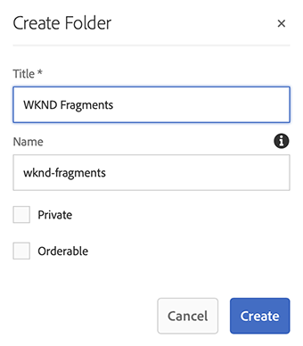

# 建立Assets資料夾Headless快速入門手冊 {#creating-an-assets-folder}

使用 AEM 內容片段模型定義內容片段的結構，這是 Headless 內容的基礎。 然後將內容片段儲存在資產資料夾中。

## 什麼是資產資料夾？ {#what-is-an-assets-folder}

[現在您已經建立內容片段模型](create-content-model.md)，它定義您未來內容片段所需的結構，您可能很想建立一些片段。

但是，您首先需要建立可以儲存片段的資產資料夾。

Assets資料夾用於[組織傳統內容資產](/help/assets/manage-assets.md)，例如影像、影片和內容片段。

## 如何建立資產資料夾 {#how-to-create-an-assets-folder}

管理員只需要偶爾建立資料夾來組織建立的內容。 出於本快速入門指南的目的，我們只需要建立一個資料夾。

1. 登入AEM，從主功能表選取&#x200B;**導覽> Assets >檔案**。
1. 按一下&#x200B;**建立>資料夾**。
1. 為您的資料夾提供 **標題**&#x200B;和&#x200B;**名稱**。
   * **標題** 應該是描述性的。
   * **名稱**&#x200B;將成為存放庫中的節點名稱。
     * 它會根據標題自動產生，並根據[AEM 命名慣例](/help/sites-developing/naming-conventions.md)進行調整
     * 如有需要，可加以調整。

   
1. 選取您建立的資料夾，然後從工具列選取&#x200B;**屬性** （或使用`p` [鍵盤快速鍵。](/help/sites-authoring/keyboard-shortcuts.md)）
1. 在&#x200B;**屬性**&#x200B;視窗中，選擇&#x200B;**雲端服務**&#x200B;索引標籤。
1. 針對&#x200B;**雲端設定**，選取您先前建立的[設定。](create-configuration.md)
   
1. 按一下「**儲存並關閉**」。
1. 在確認視窗中按一下&#x200B;**確定**。

   

您可以在剛建立的資料夾中建立其他子資料夾。 子資料夾將繼承父資料夾的&#x200B;**雲端設定**。 但是，如果您希望使用來自另一個設定的模型，這可以被覆寫。

如果您使用的是當地語系化網站結構，則可以在新資料夾下[建立語言根](/help/assets/multilingual-assets.md)。

## 後續步驟 {#next-steps}

現在您已為內容片段建立資料夾，接下來可以移至快速入門手冊的第四部分，並[建立內容片段。](create-content-fragment.md)

>[!TIP]
>
>如需有關管理內容片段的完整詳細資訊，請參閱[內容片段文件](/help/assets/content-fragments/content-fragments.md)
